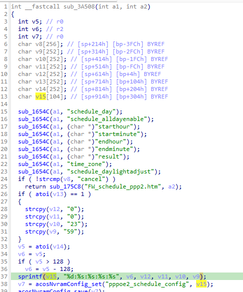
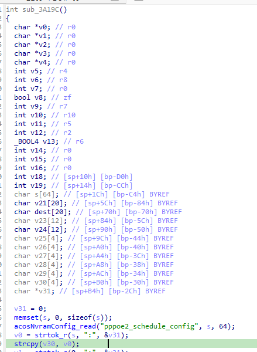

http://www.downloads.netgear.com/files/GDC/AC1450/AC1450-V1.0.0.36_10.0.17.zip
Netgear AC1450-1.0.0.36是Netgear旗下的一款路由器固件，受影响固件名称为AC1450，受影响版本为1.0.0.36。

AC1450_V1.0.0.36_10.0.17
漏洞名称：Netgear AC1450 sub_3a19c 空指针解引用漏洞
Netgear AC1450-1.0.0.36 httpd 二进制文件包含一个空指针解引用漏洞，会导致经过身份验证的远程攻击者通过构造恶意请求使目标设备崩溃并造成拒绝服务。

该漏洞位于二进制文件 usr/sbin/httpd 中，在函数sub_3a19c在地址 0x3a218 处对strcpy函数的调用。

攻击者可以远程发起攻击，通过发送构造的恶意数据包触发漏洞。

漏洞研究环境：

通过模拟仿真进行验证。当前附件中的环境是已经patch了认证环节之后的，未patch的环境可以用binwalk解压对应下载链接的固件得到。

通过greenhouse进行仿真，greenhouse链接为https://github.com/sefcom/greenhouse。仿真环境搭建的具体命令链接为https://github.com/sefcom/greenhouse/blob/master/MANUAL.md。
我在附件里面附上了rehost的镜像，链接为https://github.com/GinRawin/PoC/blob/main/Netgear/ac1450/ac1450rehost.tar.gz，启动的命令为进入到dockerfile目录下，然后docker-compose build, docker-compose up。

我还附上了复现请求文件，直接重放当前目录下的packet_1.request.raw即可。

目标配置情况：

没有进行特殊配置，默认仿真环境启动。

具体验证过程：

第一步。攻击者发送一个恶意数据包，路由信息为/fwSchedulePPP2.cgi?pppoe2_fw_serv_add.cgi。该请求故意不携带schedule_day、schedule_alldayenable、schedule_starthour、schedule_startminute、schedule_endhour和schedule_endminute等字段，函数sub_3a508会把这些缺失参数读取为空字符串，并拼接生成异常的pppoe2_schedule_config配置串。

第二步。函数sub_3a19c读取pppoe2_schedule_config后，在地址0x3a1f8处对strtok_r拆分出的返回值直接调用strcpy。由于第二个token为空，strcpy会解引用NULL指针，最终触发崩溃。

相关问题代码：

sub_3a19c
