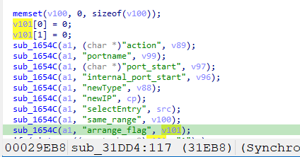
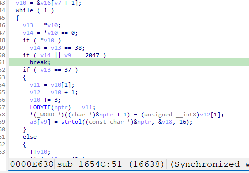

http://www.downloads.netgear.com/files/GDC/AC1450/AC1450-V1.0.0.36_10.0.17.zip
Netgear AC1450-1.0.0.36是Netgear旗下的一款路由器固件，受影响固件名称为AC1450，受影响版本为1.0.0.36。

AC1450_V1.0.0.36_10.0.17
漏洞名称：Netgear AC1450 sub_1654c 缓冲区溢出漏洞
Netgear AC1450-1.0.0.36 httpd 二进制文件包含一个栈缓冲区溢出漏洞，会导致经过身份验证的远程攻击者能够覆盖返回地址，从而使目标设备dos或执行远程代码。

该漏洞位于二进制文件 usr/sbin/httpd 中，在函数sub_1654c在地址 0x16604 处进行逐字节写入时没有校验目标缓冲区长度。

攻击者可以远程发起攻击，通过发送构造的恶意数据包触发漏洞。

漏洞研究环境：

通过模拟仿真进行验证。当前附件中的环境是已经patch了认证环节之后的，未patch的环境可以用binwalk解压对应下载链接的固件得到。

通过greenhouse进行仿真，greenhouse链接为https://github.com/sefcom/greenhouse。仿真环境搭建的具体命令链接为https://github.com/sefcom/greenhouse/blob/master/MANUAL.md。
我在附件里面附上了rehost的镜像，链接为https://github.com/GinRawin/PoC/blob/main/Netgear/ac1450/ac1450rehost.tar.gz，启动的命令为进入到dockerfile目录下，然后docker-compose build, docker-compose up。

我还附上了复现请求文件，直接重放当前目录下的packet_1.request.raw即可。

目标配置情况：

没有进行特殊配置，默认仿真环境启动。

具体验证过程：

第一步。攻击者发送一个恶意数据包，路由信息为/pforward.cgi，数据包中的arrange_flag参数长度为256字节。处理函数在地址0x31eb8处调用sub_1654c，将arrange_flag写入栈上的sp+0x29ac缓冲区v101。

第二步。函数sub_1654c在地址0x16604、0x16618和0x16640处逐字节拷贝arrange_flag，但是由于只限制了最大写入长度是2047个字节，没有使用调用者缓冲区的真实大小进行校验。由于sp+0x29ac距离保存的返回地址只有0x40字节，256字节的输入会直接覆盖返回地址。

第三步。处理函数继续执行到地址0x32da8附近返回时，被污染的返回地址变成0x32323232，最终触发SIGSEGV崩溃。

相关问题代码：

sub_1654c
