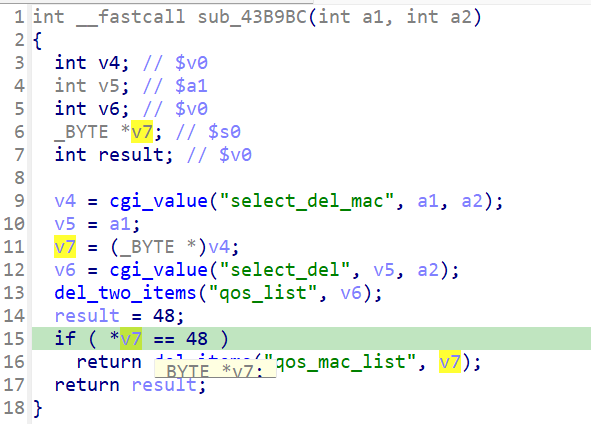

http://www.downloads.netgear.com/files/GDC/JNR3300/JNR3300-V1.0.0.34PR.zip

漏洞名称：
Netgear JNR3300 QoS 删除路径空指针解引用漏洞

Netgear JNR3300-1.0.0.34是Netgear旗下的一款路由器固件，受影响固件名称为JNR3300，受影响版本为1.0.0.34。

JNR3300_V1.0.0.34_10.0.17
Netgear JNR3300-1.0.0.34的/usr/sbin/uhttpd二进制文件中存在一个空指针解引用漏洞。远程攻击者可以通过发送构造的POST请求触发QoS删除流程，在缺少关键参数时导致httpd进程崩溃，从而造成拒绝服务。

该漏洞位于二进制文件usr/sbin/uhttpd中，在QoS删除处理函数0x43b9bc内，程序会先后读取select_del_mac参数。当字段缺失时，cgi_value返回NULL，随后代码在0x43ba30处直接对空指针最终触发SIGSEGV。

攻击者可以远程发起攻击，通过向/apply.cgi?c发送submit_flag=qos_del的恶意请求，并省略select_del_mac来触发漏洞。

漏洞研究环境：

通过模拟仿真进行验证。当前附件中的环境是已经patch了认证环节之后的，未patch的环境可以用binwalk解压对应下载链接的固件得到。

通过greenhouse进行仿真，greenhouse链接为https://github.com/sefcom/greenhouse。仿真环境搭建的具体命令链接为https://github.com/sefcom/greenhouse/blob/master/MANUAL.md。
我在附件里面附上了rehost的镜像，启动的命令为进入到dockerfile目录下，然后docker-compose build, docker-compose up。

目标配置情况：

没有进行特殊配置，默认仿真环境启动。

具体验证过程：

第一步。攻击者向/apply.cgi?c发送POST请求，设置submit_flag=qos_del，使程序进入QoS删除分支sub_43b9bc。

第二步。该分支尝试读取select_del_mac参数，但当前数据包中这个字段不存在，因此cgi_value返回NULL。函数继续调用内部删除逻辑后，在0x43ba30处对NULL指针直接解引用，最终导致程序崩溃。

相关问题代码：

0x43b9bc
