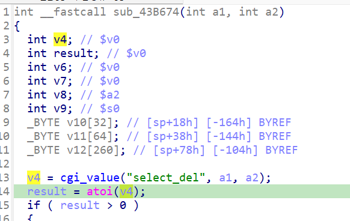

http://www.downloads.netgear.com/files/GDC/JNR3300/JNR3300-V1.0.0.34PR.zip

漏洞名称：
Netgear JNR3300 0x43b674 空指针解引用漏洞

Netgear JNR3300-1.0.0.34是Netgear旗下的一款路由器固件，受影响固件名称为JNR3300，受影响版本为1.0.0.34。

JNR3300_V1.0.0.34_10.0.17
Netgear JNR3300-1.0.0.34的/usr/sbin/uhttpd二进制文件中存在一个空指针解引用漏洞。远程攻击者可以通过发送恶意POST请求进入wlacl_del处理路径，在缺少必需字段select_del时触发崩溃，造成拒绝服务。

该漏洞位于二进制文件usr/sbin/uhttpd中，在函数0x43b674内，程序读取body.select_del后未检查返回值是否为空，随后在0x43b6c0处将NULL直接传给atoi，最终在atoi导入桩中触发SIGSEGV。

攻击者可以远程发起攻击，通过向/apply.cgi?c发送submit_flag=wlacl_del且不提供select_del参数的请求来触发漏洞。

漏洞研究环境：

通过模拟仿真进行验证。当前附件中的环境是已经patch了认证环节之后的，未patch的环境可以用binwalk解压对应下载链接的固件得到。

通过greenhouse进行仿真，greenhouse链接为https://github.com/sefcom/greenhouse。仿真环境搭建的具体命令链接为https://github.com/sefcom/greenhouse/blob/master/MANUAL.md。
我在附件里面附上了rehost的镜像，链接为https://github.com/GinRawin/PoC/blob/main/0412PoC/jnr3300-1.0.0.34.zip/jnr3300-1.0.0.34.tar.gz，启动的命令为进入到dockerfile目录下，然后docker-compose build, docker-compose up。

目标配置情况：

没有进行特殊配置，默认仿真环境启动。

具体验证过程：

第一步。攻击者向/apply.cgi?c发送POST请求，并将submit_flag设置为wlacl_del，使程序从动作表分派到0x43b674对应的处理函数。

第二步。该函数首先读取select_del字段，但样本中该字段缺失，cgi_value返回NULL。程序未做任何检查，直接在0x43b6c0处调用atoi(NULL)，导致/usr/sbin/uhttpd发生空指针解引用崩溃。

相关问题代码：

0x43b674
