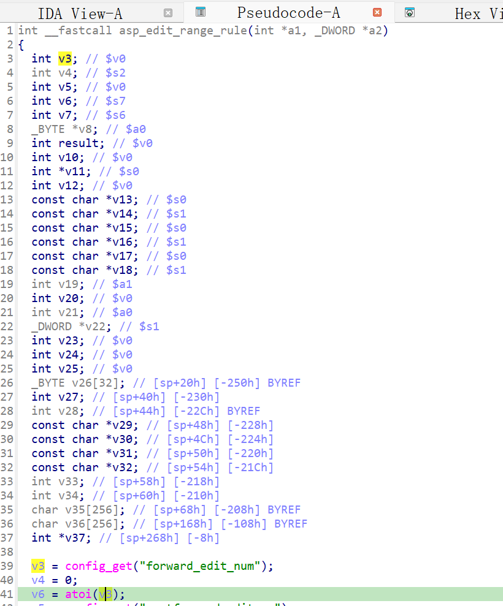

http://www.downloads.netgear.com/files/GDC/JNR3300/JNR3300-V1.0.0.34PR.zip

漏洞名称：
Netgear JNR3300 forwarding_edit页面空指针解引用漏洞

Netgear JNR3300-1.0.0.34是Netgear旗下的一款路由器固件，受影响固件名称为JNR3300，受影响版本为1.0.0.34。

JNR3300_V1.0.0.34_10.0.17
Netgear JNR3300-1.0.0.34的/usr/sbin/uhttpd二进制文件中存在一个空指针解引用漏洞。远程攻击者访问特定页面后，可诱导程序读取不存在的内部配置项，并在未校验返回值的情况下调用atoi，导致httpd进程崩溃。

该漏洞位于二进制文件usr/sbin/uhttpd中，在端口转发编辑页面处理函数asp_edit_range_rule内，程序调用config_get("forward_edit_num")后没有检查返回值是否为空，就在0x4494a0处继续执行atoi，最终触发SIGSEGV。

攻击者可以远程发起攻击，通过请求/forwarding_edit.htm，使程序进入存在缺陷的页面处理逻辑，从而在配置项缺失时触发漏洞。

漏洞研究环境：

通过模拟仿真进行验证。当前附件中的环境是已经patch了认证环节之后的，未patch的环境可以用binwalk解压对应下载链接的固件得到。

通过greenhouse进行仿真，greenhouse链接为https://github.com/sefcom/greenhouse。仿真环境搭建的具体命令链接为https://github.com/sefcom/greenhouse/blob/master/MANUAL.md。
我在附件里面附上了rehost的镜像，启动的命令为进入到dockerfile目录下，然后docker-compose build, docker-compose up。

目标配置情况：

没有进行特殊配置，默认仿真环境启动。

具体验证过程：

第一步。攻击者访问/forwarding_edit.htm页面，请求被uhttpd分派到端口转发编辑相关处理函数。

第二步。asp_edit_range_rule函数读取内部配置项forward_edit_num，但当前环境中该配置不存在，config_get返回NULL。程序随后在0x4494a0处直接调用atoi(NULL)，最终导致/usr/sbin/uhttpd崩溃。

相关问题代码：

asp_edit_range_rule
