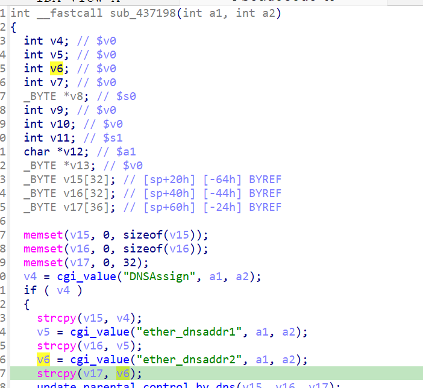

http://www.downloads.netgear.com/files/GDC/JNR3300/JNR3300-V1.0.0.34PR.zip

漏洞名称：
Netgear JNR3300 ether_dnsaddr2栈缓冲区溢出漏洞

Netgear JNR3300-1.0.0.34是Netgear旗下的一款路由器固件，受影响固件名称为JNR3300，受影响版本为1.0.0.34。

JNR3300_V1.0.0.34_10.0.17
Netgear JNR3300-1.0.0.34的/usr/sbin/uhttpd二进制文件中存在一个栈缓冲区溢出漏洞。远程攻击者可以通过提交超长的ether_dnsaddr2参数覆盖返回地址，使进程跳转到攻击者可控数据并崩溃，严重情况下可能进一步实现代码执行。

该漏洞位于二进制文件usr/sbin/uhttpd中，在ether处理函数0x437198内，程序会将body.ether_dnsaddr2通过strcpy复制到仅0x20字节的栈缓冲区sp+0x60中。由于没有长度检查，超长输入会覆盖保存寄存器和返回地址，trace中最终出现si_addr=0x32323232。

攻击者可以远程发起攻击，通过向/apply.cgi?c发送submit_flag=ether的POST请求，并提供超长ether_dnsaddr2字段来触发漏洞。

漏洞研究环境：

通过模拟仿真进行验证。当前附件中的环境是已经patch了认证环节之后的，未patch的环境可以用binwalk解压对应下载链接的固件得到。

通过greenhouse进行仿真，greenhouse链接为https://github.com/sefcom/greenhouse。仿真环境搭建的具体命令链接为https://github.com/sefcom/greenhouse/blob/master/MANUAL.md。
我在附件里面附上了rehost的镜像，启动的命令为进入到dockerfile目录下，然后docker-compose build, docker-compose up。

目标配置情况：

没有进行特殊配置，默认仿真环境启动。

具体验证过程：

第一步。攻击者向/apply.cgi?c发送POST请求，设置submit_flag=ether，使执行流进入ether配置函数。

第二步。程序在处理DNS参数时调用cgi_value读取ether_dnsaddr2，并在0x4372a8处将其直接strcpy到固定大小的栈缓冲区。由于输入远超缓冲区大小，返回地址被字符'2'覆盖，函数后续执行时崩溃。

相关问题代码：

0x437198
