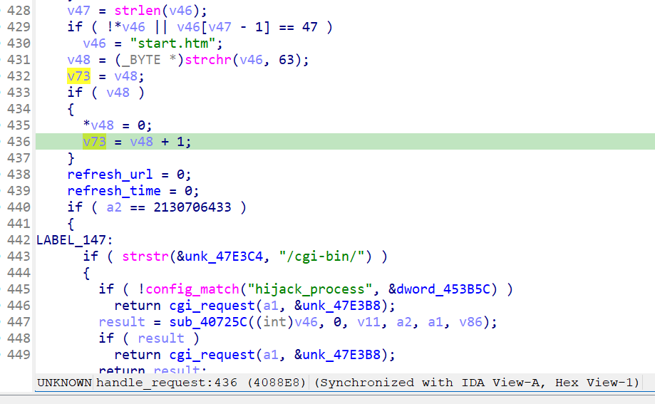
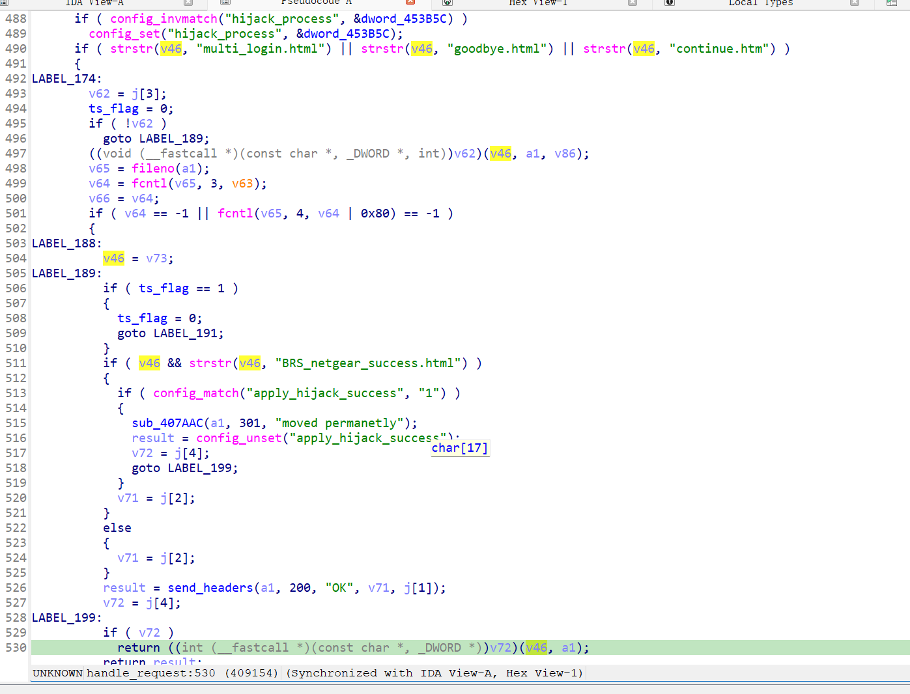
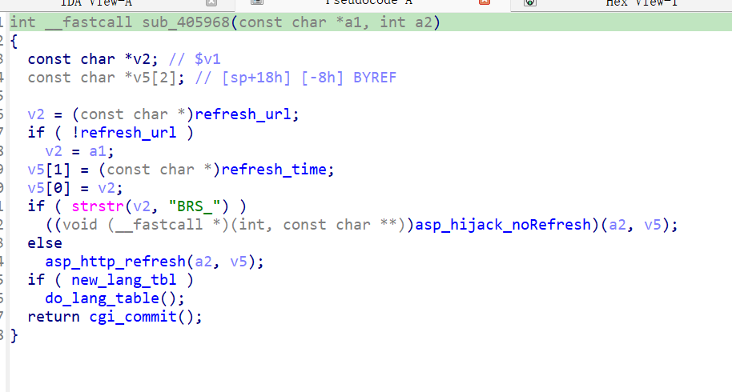

http://www.downloads.netgear.com/files/GDC/JNR3300/JNR3300-V1.0.0.34PR.zip

漏洞名称：
Netgear JNR3300 handle_request解析url不当导致空指针解引用漏洞

Netgear JNR3300-1.0.0.34是Netgear旗下的一款路由器固件，受影响固件名称为JNR3300，受影响版本为1.0.0.34。

JNR3300_V1.0.0.34_10.0.17
Netgear JNR3300-1.0.0.34的/usr/sbin/uhttpd二进制文件中存在一个空指针解引用漏洞。远程攻击者可以通过向/apply.cgi发送包含submit_flag=hijack_l2tp的POST请求，使请求在收尾阶段进入函数sub_405968，并最终触发strstr(NULL, "BRS_")崩溃。

该漏洞位于二进制文件usr/sbin/uhttpd中，handle_request函数解析url不当，导致sub_405968函数的strstr调用出现了空指针解引用。

攻击者可以远程发起攻击，通过向/apply.cgi发送submit_flag=hijack_l2tp的POST请求触发漏洞。这里的submit_flag来自POST请求体，而不是URL查询参数，这也是本次/apply.cgi请求无法提供'?'后备用字符串的重要原因。

漏洞研究环境：

通过模拟仿真进行验证。当前附件中的环境是已经patch了认证环节之后的，未patch的环境可以用binwalk解压对应下载链接的固件得到。

通过greenhouse进行仿真，greenhouse链接为https://github.com/sefcom/greenhouse。仿真环境搭建的具体命令链接为https://github.com/sefcom/greenhouse/blob/master/MANUAL.md。
我在附件里面附上了rehost的镜像，启动的命令为进入到dockerfile目录下，然后docker-compose build, docker-compose up。

目标配置情况：

没有进行特殊配置，默认仿真环境启动。

具体验证过程：

第一步。攻击者向/apply.cgi发送POST请求，请求行是POST /apply.cgi HTTP/1.1，请求体中包含submit_flag=hijack_l2tp。handle_request函数在0x4088c0开始尝试对请求URL执行strchr(s1, '?')，只有URL中存在'?'时才会把'?'后面的子串写回栈上的sp+0x20（IDA Pro中的v73）作为后续刷新逻辑的备用字符串；本次PoC的请求行为POST /apply.cgi HTTP/1.1，请求URL本身不带'?'，因此这条备用字符串构造链没有建立起来。紧接着，handle_request又在0x4088ec/0x4088f4把全局refresh_url清零，在0x4088f8/0x4088fc把refresh_time清零。

第二步。handle_request随后在0x4088ec/0x4088f4清空refresh_url，在0x4088f8/0x4088fc清空refresh_time，然后继续进入apply.cgi对应的CGI处理流程。而后一直没有向refresh_url写入。

第三步。在0x409154把备用更新字符串作为第一个参数传给收尾回调（IDA Pro中的v46，在前面赋值v46=v73）,并调用函数sub_405968，其中0x405990检查refresh_url是空值，因此将sub_405968的第一个参数传递给0x405738的strstr函数，导致strstr(arg0, "BRS_")出现空指针解引用，最终导致/usr/sbin/uhttpd崩溃。

相关问题代码：

handle_request
