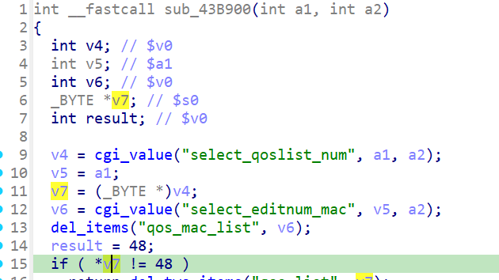

http://www.downloads.netgear.com/files/GDC/JNR3300/JNR3300-V1.0.0.34PR.zip

漏洞名称：
Netgear JNR3300 0x43b900 空指针解引用漏洞

Netgear JNR3300-1.0.0.34是Netgear旗下的一款路由器固件，受影响固件名称为JNR3300，受影响版本为1.0.0.34。

JNR3300_V1.0.0.34_10.0.17
Netgear JNR3300-1.0.0.34的/usr/sbin/uhttpd二进制文件中存在一个空指针解引用漏洞。远程攻击者可以通过构造qos_delmac删除请求，在缺少select_qoslist_num字段时触发NULL指针访问，导致设备拒绝服务。

该漏洞位于二进制文件usr/sbin/uhttpd中，在函数0x43b900内，程序先读取select_qoslist_num，当select_qoslist_num缺失时，cgi_value在0x43b934处返回NULL，随后程序在0x43b974处直接解引用空指针，最终触发SIGSEGV。

攻击者可以远程发起攻击，通过向/apply.cgi?qos_del发送submit_flag=qos_delmac的POST请求，并省略select_qoslist_num参数来触发漏洞。

漏洞研究环境：

通过模拟仿真进行验证。当前附件中的环境是已经patch了认证环节之后的，未patch的环境可以用binwalk解压对应下载链接的固件得到。

通过greenhouse进行仿真，greenhouse链接为https://github.com/sefcom/greenhouse。仿真环境搭建的具体命令链接为https://github.com/sefcom/greenhouse/blob/master/MANUAL.md。
我在附件里面附上了rehost的镜像，链接为https://github.com/GinRawin/PoC/blob/main/0412PoC/jnr3300-1.0.0.34.zip/jnr3300-1.0.0.34.tar.gz，启动的命令为进入到dockerfile目录下，然后docker-compose build, docker-compose up。

目标配置情况：

没有进行特殊配置，默认仿真环境启动。

具体验证过程：

第一步。攻击者向/apply.cgi?qos_del发送POST请求，设置submit_flag=qos_delmac，程序进入QoS MAC删除逻辑。

第二步。程序读取select_qoslist_num时得到NULL，并继续把该返回值保存在s0中。执行到0x43b974时，代码直接对空指针解引用，最终导致/usr/sbin/uhttpd崩溃。

相关问题代码：

0x43b900
