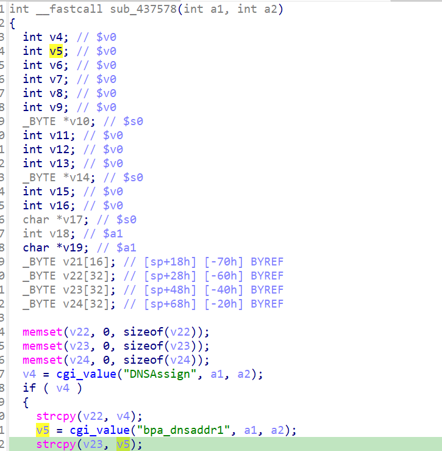

http://www.downloads.netgear.com/files/GDC/JNR3300/JNR3300-V1.0.0.34PR.zip

漏洞名称：
Netgear JNR3300 BPA DNS参数空指针解引用漏洞

Netgear JNR3300-1.0.0.34是Netgear旗下的一款路由器固件，受影响固件名称为JNR3300，受影响版本为1.0.0.34。

JNR3300_V1.0.0.34_10.0.17
Netgear JNR3300-1.0.0.34的/usr/sbin/uhttpd二进制文件中存在一个空指针解引用漏洞。远程攻击者可以在BPA配置流程中提交不完整的DNS参数，使程序对NULL执行strcpy，导致httpd进程崩溃。

该漏洞位于二进制文件usr/sbin/uhttpd中，在BPA处理函数0x437578内，程序在DNSAssign非零时会继续读取bpa_dnsaddr1。若该字段缺失，cgi_value在0x437640处返回NULL，随后代码在0x437654处直接执行strcpy，最终触发SIGSEGV。

攻击者可以远程发起攻击，通过向/apply.cgi?c发送submit_flag=bpa的POST请求，并在开启DNS分支的情况下省略bpa_dnsaddr1来触发漏洞。

漏洞研究环境：

通过模拟仿真进行验证。当前附件中的环境是已经patch了认证环节之后的，未patch的环境可以用binwalk解压对应下载链接的固件得到。

通过greenhouse进行仿真，greenhouse链接为https://github.com/sefcom/greenhouse。仿真环境搭建的具体命令链接为https://github.com/sefcom/greenhouse/blob/master/MANUAL.md。
我在附件里面附上了rehost的镜像，启动的命令为进入到dockerfile目录下，然后docker-compose build, docker-compose up。

目标配置情况：

没有进行特殊配置，默认仿真环境启动。

具体验证过程：

第一步。攻击者向/apply.cgi?c发送POST请求，设置submit_flag=bpa，并让DNSAssign取非零值，程序据此进入BPA手工DNS配置分支。

第二步。程序在0x437640处读取bpa_dnsaddr1，但样本没有提供该字段，返回值为NULL。执行到0x437654时，程序直接对NULL调用strcpy，最终导致/usr/sbin/uhttpd崩溃。

相关问题代码：

0x437578
