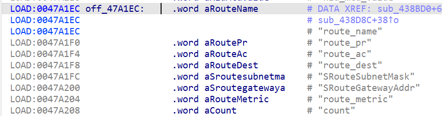
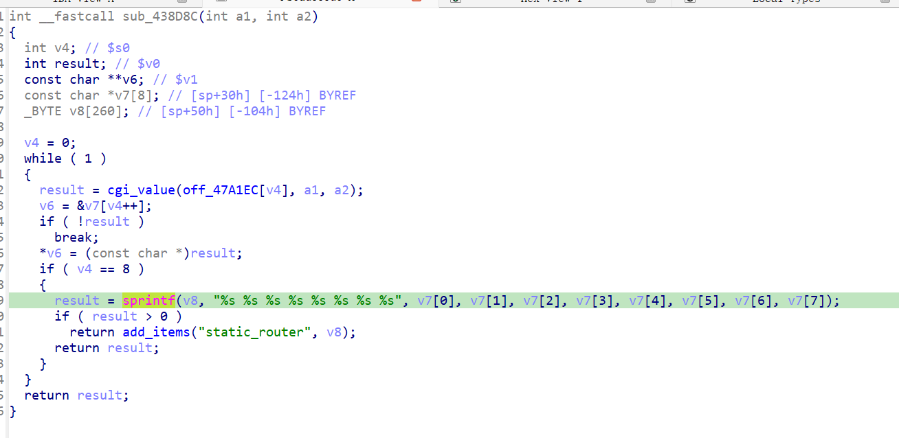

http://www.downloads.netgear.com/files/GDC/JNR3300/JNR3300-V1.0.0.34PR.zip

漏洞名称：
Netgear JNR3300 st_router_add 缓冲区溢出漏洞

Netgear JNR3300-1.0.0.34是Netgear旗下的一款路由器固件，受影响固件名称为JNR3300，受影响版本为1.0.0.34。

JNR3300_V1.0.0.34_10.0.17
Netgear JNR3300-1.0.0.34的/usr/sbin/uhttpd二进制文件中存在一个栈缓冲区溢出漏洞。远程攻击者可以通过提交多个超长静态路由字段，覆盖函数栈帧中的保存状态并导致进程崩溃，严重情况下可能进一步实现代码执行。

该漏洞位于二进制文件usr/sbin/uhttpd中，在静态路由添加函数0x438d8c内，程序会依次读取route_name、route_pr、route_ac、route_dest、SRouteSubnetMask、SRouteGatewayAddr、route_metric和count八个字段，然后在0x438e4c处使用sprintf("%s %s %s %s %s %s %s %s")拼接到sp+0x50处的栈缓冲区。由于没有长度检查，多个超长字段会共同造成栈溢出。

攻击者可以远程发起攻击，通过向/apply.cgi?st_router_del发送submit_flag=st_router_add的POST请求，并在路由相关字段中填入超长数据来触发漏洞。

漏洞研究环境：

通过模拟仿真进行验证。当前附件中的环境是已经patch了认证环节之后的，未patch的环境可以用binwalk解压对应下载链接的固件得到。

通过greenhouse进行仿真，greenhouse链接为https://github.com/sefcom/greenhouse。仿真环境搭建的具体命令链接为https://github.com/sefcom/greenhouse/blob/master/MANUAL.md。
我在附件里面附上了rehost的镜像，链接为https://github.com/GinRawin/PoC/blob/main/0412PoC/jnr3300-1.0.0.34.zip/jnr3300-1.0.0.34.tar.gz，启动的命令为进入到dockerfile目录下，然后docker-compose build, docker-compose up。

目标配置情况：

没有进行特殊配置，默认仿真环境启动。

具体验证过程：

第一步。攻击者向/apply.cgi?st_router_del发送POST请求，设置submit_flag=st_router_add，使程序进入静态路由添加函数。

第二步。函数依次读取八个路由参数，并在0x438e4c处用sprintf一次性拼接到固定栈缓冲区中。由于输入总长度远超缓冲区容量，返回地址被字符'2'覆盖，函数后续执行时崩溃。

相关问题代码：

0x438d8c
