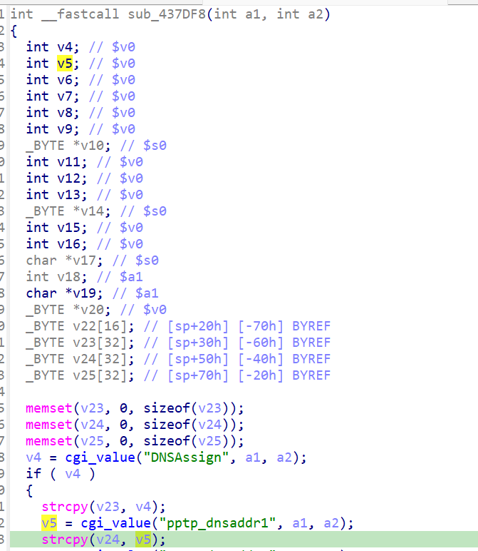

http://www.downloads.netgear.com/files/GDC/JNR3300/JNR3300-V1.0.0.34PR.zip

漏洞名称：
Netgear JNR3300 PPTP DNS栈缓冲区溢出漏洞

Netgear JNR3300-1.0.0.34是Netgear旗下的一款路由器固件，受影响固件名称为JNR3300，受影响版本为1.0.0.34。

JNR3300_V1.0.0.34_10.0.17
Netgear JNR3300-1.0.0.34的/usr/sbin/uhttpd二进制文件中存在一个栈缓冲区溢出漏洞。远程攻击者可以在PPTP配置流程中提交超长pptp_dnsaddr1参数，覆盖函数返回地址并导致httpd进程崩溃。

该漏洞位于二进制文件usr/sbin/uhttpd中，在PPTP处理函数0x437df8内，程序在DNSAssign有效时会读取pptp_dnsaddr1，并在0x437ed4处直接通过strcpy复制到局部缓冲区。由于缺少长度检查，超长输入可覆盖保存状态，trace中最终表现为si_addr=0x32323232。

攻击者可以远程发起攻击，通过向/apply.cgi?bpa发送submit_flag=pptp的POST请求，在DNSAssign非空的情况下提供超长pptp_dnsaddr1字段来触发漏洞。

漏洞研究环境：

通过模拟仿真进行验证。当前附件中的环境是已经patch了认证环节之后的，未patch的环境可以用binwalk解压对应下载链接的固件得到。

通过greenhouse进行仿真，greenhouse链接为https://github.com/sefcom/greenhouse。仿真环境搭建的具体命令链接为https://github.com/sefcom/greenhouse/blob/master/MANUAL.md。
我在附件里面附上了rehost的镜像，启动的命令为进入到dockerfile目录下，然后docker-compose build, docker-compose up。

目标配置情况：

没有进行特殊配置，默认仿真环境启动。

具体验证过程：

第一步。攻击者向/apply.cgi?bpa发送POST请求，设置submit_flag=pptp，并让DNSAssign非空。

第二步。程序读取超长pptp_dnsaddr1，并在0x437ed4处直接执行strcpy。由于目标缓冲区长度有限，返回地址被字符'2'覆盖，函数继续执行后发生崩溃。

相关问题代码：

0x437df8
