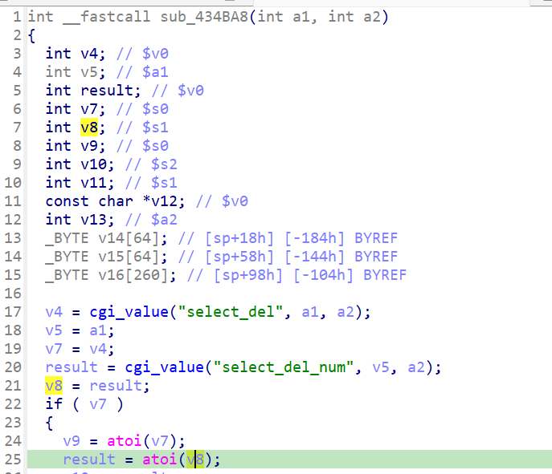

http://www.downloads.netgear.com/files/GDC/JNR3300/JNR3300-V1.0.0.34PR.zip

漏洞名称：
Netgear JNR3300 forwarding_del_range参数校验缺失漏洞

Netgear JNR3300-1.0.0.34是Netgear旗下的一款路由器固件，受影响固件名称为JNR3300，受影响版本为1.0.0.34。

JNR3300_V1.0.0.34_10.0.17
Netgear JNR3300-1.0.0.34的/usr/sbin/uhttpd二进制文件中存在一个空指针解引用漏洞。远程攻击者可以通过构造端口转发删除请求，在缺少select_del_num字段时触发atoi(NULL)，导致设备拒绝服务。

该漏洞位于二进制文件usr/sbin/uhttpd中，在forwarding_del_range处理函数0x434ba8内，程序会先读取select_del，再读取select_del_num。当第二个字段缺失时，cgi_value在0x434c14处返回NULL，而程序仍然在0x434c28处直接调用atoi，最终触发SIGSEGV。

攻击者可以远程发起攻击，通过向/apply.cgi?debuginfo.htm发送submit_flag=forwarding_del_range的POST请求，保证select_del字段非空并省略select_del_num字段来触发漏洞。

漏洞研究环境：

通过模拟仿真进行验证。当前附件中的环境是已经patch了认证环节之后的，未patch的环境可以用binwalk解压对应下载链接的固件得到。

通过greenhouse进行仿真，greenhouse链接为https://github.com/sefcom/greenhouse。仿真环境搭建的具体命令链接为https://github.com/sefcom/greenhouse/blob/master/MANUAL.md。
我在附件里面附上了rehost的镜像，启动的命令为进入到dockerfile目录下，然后docker-compose build, docker-compose up。

目标配置情况：

没有进行特殊配置，默认仿真环境启动。

具体验证过程：

第一步。攻击者向/apply.cgi?debuginfo.htm发送POST请求，设置submit_flag=forwarding_del_range，使程序进入端口转发删除处理函数sub_434BA8。

第二步。程序先读取select_del，再继续读取select_del_num。由于当前数据包未提供select_del_num，cgi_value返回NULL，但函数仍在0x434c28处执行atoi(NULL)，最终导致/usr/sbin/uhttpd崩溃。

相关问题代码：

0x434ba8
