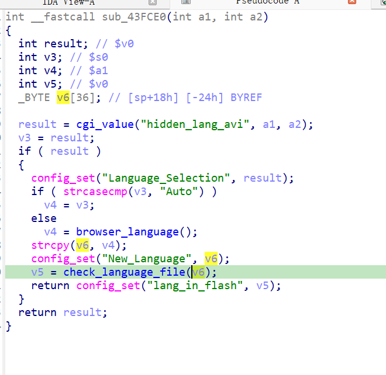
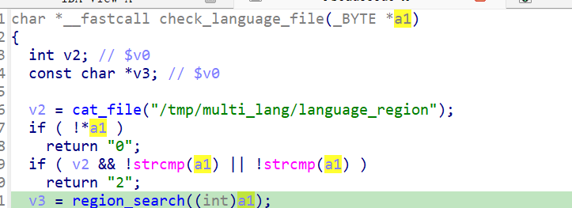
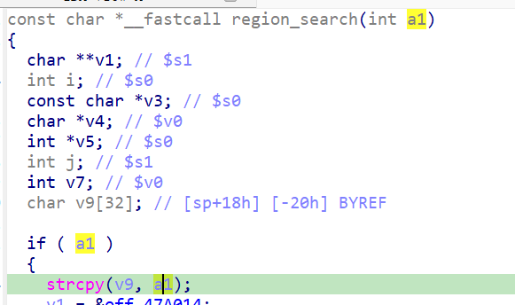

http://www.downloads.netgear.com/files/GDC/JNR3300/JNR3300-V1.0.0.34PR.zip

漏洞名称：
Netgear JNR3300 region_search 缓冲区溢出漏洞

Netgear JNR3300-1.0.0.34是Netgear旗下的一款路由器固件，受影响固件名称为JNR3300，受影响版本为1.0.0.34。

JNR3300_V1.0.0.34_10.0.17
Netgear JNR3300-1.0.0.34的/usr/sbin/uhttpd二进制文件中存在一个栈缓冲区溢出漏洞。远程攻击者可以通过语言切换请求提交超长hidden_lang_avi字段，覆盖region_search函数的返回地址并导致httpd进程崩溃。

该漏洞位于二进制文件usr/sbin/uhttpd中。请求首先通过submit_flag=select_language进入0x43fce0，程序读取hidden_lang_avi后不仅在本函数内进行了不安全复制，还会继续把该字段传给region_search。region_search在0x411f18处将其strcpy到sp+0x18处的固定栈缓冲区，而该函数的返回地址距离该缓冲区很近，最终被超长输入覆盖为0x32323232。

攻击者可以远程发起攻击，通过向/apply.cgi?change_multiPPPoE_status发送submit_flag=select_language的POST请求，并提供超长hidden_lang_avi字段来触发漏洞。

漏洞研究环境：

通过模拟仿真进行验证。当前附件中的环境是已经patch了认证环节之后的，未patch的环境可以用binwalk解压对应下载链接的固件得到。

通过greenhouse进行仿真，greenhouse链接为https://github.com/sefcom/greenhouse。仿真环境搭建的具体命令链接为https://github.com/sefcom/greenhouse/blob/master/MANUAL.md。
我在附件里面附上了rehost的镜像，链接为https://github.com/GinRawin/PoC/blob/main/0412PoC/jnr3300-1.0.0.34.zip/jnr3300-1.0.0.34.tar.gz，启动的命令为进入到dockerfile目录下，然后docker-compose build, docker-compose up。

目标配置情况：

没有进行特殊配置，默认仿真环境启动。

具体验证过程：

第一步。攻击者向/apply.cgi?change_multiPPPoE_status发送POST请求，设置submit_flag=select_language，使程序进入语言切换处理路径，并读取hidden_lang_avi字段。

第二步。程序随后将指向hidden_lang_avi字段内容的指针传给check_language_file函数，check_language_file函数又将指针传给region_search函数，region_search函数并在0x411f18处将超长hidden_lang_avi复制到固定栈缓冲区strcpy(v9, a1);。由于输入长度远超目标缓冲区容量，返回地址被字符'2'覆盖，最终导致/usr/sbin/uhttpd崩溃。

相关问题代码：

region_search
