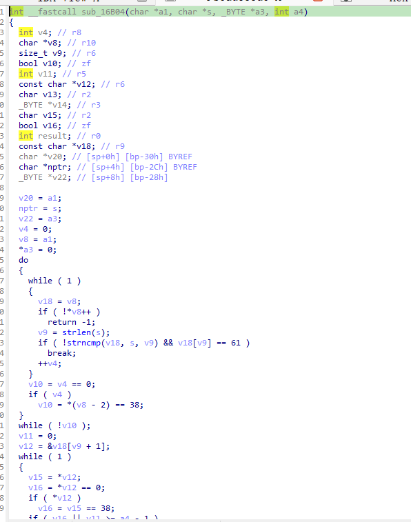
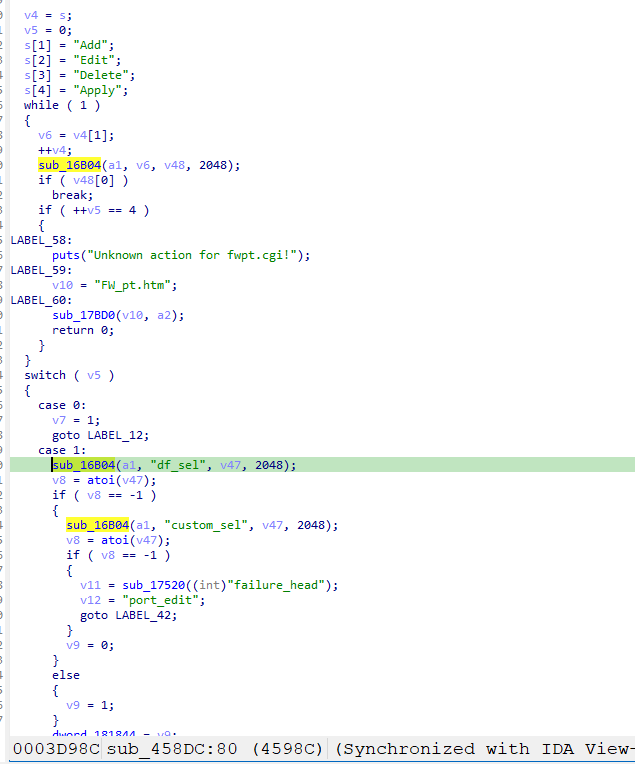
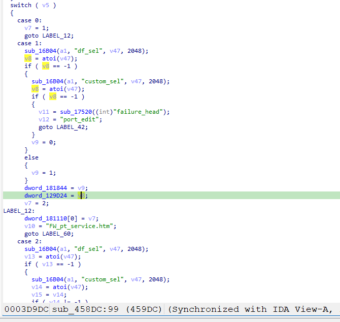
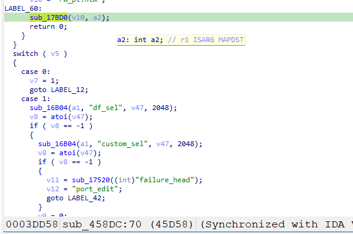
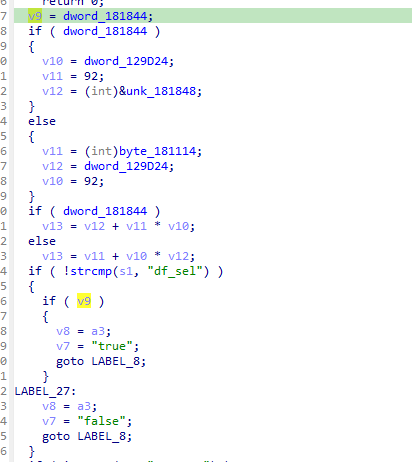
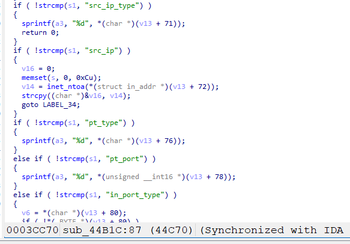

https://www.downloads.netgear.com/files/GDC/R6250/R6250-V1.0.4.48_10.1.30.zip

漏洞名称：
Netgear R6250 fwpt.cgi 参数 df_sel 越界访问漏洞

Netgear R6250-V1.0.4.48_10.1.30 是 Netgear 旗下的一款路由器固件，受影响固件名称为 R6250，受影响版本为 1.0.4.48_10.1.30。

R6250-V1.0.4.48_10.1.30
Netgear R6250 的 `/usr/sbin/httpd` 中存在一个由 `fwpt.cgi` 页面逻辑引起的越界访问漏洞。攻击者向 `/fwpt.cgi?bsw_dhcp.cgi` 发送一个带有超大 `df_sel` 值的 POST 请求后，程序会把该值当成规则索引保存下来。随后在渲染 `FW_pt_service.htm` 页面时，函数 `sub_44B1C` 会根据这个索引去计算规则结构体地址，并在读取 `src_ip_type` 字段时访问非法地址，最终导致 `httpd` 崩溃，造成拒绝服务。

该漏洞位于r6250固件的usr/sbin/httpd中，位于函数sub_458dc。

攻击者可以远程发起攻击，通过发送构造的恶意数据包触发漏洞。

漏洞研究环境：

通过模拟仿真进行验证。当前分析对象是 Netgear R6250 官方固件镜像，可通过上述官方下载链接获取。

通过 greenhouse 进行仿真，greenhouse 链接为 https://github.com/sefcom/greenhouse。仿真环境搭建的具体命令链接为 https://github.com/sefcom/greenhouse/blob/master/MANUAL.md。

目标配置情况：

没有进行特殊配置，默认仿真环境启动。

具体验证过程：

第一步。函数sub_16b04的作用是从字符串 a1 中查找s参数对应值，对值部分进行 URL 解码后存入缓冲区a3中，并限制往a3写入的大小为a4。发送的数据包请求的目标路径是 `/fwpt.cgi?bsw_dhcp.cgi`，请求体中包含 `Edit=7` 和 `df_sel=22222222`。 `sub_458DC` 会按 `"Add" -> "Edit" -> "Delete" -> "Apply"` 的顺序依次检查参数，于是v5的值为1，会进入 `case 1` 的编辑分支。
函数sub_16b04:

函数sub_458DC：

第二步。在 `sub_458DC` 的 `case 1` 中，程序调用 `sub_16B04(a1, "df_sel", v47, 2048)` 从 POST body 中取出 `df_sel`，随后执行 `atoi(v47)`。由于数据包里 `df_sel=22222222`，所以v8就是 `22222222`。
接下来代码会执行：

```c
dword_181844 = 1;
dword_129D24 = 22222222;
dword_181110[0] = 2;
sub_17BD0("FW_pt_service.htm", a2);
```


这几句的含义分别是：

1. `dword_181844 = 1`：表示当前选择的是默认规则表，对应后面使用 `dword_181848` 这块规则数组。
2. `dword_129D24 = 22222222`：把用户提供的 `df_sel` 直接保存成“当前选中的规则索引”。
3. `dword_181110[0] = 2`：把页面状态设置为“编辑模式”。
4. 跳转去渲染 `FW_pt_service.htm` 页面。

这里真正的根因是：代码只把 `-1` 当作“未选择”，却没有检查 `22222222` 这种值是否越界。

第三步。接着程序调用 `sub_17BD0("FW_pt_service.htm", a2)` 开始渲染 `FW_pt_service.htm` 页面。


这里可以把它理解成“进入页面模板渲染流程”。`sub_17BD0` 会把 `FW_pt_service.htm` 交给页面渲染函数 `sub_166C4` 处理，而 `sub_166C4` 在扫描页面内容时，会解析其中的模板占位符。例如在 `FW_pt_service.htm` 中存在如下内容：

```html
var src_ip_type = "<%1684%>";
```

当渲染器处理到 `<%1684%>` 时，会通过 ASP/模板分发逻辑把它解释成 `fw_cgi_pt_get_policy_param("src_ip_type")` 这一类取值请求，最终进入 `sub_44B1C`，此时传入的字段名 `s1` 就是 `"src_ip_type"`。

这一步很关键，因为崩溃不是在 `sub_458DC` 里立刻发生的，而是先进入页面渲染，再在渲染页面需要“读取当前规则的 src_ip_type 值”时触发的。

第四步。进入 `sub_44B1C` 之后，程序会根据之前保存在全局变量中的状态，决定去哪里取当前规则的数据。由于前一步已经设置了 `dword_181110[0] = 2`，所以这里会进入“编辑已有规则”的逻辑；又因为前一步设置了 `dword_181844 = 1`，表示当前选择的是默认规则表，所以代码实际会走下面这条分支：

```c
v9 = dword_181844;
if ( dword_181844 )
{
  v10 = dword_129D24;
  v11 = 92;
  v12 = (int)&dword_181848;
}
...
if ( dword_181844 )
  v13 = v12 + v11 * v10;
```

也就是说，`sub_44B1C` 会直接使用前面保存下来的 `dword_129D24` 作为规则索引，按 `规则基址 + 92 * 索引` 的方式计算当前规则记录地址：

```c
v13 = &dword_181848 + 92 * dword_129D24;
```

而 `dword_129D24` 的值正是攻击者通过数据包传入的 `22222222`，因此这里算出的结果就是：

```c
v13 = 0x181848 + 0x5c * 22222222 = 0x79f3d750
```

这个 `v13` 本来应该指向某一条合法的端口触发规则记录，但由于索引完全越界，它已经落到了一个非法地址上。
函数sub_44B1C:


第五步。`sub_44B1C` 在拿到这个非法的“规则地址”后，还会继续根据字段名返回对应内容。当字段名是 `"src_ip_type"` 时，执行的是下面这段代码：

```c
if ( !strcmp(s1, "src_ip_type") )
{
  sprintf(a3, "%d", *(char *)(v13 + 71));
  return 0;
}
```

由于此时 `v13 = 0x79f3d750`，所以这里实际读取的地址就是：

```c
v13 + 71 = 0x79f3d750 + 0x47 = 0x79f3d797
```

最终导致读取非法地址程序崩溃。

相关问题代码：

sub_458DC
