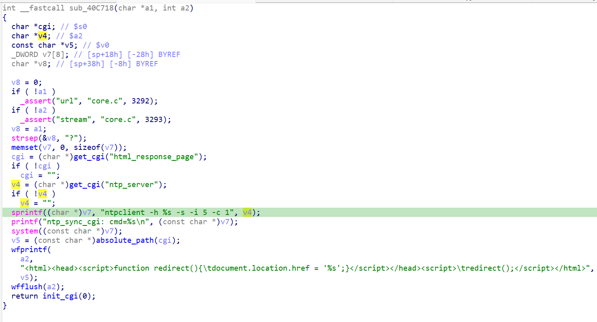

https://www.trendnet.com/support/support-detail.asp?prod=160_TEW-632BRP

漏洞名称：
Trendnet TEW-632BRP 0x40c718 栈缓冲区溢出漏洞

Trendnet TEW-632BRP是Trendnet公司旗下的一款路由器固件，受影响固件名称为TEW-632BRP，受影响版本为1.010b32。

tew-632brp-1.010b32
Trendnet TEW-632BRP的/sbin/httpd二进制文件中存在一个栈缓冲区溢出漏洞。远程攻击者可以通过向/ntp_sync.cgi*发送构造的POST请求，传入过长的ntp_server参数，在NTP同步处理流程中覆盖栈上缓冲区并导致httpd进程崩溃，从而造成拒绝服务。

该漏洞位于二进制文件/sbin/httpd中，在ntp_sync.cgi*对应的处理分支内，程序会在0x40c7fc处读取ntp_server参数，并在0x40c82c处使用sprintf将其写入固定大小的栈缓冲区。由于这里没有进行长度校验，超长输入会覆盖返回现场并最终触发SIGSEGV。

攻击者可以远程发起攻击，通过向/ntp_sync.cgi*发送POST请求，并提交超长的ntp_server参数来触发漏洞。

漏洞研究环境：

通过模拟仿真进行验证。当前附件中的环境是已经patch了认证环节之后的，未patch的环境可以用binwalk解压对应下载链接的固件得到。

通过greenhouse进行仿真，greenhouse链接为https://github.com/sefcom/greenhouse。仿真环境搭建的具体命令链接为https://github.com/sefcom/greenhouse/blob/master/MANUAL.md。
我在附件里面附上了rehost的镜像，链接为https://github.com/GinRawin/PoC/blob/main/0412PoC/tew-632brp-1.010b32.zip/tew-632brp-1.010b32.tar.gz，启动的命令为进入到dockerfile目录下，然后docker-compose build, docker-compose up。

目标配置情况：

没有进行特殊配置，默认仿真环境启动。

具体验证过程：

第一步。攻击者向/ntp_sync.cgi*发送POST请求，提交超长的ntp_server参数，使程序进入NTP同步处理分支。

第二步。该分支在0x40c7fc处读取ntp_server参数，并在0x40c82c处通过sprintf将其拼接到栈上的命令缓冲区中。由于写入过程没有长度限制，超长数据会覆盖栈内存并在后续流程中触发崩溃，最终导致httpd进程发生SIGSEGV。

相关问题代码：

0x40c718
