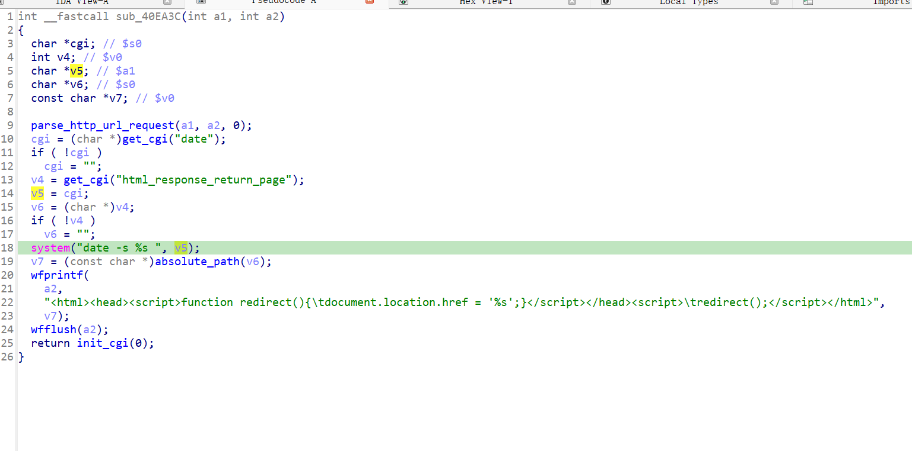

https://www.trendnet.com/langen/support/support-detail.asp?prod=150_TEW-652BRP

漏洞名称：
Trendnet TEW-652BRP 0x40ea3c 命令注入漏洞

Trendnet TEW-652BRP是Trendnet公司旗下的一款路由器固件，受影响固件名称为TEW-652BRP，受影响版本为1.10.29。

tew-652brp-1.10.29
Trendnet TEW-652BRP的/sbin/httpd二进制文件中存在一个命令注入漏洞。远程攻击者可以通过向/system_time.cgi*发送构造的POST请求，控制date参数内容，使其未经转义直接进入_system("date -s %s ", date)执行流程，最终通过/bin/sh -c执行，从而造成任意命令执行风险。

该漏洞位于二进制文件/sbin/httpd中，在0x40ea3c函数处理system_time.cgi*请求的分支内，程序会在0x40ea78处调用get_cgi("date")读取用户提交的date参数，并在0x40eadc处调用_system执行前面拼接得到的命令。由于用户可控的date参数在进入shell前没有经过过滤或转义，攻击者可以构造恶意输入触发命令注入。结合当前样本的trace可知，本次真实命中的漏洞位置是0x40ea3c分支中的0x40eadc

攻击者可以远程发起攻击，通过向/system_time.cgi*发送POST请求，并在date参数中插入恶意命令内容来触发漏洞。

漏洞研究环境：

通过模拟仿真进行验证。当前附件中的环境是已经patch了认证环节之后的，未patch的环境可以用binwalk解压对应下载链接的固件得到。

通过greenhouse进行仿真，greenhouse链接为https://github.com/sefcom/greenhouse。仿真环境搭建的具体命令链接为https://github.com/sefcom/greenhouse/blob/master/MANUAL.md。
我在附件里面附上了patch后的rehost镜像，链接为https://github.com/GinRawin/PoC/blob/main/0412PoC/tew-652brp-1.10.29.zip/tew-652brp-1.10.29.tar.gz，启动的命令为进入到dockerfile目录下，然后docker-compose build, docker-compose up。

目标配置情况：

没有进行特殊配置，默认仿真环境启动。

具体验证过程：

第一步。攻击者向/system_time.cgi*发送POST请求，提交date参数，使程序进入0x40ea3c中的system_time.cgi*处理分支。

第二步。该分支在0x40ea78处调用get_cgi("date")读取用户输入，并在后续流程中将其作为参数传入date -s %s 格式串，再由0x40eadc处的_system调用执行。由于输入内容未经过过滤，用户可控数据会进入/bin/sh -c执行路径，从而触发命令注入风险。

相关问题代码：

0x40ea3c
