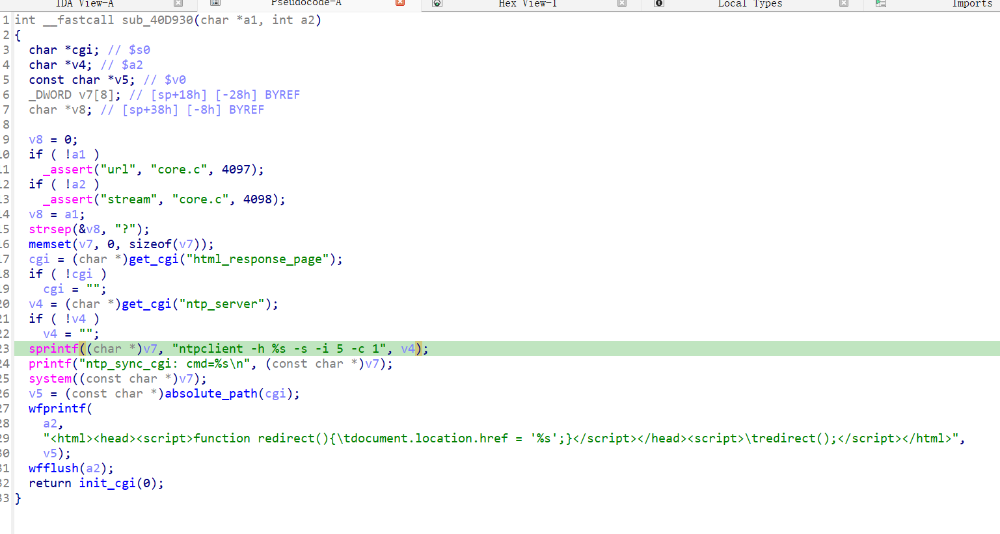

https://www.trendnet.com/support/support-detail.asp?prod=160_TEW-673GRU

漏洞名称：
Trendnet TEW-673GRU 0x40d930 栈缓冲区溢出漏洞

Trendnet TEW-673GRU 1.00B40是Trendnet公司旗下的一款路由器固件，受影响产品为TEW-673GRU，受影响版本为1.00B40。

Trendnet TEW-673GRU 1.00B40的/sbin/httpd二进制文件中存在一个栈缓冲区溢出漏洞。远程攻击者可以通过向/ntp_sync.cgi*发送构造的POST请求，提供超长ntp_server参数，触发sprintf向栈上固定缓冲区写入过长数据，最终导致httpd进程崩溃，造成拒绝服务。

该漏洞位于二进制文件/sbin/httpd中，在do_apply_post函数的NTP同步处理分支内，程序在0x40da14处读取ntp_server参数，在0x40da44处通过sprintf将用户输入拼接进ntpclient -h %s -s -i 5 -c 1命令字符串并写入栈缓冲区。由于这里没有进行长度检查，超长输入会覆盖栈上的保存寄存器和返回地址，最终在后续执行过程中触发崩溃。

攻击者可以远程发起攻击，通过向/ntp_sync.cgi*发送包含超长ntp_server参数的POST请求触发漏洞。

漏洞研究环境：

通过模拟仿真进行验证。当前附件中提供了对应的rehost环境，原始固件可通过上述下载链接获取。

通过greenhouse进行仿真，greenhouse链接为https://github.com/sefcom/greenhouse。仿真环境搭建的具体命令链接为https://github.com/sefcom/greenhouse/blob/master/MANUAL.md。
我在附件里面附上了rehost的镜像，链接为https://github.com/GinRawin/PoC/blob/main/0412PoC/tew-673gru-1.00b40.zip/tew-673gru-1.00b40.tar.gz，启动的命令为进入到dockerfile目录下，然后docker-compose build, docker-compose up。

目标配置情况：

没有进行特殊配置，默认仿真环境启动。

具体验证过程：

第一步。攻击者向/ntp_sync.cgi*发送POST请求，请求中携带超长ntp_server参数，使程序进入NTP同步处理分支。

第二步。程序在0x40da14处读取ntp_server参数内容，并在0x40da44处通过sprintf将其拼接到ntpclient -h %s -s -i 5 -c 1命令模板中，写入栈上的固定缓冲区。

第三步。由于写入数据长度超出缓冲区容量，栈上的关键控制数据被覆盖，程序在后续执行和返回过程中触发崩溃。

相关问题代码：

0x40d930
