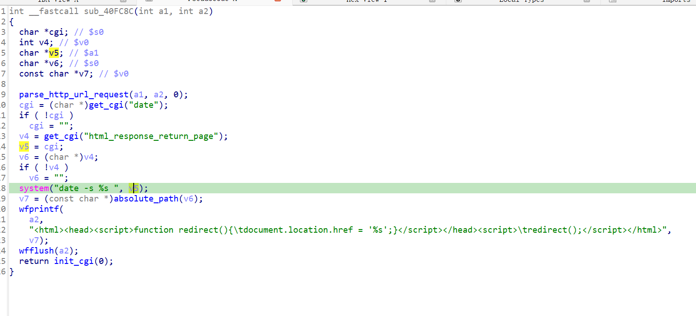

https://www.trendnet.com/support/support-detail.asp?prod=160_TEW-673GRU

漏洞名称：
Trendnet TEW-673GRU 0x40fc80 命令注入漏洞

Trendnet TEW-673GRU 1.00B40是Trendnet公司旗下的一款路由器固件，受影响产品为TEW-673GRU，受影响版本为1.00B40。

Trendnet TEW-673GRU 1.00B40的/sbin/httpd二进制文件中存在一个命令注入漏洞。远程攻击者可以通过向/system_time.cgi*发送构造的POST请求，控制date参数内容，使其进入date -s %s 命令模板并被/bin/sh -c执行，从而造成任意命令执行。

该漏洞位于二进制文件/sbin/httpd中，在do_apply_post函数的系统时间处理分支内，程序在0x40fcd0处读取date参数，在0x40fd2c处直接调用_system("date -s %s ", date)执行命令。由于用户输入在进入shell前没有经过有效过滤，攻击者可以构造恶意date参数触发命令注入。

攻击者可以远程发起攻击，通过向/system_time.cgi*发送包含恶意date参数的POST请求触发漏洞。

漏洞研究环境：

通过模拟仿真进行验证。当前附件中提供了对应的rehost环境，原始固件可通过上述下载链接获取。

通过greenhouse进行仿真，greenhouse链接为https://github.com/sefcom/greenhouse。仿真环境搭建的具体命令链接为https://github.com/sefcom/greenhouse/blob/master/MANUAL.md。
我在附件里面附上了rehost的镜像，链接为https://github.com/GinRawin/PoC/blob/main/0412PoC/tew-673gru-1.00b40.zip/tew-673gru-1.00b40.tar.gz，启动的命令为进入到dockerfile目录下，然后docker-compose build, docker-compose up。

目标配置情况：

没有进行特殊配置，默认仿真环境启动。

具体验证过程：

第一步。攻击者向/system_time.cgi*发送POST请求，请求中携带date参数，使程序进入系统时间设置处理分支。

第二步。程序在0x40fcd0处读取date参数内容，并将其作为格式化参数传入date -s %s 命令模板。

第三步。程序在0x40fd2c处调用_system执行拼接后的命令，请求参数最终经/bin/sh -c解释执行，造成命令注入。

相关问题代码：

0x40fc80
