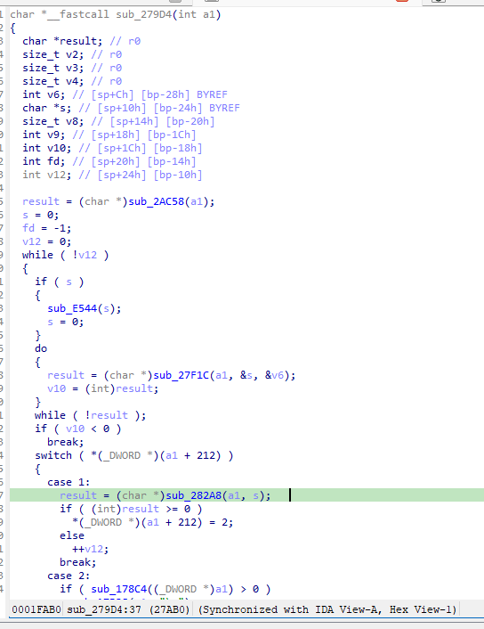
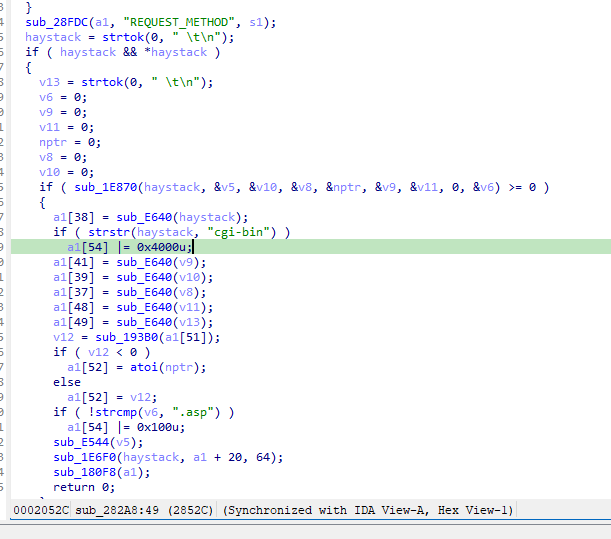
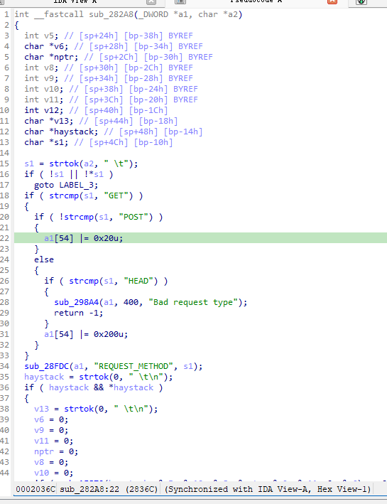
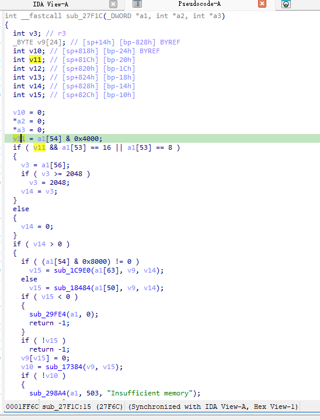
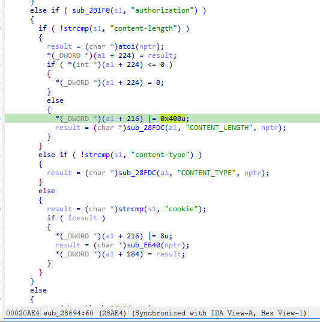
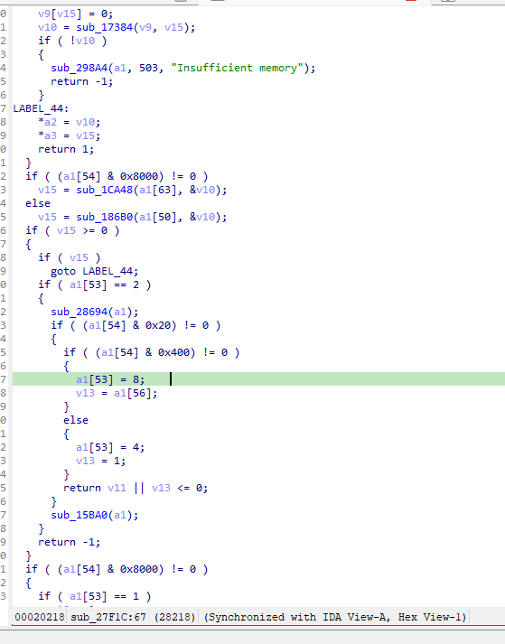
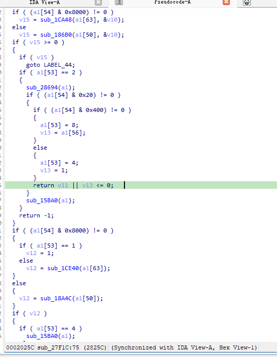
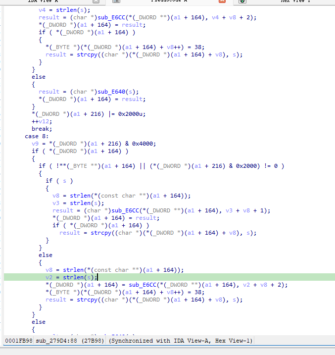

https://github.com/GinRawin/PoC/blob/main/0412PoC/us-ac500v1br-v1.0.0.14-en-td.zip/IMG_US_AC500V1BR_V1.0.0.14_en_TD.rar

漏洞名称：
Tenda AC500 0x279d4 空指针解引用漏洞

Tenda AC500是Tenda公司旗下的一款路由器固件，受影响固件名称为us-ac500v1br-v1.0.0.14-en-td，受影响版本为V1.0.0.14。

us-ac500v1br-v1.0.0.14-en-td
Tenda AC500的/bin/httpd二进制文件中存在一个空指针解引用漏洞。远程攻击者可以通过发送构造的POST请求触发HTTP请求解析状态机异常，在请求头解析结束后使程序进入错误分支，并在后续对空指针执行strlen，从而导致httpd进程崩溃，造成拒绝服务。

该漏洞位于二进制文件/bin/httpd中，关键调用链为sub_279D4 -> sub_27F1C -> sub_282A8 -> sub_27F1C -> sub_28694 -> sub_279D4(case 8)。在处理POST请求并解析到包含cgi-bin和Content-Length的特定请求后，程序没有正确填充新的请求体指针s，并且缺乏对s是否为空指针的见擦汗。之后sub_279D4在case 8分支的0x27b70处执行v2 = strlen(s)触发SIGSEGV。

攻击者可以远程发起攻击，通过向//index.asp?/cgi-bin发送构造的POST请求来触发漏洞。

漏洞研究环境：

通过模拟仿真进行验证。当前附件中的环境是已经patch了认证环节之后的，未patch的环境可以通过上述下载链接获取对应固件。

通过greenhouse进行仿真，greenhouse链接为https://github.com/sefcom/greenhouse。仿真环境搭建的具体命令链接为https://github.com/sefcom/greenhouse/blob/master/MANUAL.md。
我在附件里面附上了rehost的镜像，链接为https://github.com/GinRawin/PoC/blob/main/0412PoC/us-ac500v1br-v1.0.0.14-en-td.zip/us-ac500v1br-v1.0.0.14-en-td.tar.gz，启动的命令为进入到dockerfile目录下，然后docker-compose build, docker-compose up。

目标配置情况：

没有进行特殊配置，默认仿真环境启动。

具体验证过程：

第一步。攻击者向//index.asp?/cgi-bin发送POST请求，请求中包含Content-Length和请求体数据，使程序进入函数sub_279d4。

第二步。进入sub_279d4的while循环，进入sub_279d4的case 1分支，程序首先在sub_282A8中解析请求行，识别到URI中的cgi-bin标志后设置a1[54] |= 0x4000，a1[54] |= 0x20u，a1[41]指向"/cgi-bin"。sub_279d4设置a1[53]为2，数据包读取了第一行。

第三步。回到sub_279d4的while循环，在第二次调用函数sub_27F1C时，由于第二步中设置a1[54] |= 0x4000，因此v11=1。

sub_27F1c中调用sub_28694解析Content-Length，设置了a1[56] (即(a1+224))的值，且a1[54] |= 0x400u。

因此在sub_27F1C中，a1[54] &= 0x400u和a1[54] &= 0x20u都不是0，将a1[53]设置为8，在清空了指针s又没有填充s的情况下返回1.

第三步。sub_279D4回到case 8分支后继续使用该空指针s，由于a1[41][0]不是空字符且a1[54]的0x2000位置只有case 4或case 8结束后才可能设置为1，因此程序进入0x27b70处执行v2 = strlen(s)，最终触发空指针解引用并导致httpd进程崩溃。

相关问题代码：

sub_279D4
