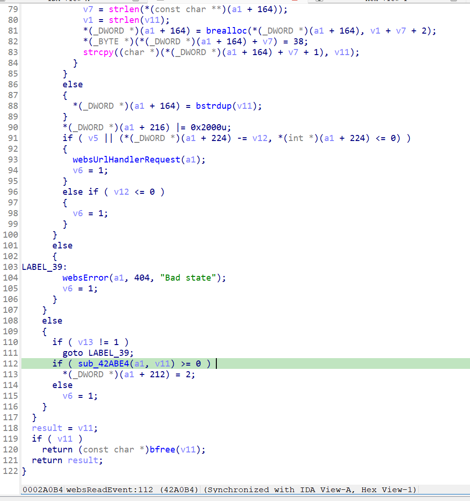
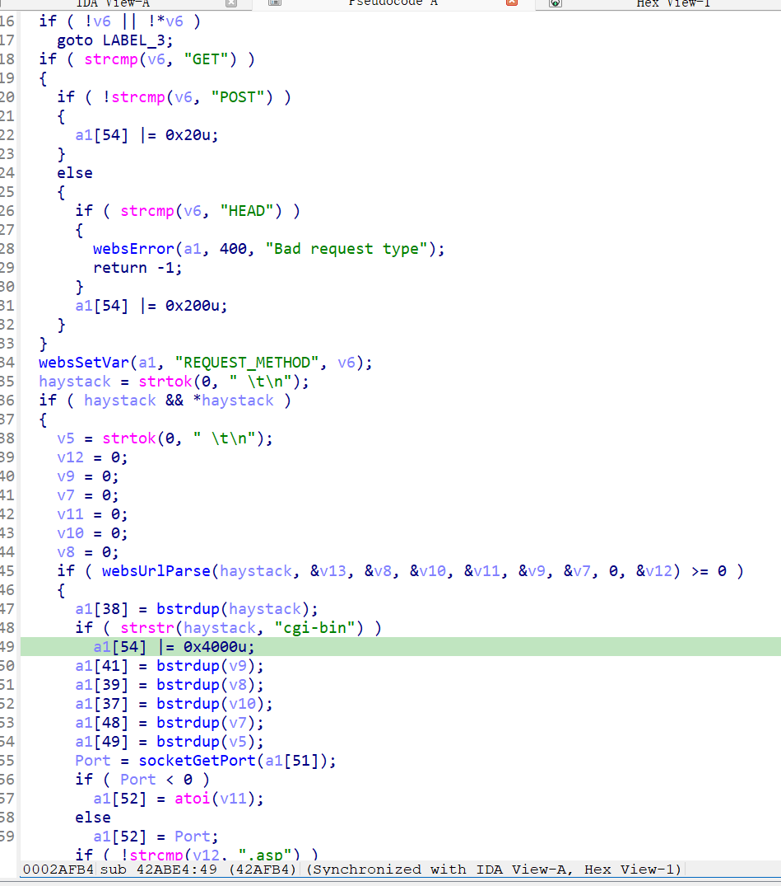
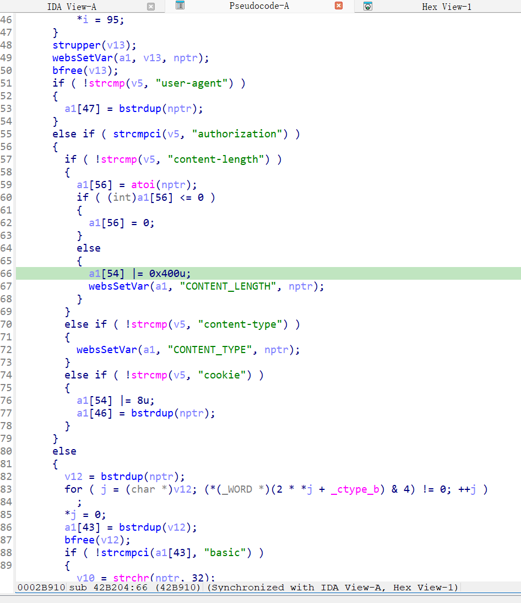
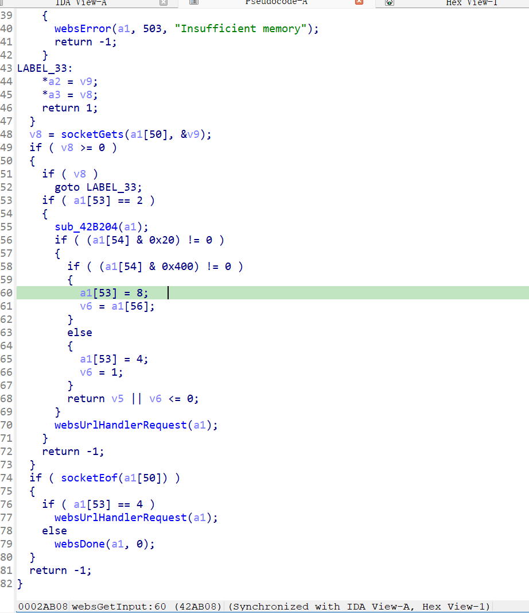
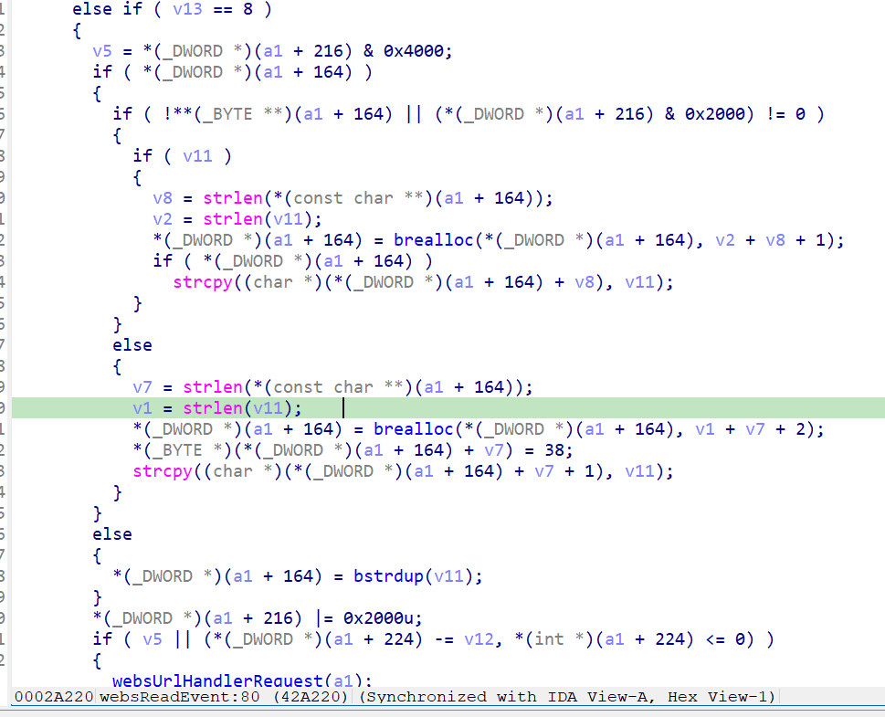

https://www.tendacn.com/material/show/103466

漏洞名称：
Tenda AP5 websReadEvent 空指针解引用漏洞

Tenda AP5是Tenda公司旗下的一款无线接入点设备，受影响固件名称为us-ap5v1.0br-v1.0.0.9-2224-en-tde01，受影响版本为V1.0.0.9(2224)。

us-ap5v1.0br-v1.0.0.9-2224-en-tde01
Tenda AP5的/bin/httpd二进制文件中存在一个空指针解引用漏洞。远程攻击者可以通过发送构造的POST请求触发HTTP请求解析状态机异常，在请求头解析结束后使程序进入`websReadEvent`的case 8分支，并在后续对空指针执行`strlen`，从而导致httpd进程崩溃，造成拒绝服务。

该漏洞位于二进制文件/bin/httpd中，关键调用链可概括为`websReadEvent -> sub_42ABE4 -> websReadEvent -> websGetInput -> sub_42B204 -> websGetInput -> websReadEvent(case 8)`。在处理包含`/cgi-bin`和`Content-Length`的POST请求时，`websGetInput`会在请求头解析结束后直接返回1，但没有为新的请求体缓冲区写入有效指针，导致`websReadEvent`在case 8分支的0x42a214处执行`strlen(v11)`时触发SIGSEGV。

攻击者可以远程发起攻击，通过向`//webroot?/cgi-bin`发送构造的POST请求来触发漏洞。

漏洞研究环境：

通过模拟仿真进行验证。当前附件中的环境是已经patch了认证环节之后的，未patch的环境可以用binwalk解压对应下载链接的固件得到。

通过greenhouse进行仿真，greenhouse链接为https://github.com/sefcom/greenhouse。仿真环境搭建的具体命令链接为https://github.com/sefcom/greenhouse/blob/master/MANUAL.md。
我在附件里面附上了rehost的镜像，链接为https://github.com/GinRawin/PoC/blob/main/0412PoC/us-ap5v1.0br-v1.0.0.9-2224-en-tde01.zip/us-ap5v1.0br-v1.0.0.9-2224-en-tde01.tar.gz，启动的命令为进入到dockerfile目录下，然后docker-compose build, docker-compose up。

目标配置情况：

没有进行特殊配置，默认仿真环境启动。

具体验证过程：

第一步。攻击者向`//webroot?/cgi-bin`发送POST请求，请求中包含`Content-Length`和请求体数据，使程序进入`websReadEvent`。

第二步。`websReadEvent`首先调用`sub_42ABE4(a1, v11)`解析HTTP请求行。`sub_42ABE4`在识别URI中的`cgi-bin`后会设置CGI处理相关标志，使后续`websGetInput`满足`v5 = a1[54] & 0x4000`以及`(a1[54] & 0x20) != 0`的条件。随后`websReadEvent`将状态`a1[53]`(即v13)推进到2，等待继续解析请求头。



第三步。回到`websReadEvent`的while循环后，程序再次调用`websGetInput`读取后续数据。当`socketGets`读到HTTP头部结束的空行时，`websGetInput`进入`a1[53] == 2`分支并调用`sub_42B204(a1)`解析已缓存的请求头。

在`sub_42B204`中，程序会逐项处理头字段；当匹配到`content-length`时，会执行`a1[56] = atoi(nptr)`，并设置`a1[54] |= 0x400u`。这样一来，`websGetInput`随后命中：

```c
if ( (a1[54] & 0x20) != 0 )
{
    if ( (a1[54] & 0x400) != 0 )
    {
        a1[53] = 8;
        v6 = a1[56];
    }
    else
    {
        a1[53] = 4;
        v6 = 1;
    }
    return v5 || v6 <= 0;
}
```

由于前面请求行解析已经使`v5 = a1[54] & 0x4000`非零，因此这里即使请求体尚未真正读入，也会直接返回1。需要注意的是，`websGetInput`函数开头先执行了`*a2 = 0; *a3 = 0;`，而这个返回路径没有重新给`*a2`写入有效请求体指针，因此返回到`websReadEvent`时，`v11`仍然为NULL，`v12`仍然为0。




第四步。`websReadEvent`收到`Input == 1`后继续执行，此时当前状态已经是8，于是进入case 8分支：


在这里，`*(_DWORD *)(a1 + 164)`已经由前序流程设置为非空字符串，且`(*(_DWORD *)(a1 + 216) & 0x2000) == 0`，因此程序会落入`else`分支，在0x42a214处执行`v1 = strlen(v11)`。由于上一步返回时`v11 == NULL`，这里最终触发空指针解引用并导致httpd进程崩溃。正常情况下程序本应继续读取请求体并在后续调用`websUrlHandlerRequest`，但在该异常状态转换下，崩溃先于正常处理逻辑发生。


相关问题代码：

`websReadEvent`
