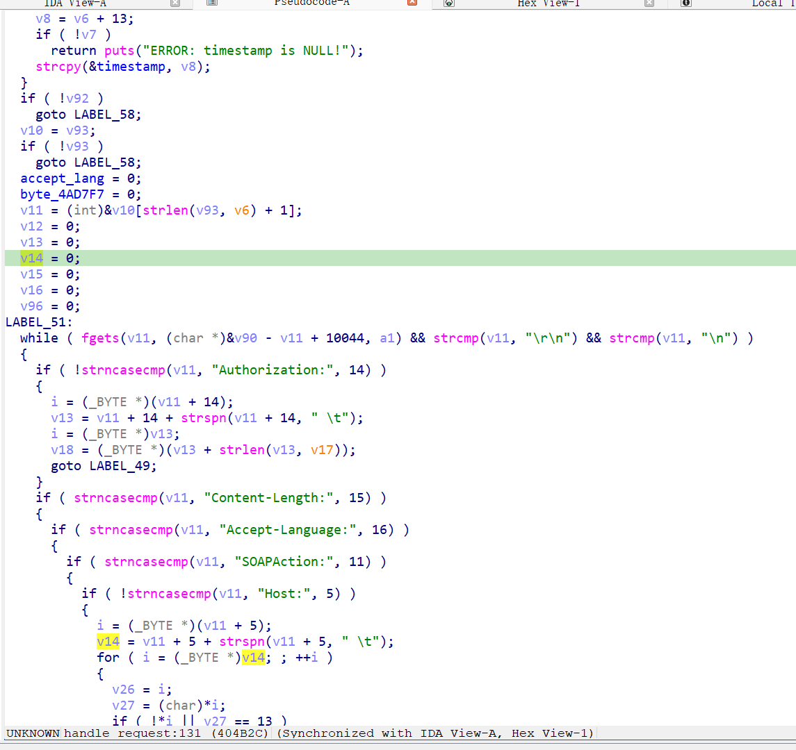
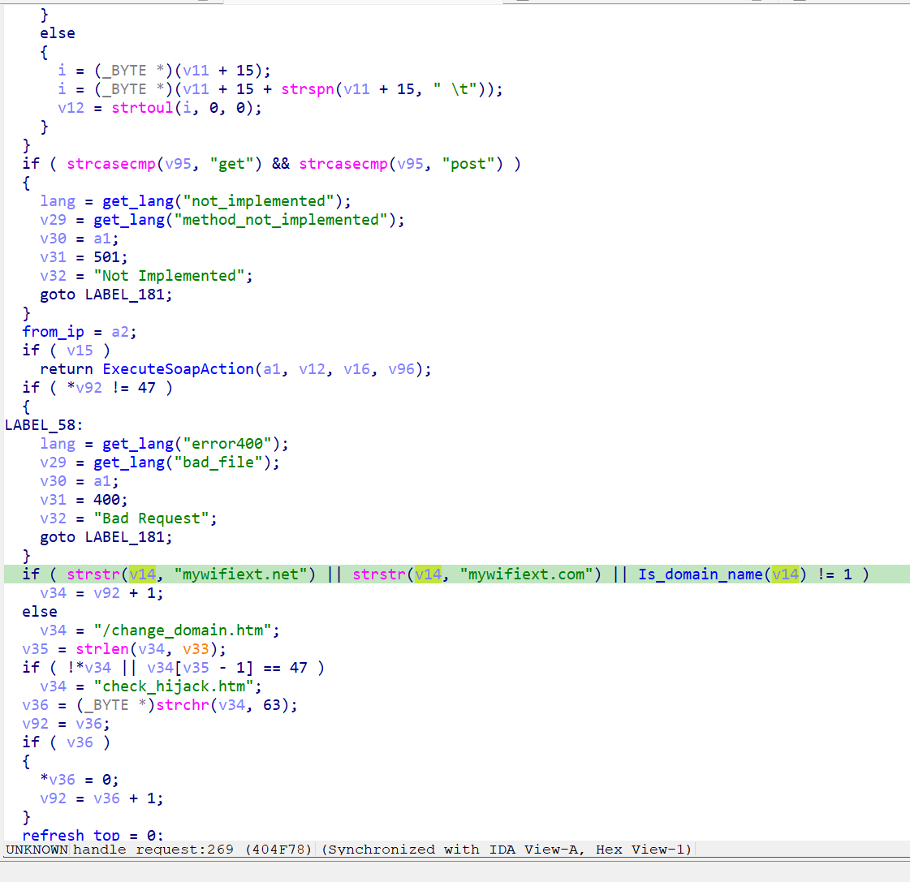

https://www.downloads.netgear.com/files/GDC/WNCE4004/WNCE4004-V1.0.0.22.zip

漏洞名称：
Netgear WNCE4004 handle_request 空指针解引用漏洞

Netgear WNCE4004 1.0.0.22是netgear公司旗下的一款无线网桥固件，受影响产品为WNCE4004，受影响版本为1.0.0.22。

Netgear WNCE4004 1.0.0.22的/usr/sbin/uhttpd二进制文件中存在一个空指针解引用漏洞。远程攻击者可以通过发送构造的GET请求，并在请求中省略Host请求头，触发HTTP请求处理流程中的空指针解引用，最终导致uhttpd进程崩溃，从而造成拒绝服务。

该漏洞位于二进制文件/usr/sbin/uhttpd中，在handle_request函数内，程序在解析绝对路径请求时会检查Host头内容。在本次触发路径中，请求URL为/WLG_adv.htm，但请求头中缺少Host字段，导致保存Host值的指针保持为NULL。随后程序在0x404f74处调用strstr对该空指针进行匹配判断，最终触发SIGSEGV。

攻击者可以远程发起攻击，通过向/WLG_adv.htm发送不带Host请求头的恶意GET请求触发漏洞。

漏洞研究环境：

通过模拟仿真进行验证。当前附件中的环境是已经patch了认证环节之后的，未patch的环境可以通过上述下载链接获取对应固件。

通过greenhouse进行仿真，greenhouse链接为https://github.com/sefcom/greenhouse。仿真环境搭建的具体命令链接为https://github.com/sefcom/greenhouse/blob/master/MANUAL.md。
我在附件里面附上了rehost的镜像，链接为https://github.com/GinRawin/PoC/blob/main/0412PoC/wnce4004-1.0.0.22.zip/wnce4004-1.0.0.22.tar.gz，启动的命令为进入到dockerfile目录下，然后docker-compose build, docker-compose up。

目标配置情况：

没有进行特殊配置，默认仿真环境启动。

具体验证过程：

第一步。攻击者向/WLG_adv.htm发送GET请求，请求中不包含Host请求头，使程序进入对应的HTTP请求处理流程。

第二步。程序在handle_request函数中解析请求首行和后续请求头，并尝试查找Host字段。由于当前请求中没有Host头，相关指针保持为NULL。

第三步。程序在0x404f74处调用strstr对该空指针进行字符串匹配判断，最终触发空指针解引用并导致uhttpd进程崩溃。

相关问题代码：

handle_request
