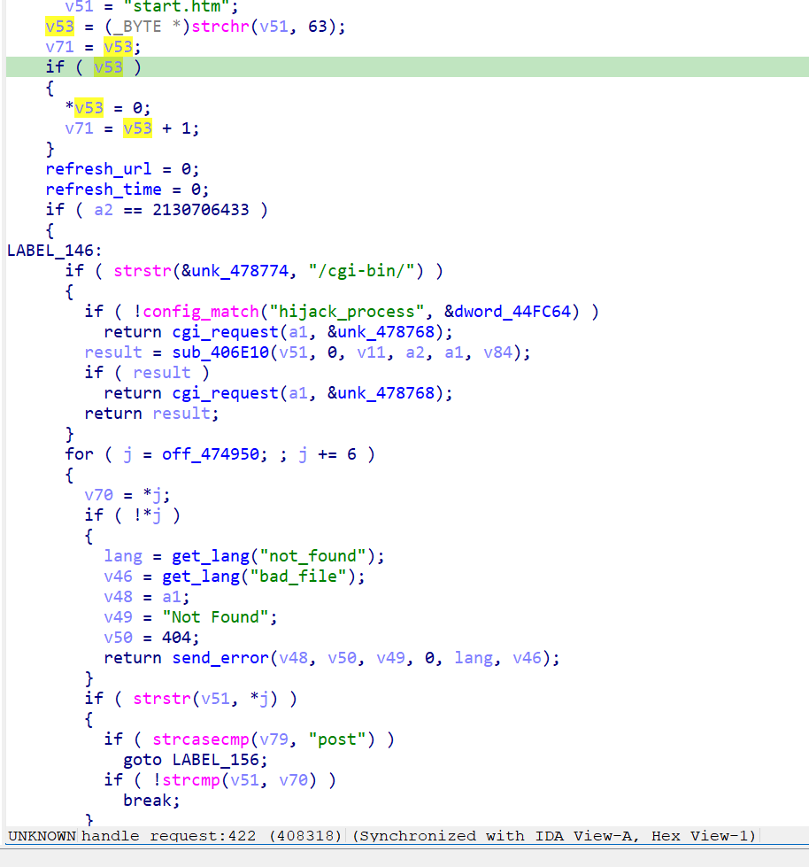
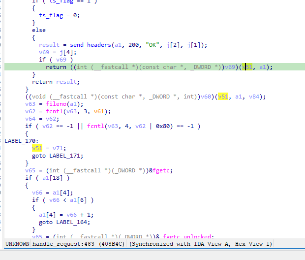
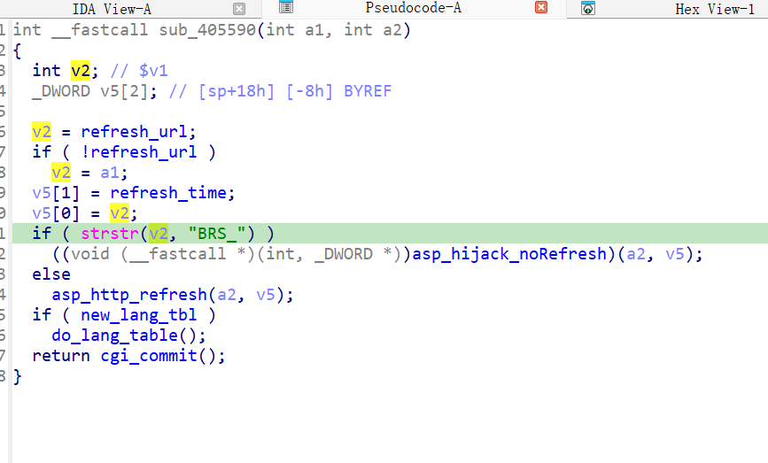

漏洞名称：
Netgear WNR2500 0x405590 空指针解引用漏洞

Netgear WNR2500是Netgear公司旗下的一款路由器固件，受影响固件名称为WNR2500，受影响版本为1.0.0.24。

wnr2500-1.0.0.24
Netgear WNR2500的/usr/sbin/uhttpd二进制文件中存在一个空指针解引用漏洞。远程攻击者可以通过向/apply.cgi发送构造的POST请求，并在后续对空指针执行字符串搜索操作，从而导致uhttpd进程崩溃，造成拒绝服务。

该漏洞位于二进制文件/usr/sbin/uhttpd中。在处理/apply.cgi请求时，程序会先清空全局refresh_url，随后没有正确恢复该字段。同时，本次请求URL中又不包含问号后的备用跳转字符串，导致返回阶段在0x4055d4处调用strstr时使用了空指针，最终触发SIGSEGV。

攻击者可以远程发起攻击，通过向/apply.cgi发送POST请求来触发漏洞。

漏洞研究环境：

通过模拟仿真进行验证。当前附件中的环境是已经patch了认证环节之后的，未patch的环境可以用binwalk解压对应下载链接的固件得到。
原始固件链接为：https://github.com/GinRawin/PoC/blob/main/0412PoC/wnr2500-1.0.0.24.zip/IMG_wnr2500-1.0.0.24.zip

通过greenhouse进行仿真，greenhouse链接为https://github.com/sefcom/greenhouse。仿真环境搭建的具体命令链接为https://github.com/sefcom/greenhouse/blob/master/MANUAL.md。
我在附件里面附上了rehost的镜像，链接为https://github.com/GinRawin/PoC/blob/main/0412PoC/wnr2500-1.0.0.24.zip/wnr2500-1.0.0.24.tar.gz，启动的命令为进入到dockerfile目录下，然后docker-compose build, docker-compose up。

目标配置情况：

没有进行特殊配置，默认仿真环境启动。

具体验证过程：

第一步。攻击者向/apply.cgi发送POST请求，使程序进入handle_request函数,由于URL中没有?，因此备用刷新字符串v71是空指针。

第二步。由于数据包submit_flag的值并没有匹配到对应处理逻辑，因此请求URL本身也没有进入能够提供可用的备用跳转字符串的处理逻辑。在handle_request函数的返回阶段，将v51赋值为v71，再调用apply.cgi对应的刷新函数0x405590，将v51作为备用跳转字符串传入，而后程序检测到refresh_url为空，于是赋值v2为传入的v51，在0x4055d4处调用strstr时对空指针进行解引用，最终触发崩溃。

相关问题代码：

0x405590
