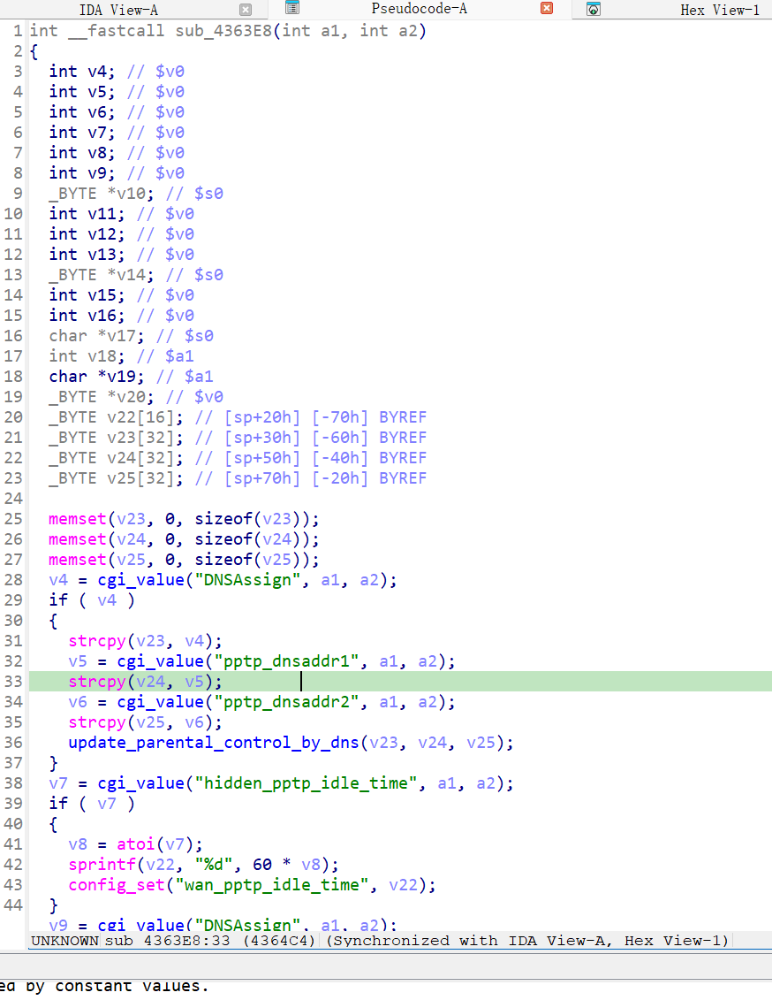

漏洞名称：
Netgear WNR2500 0x4364e8 空指针解引用漏洞

Netgear WNR2500是Netgear公司旗下的一款路由器固件，受影响固件名称为WNR2500，受影响版本为1.0.0.24。

wnr2500-1.0.0.24
Netgear WNR2500的/usr/sbin/uhttpd二进制文件中存在一个空指针解引用漏洞。远程攻击者可以通过向/apply.cgi?currentsetting.htm发送构造的POST请求，在PPTP配置处理流程中省略pptp_dnsaddr1参数，使程序在后续复制字符串时对空指针进行解引用，从而导致uhttpd进程崩溃，造成拒绝服务。

该漏洞位于二进制文件/usr/sbin/uhttpd中。在submit_flag=pptp对应的处理分支内，程序会先读取DNSAssign参数，随后在0x4364b0处读取pptp_dnsaddr1参数。当该字段缺失时，cgi_value返回NULL，但代码仍在0x4364c4处调用strcpy进行复制，最终触发SIGSEGV。

攻击者可以远程发起攻击，通过向/apply.cgi?currentsetting.htm发送POST请求，并省略pptp_dnsaddr1参数来触发漏洞。

漏洞研究环境：

通过模拟仿真进行验证。当前附件中的环境是已经patch了认证环节之后的，未patch的环境可以用binwalk解压对应下载链接的固件得到。
原始固件链接为：https://github.com/GinRawin/PoC/blob/main/0412PoC/wnr2500-1.0.0.24.zip/IMG_wnr2500-1.0.0.24.zip

通过greenhouse进行仿真，greenhouse链接为https://github.com/sefcom/greenhouse。仿真环境搭建的具体命令链接为https://github.com/sefcom/greenhouse/blob/master/MANUAL.md。
我在附件里面附上了rehost的镜像，链接为https://github.com/GinRawin/PoC/blob/main/0412PoC/wnr2500-1.0.0.24.zip/wnr2500-1.0.0.24.tar.gz，启动的命令为进入到dockerfile目录下，然后docker-compose build, docker-compose up。

目标配置情况：

没有进行特殊配置，默认仿真环境启动。

具体验证过程：

第一步。攻击者向/apply.cgi?currentsetting.htm发送POST请求，提交submit_flag=pptp，使程序进入PPTP配置处理分支sub_4363e8。

第二步。该分支在前面读取DNSAssign后，会继续在0x4364b0处读取pptp_dnsaddr1参数。由于当前请求中缺少该字段，返回值为NULL，但程序仍在0x4364c4处调用strcpy复制该指针内容，最终触发崩溃。

相关问题代码：

0x4364e8
