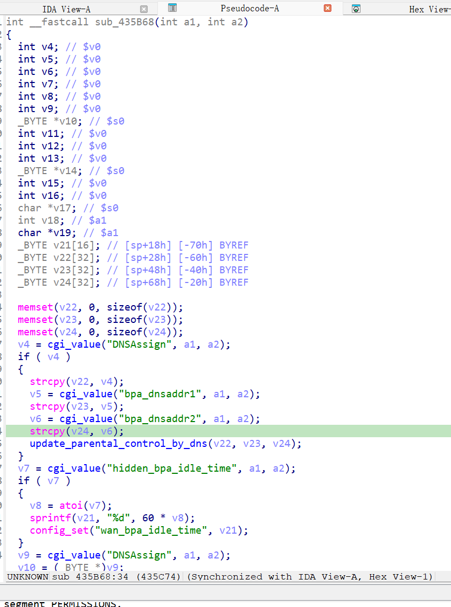

漏洞名称：
Netgear WNR2500 0x435b68 栈缓冲区溢出漏洞

Netgear WNR2500是Netgear公司旗下的一款路由器固件，受影响固件名称为WNR2500，受影响版本为1.0.0.24。

wnr2500-1.0.0.24
Netgear WNR2500的/usr/sbin/uhttpd二进制文件中存在一个栈缓冲区溢出漏洞。远程攻击者可以通过向/apply.cgi?ﾌﾇ发送构造的POST请求，传入超长的bpa_dnsaddr2参数，在BPA配置处理流程中覆盖局部内存并导致程序崩溃，从而造成拒绝服务。

该漏洞位于二进制文件/usr/sbin/uhttpd中。在submit_flag=bpa对应的处理分支内，程序会在0x435c60处读取bpa_dnsaddr2参数，并在0x435c74处使用strcpy将其复制到局部缓冲区。由于这里没有进行长度校验，超长输入会破坏后续使用的局部状态，并在随后的处理过程中触发SIGSEGV。

攻击者可以远程发起攻击，通过向/apply.cgi?c发送POST请求，并提交超长的bpa_dnsaddr2参数来触发漏洞。

漏洞研究环境：

通过模拟仿真进行验证。当前附件中的环境是已经patch了认证环节之后的，未patch的环境可以用binwalk解压对应下载链接的固件得到。
原始固件链接为：https://github.com/GinRawin/PoC/blob/main/0412PoC/wnr2500-1.0.0.24.zip/IMG_wnr2500-1.0.0.24.zip

通过greenhouse进行仿真，greenhouse链接为https://github.com/sefcom/greenhouse。仿真环境搭建的具体命令链接为https://github.com/sefcom/greenhouse/blob/master/MANUAL.md。
我在附件里面附上了rehost的镜像，链接为https://github.com/GinRawin/PoC/blob/main/0412PoC/wnr2500-1.0.0.24.zip/wnr2500-1.0.0.24.tar.gz，启动的命令为进入到dockerfile目录下，然后docker-compose build, docker-compose up。

目标配置情况：

没有进行特殊配置，默认仿真环境启动。

具体验证过程：

第一步。攻击者向/apply.cgi?c发送POST请求，提交submit_flag=bpa，使程序进入BPA配置处理分支sub_435b68。

第二步。在DNSAssign与bpa_dnsaddr1不为空的情况下，该分支在0x435c60处读取bpa_dnsaddr2参数，并在0x435c74处通过strcpy将其复制到局部缓冲区。由于复制过程没有长度限制，超长数据会破坏局部内存，导致程序在后续流程中崩溃。

相关问题代码：

0x435b68
