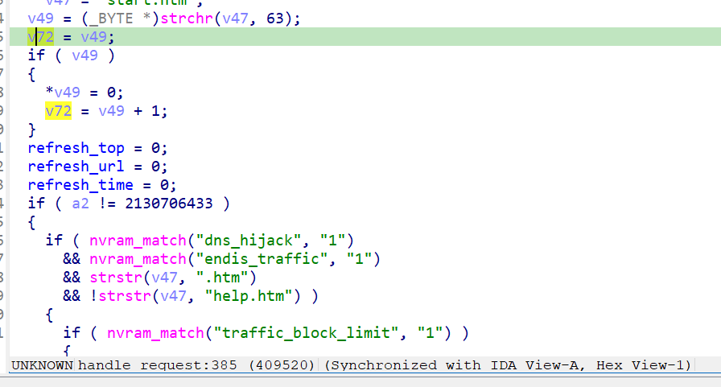
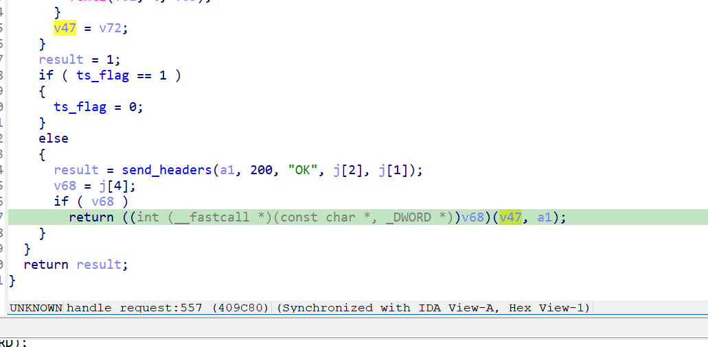
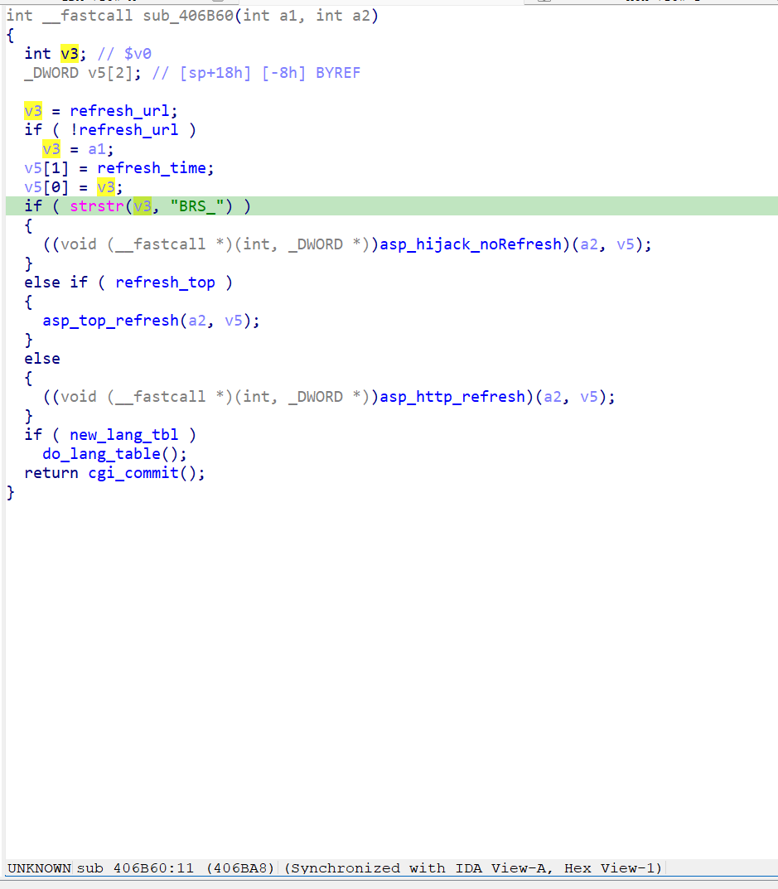

漏洞名称：
Netgear XAVN2001v2 0x406b60 空指针解引用漏洞

Netgear XAVN2001v2是Netgear公司旗下的一款网络设备固件，受影响固件名称为XAVN2001v2，受影响版本为0.4.0.7。

xavn2001v2-0.4.0.7
Netgear XAVN2001v2的/usr/sbin/uhttpd二进制文件中存在一个空指针解引用漏洞。远程攻击者可以通过向/apply.cgi发送构造的POST请求，使程序在apply.cgi的早期刷新/跳转处理路径中触发空指针崩溃，从而导致uhttpd进程异常退出，造成拒绝服务。

该漏洞位于二进制文件/usr/sbin/uhttpd中。在处理/apply.cgi请求时，程序进入handle_request函数，由于URL中没有?，因此没有能够初始化备用字符串。由于submit_flag没有匹配到有效的处理函数，refresh_url此时也是空指针。handle_request函数最后调用apply.cgi对应的刷新函数sub_406b60时将空指针传入了strstr函数导致空指针解引用。

攻击者可以远程发起攻击，通过向/apply.cgi发送构造的POST请求来触发漏洞。

漏洞研究环境：

通过模拟仿真进行验证。当前附件中的环境是已经patch了认证环节之后的，未patch的环境可以用binwalk解压对应下载链接的固件得到。
原始固件链接为：https://github.com/GinRawin/PoC/blob/main/0412PoC/xavn2001v2-0.4.0.7.zip/IMG_xavn2001v2-0.4.0.7.zip

通过greenhouse进行仿真，greenhouse链接为https://github.com/sefcom/greenhouse。仿真环境搭建的具体命令链接为https://github.com/sefcom/greenhouse/blob/master/MANUAL.md。
我在附件里面附上了rehost的镜像，链接为https://github.com/GinRawin/PoC/blob/main/0412PoC/xavn2001v2-0.4.0.7.zip/xavn2001v2-0.4.0.7.tar.gz，启动的命令为进入到dockerfile目录下，然后docker-compose build, docker-compose up。

目标配置情况：

没有进行特殊配置，默认仿真环境启动。

具体验证过程：

第一步。攻击者向/apply.cgi发送POST请求，使程序进入handle_request函数，由于URL中没有?，因此没有能够初始化备用字符串v72，并设置refresh_url为空字符串。

第二步。submit_flag没有匹配到有效的处理函数，handle_request将v47赋值v72并传入刷新函数0x406b60，在0x406b60中将v72传给了strstr函数导致空指针解引用并导致崩溃。

相关问题代码：

0x406b60
