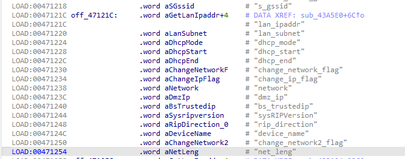
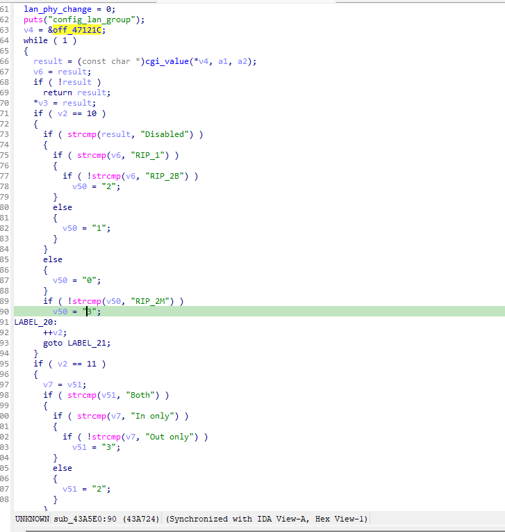
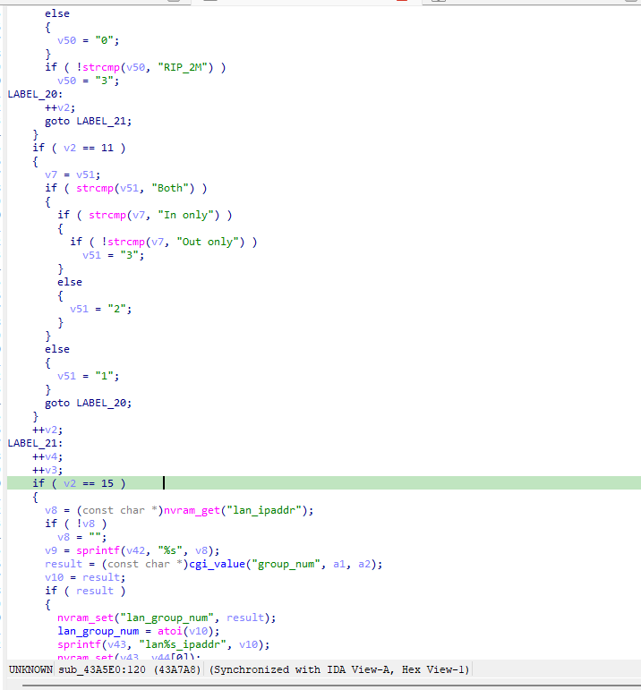
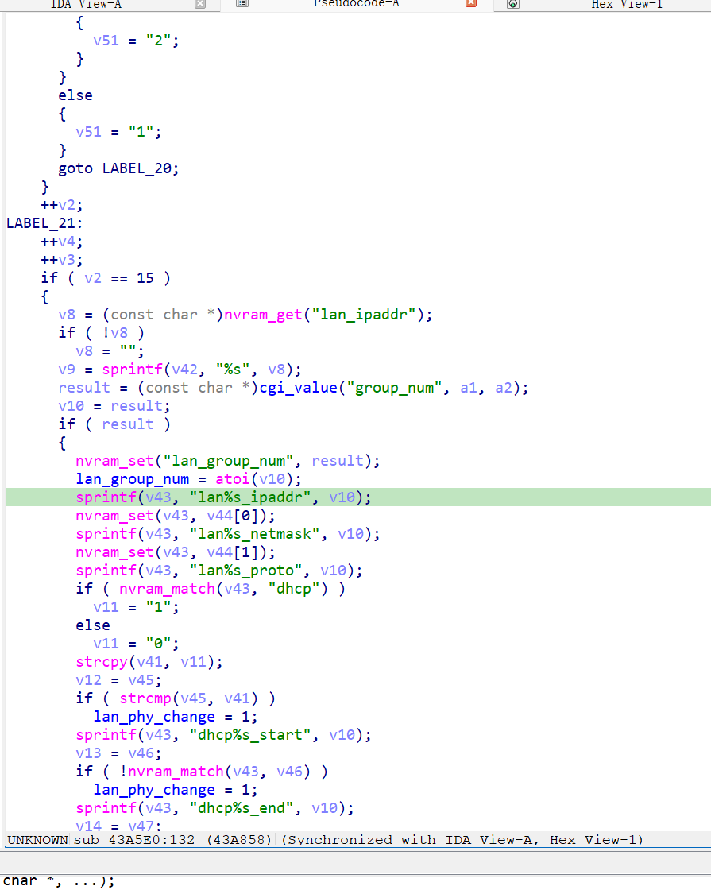

漏洞名称：
Netgear XAVN2001v2 0x43a5e0 栈缓冲区溢出漏洞

Netgear XAVN2001v2是Netgear公司旗下的一款网络设备固件，受影响固件名称为XAVN2001v2，受影响版本为0.4.0.7。

xavn2001v2-0.4.0.7
Netgear XAVN2001v2的/usr/sbin/uhttpd二进制文件中存在一个栈缓冲区溢出漏洞。远程攻击者可以通过向/apply.cgi?wlacl_add发送构造的POST请求，传入超长的group_num参数，在LAN分组配置流程中覆盖栈上局部变量并导致程序崩溃，从而造成拒绝服务。

该漏洞位于二进制文件/usr/sbin/uhttpd中。在submit_flag=lan_group对应的处理分支内，程序会在0x43a800处读取group_num参数，并在0x43a858处执行sprintf(sp+0x50, "lan%s_ipaddr", group_num)。由于这里没有进行长度校验，超长group_num会覆盖后续局部变量槽位，并在随后的nvram_set调用中触发SIGSEGV。

攻击者可以远程发起攻击，通过向/apply.cgi?wlacl_add发送POST请求，并提交超长的group_num参数来触发漏洞。

漏洞研究环境：

通过模拟仿真进行验证。当前附件中的环境是已经patch了认证环节之后的，未patch的环境可以用binwalk解压对应下载链接的固件得到。
原始固件链接为：https://github.com/GinRawin/PoC/blob/main/0412PoC/xavn2001v2-0.4.0.7.zip/IMG_xavn2001v2-0.4.0.7.zip

通过greenhouse进行仿真，greenhouse链接为https://github.com/sefcom/greenhouse。仿真环境搭建的具体命令链接为https://github.com/sefcom/greenhouse/blob/master/MANUAL.md。
我在附件里面附上了rehost的镜像，链接为https://github.com/GinRawin/PoC/blob/main/0412PoC/xavn2001v2-0.4.0.7.zip/xavn2001v2-0.4.0.7.tar.gz，启动的命令为进入到dockerfile目录下，然后docker-compose build, docker-compose up。

目标配置情况：

没有进行特殊配置，默认仿真环境启动。

具体验证过程：

第一步。攻击者向/apply.cgi?wlacl_add发送POST请求，提交submit_flag=lan_group，使程序进入LAN分组配置处理分支sub_43a5e0,然后由于数据包中拥有15个对应字段，因此能够顺利进入读取group_num参数的分支。

第二步。该分支在0x43a800处读取group_num参数，并在0x43a858处通过sprintf将其拼接进栈上的键名缓冲区。由于写入过程没有长度限制，超长数据会覆盖后续局部状态，并最终在后续处理过程中导致崩溃。

相关问题代码：

0x43a5e0
