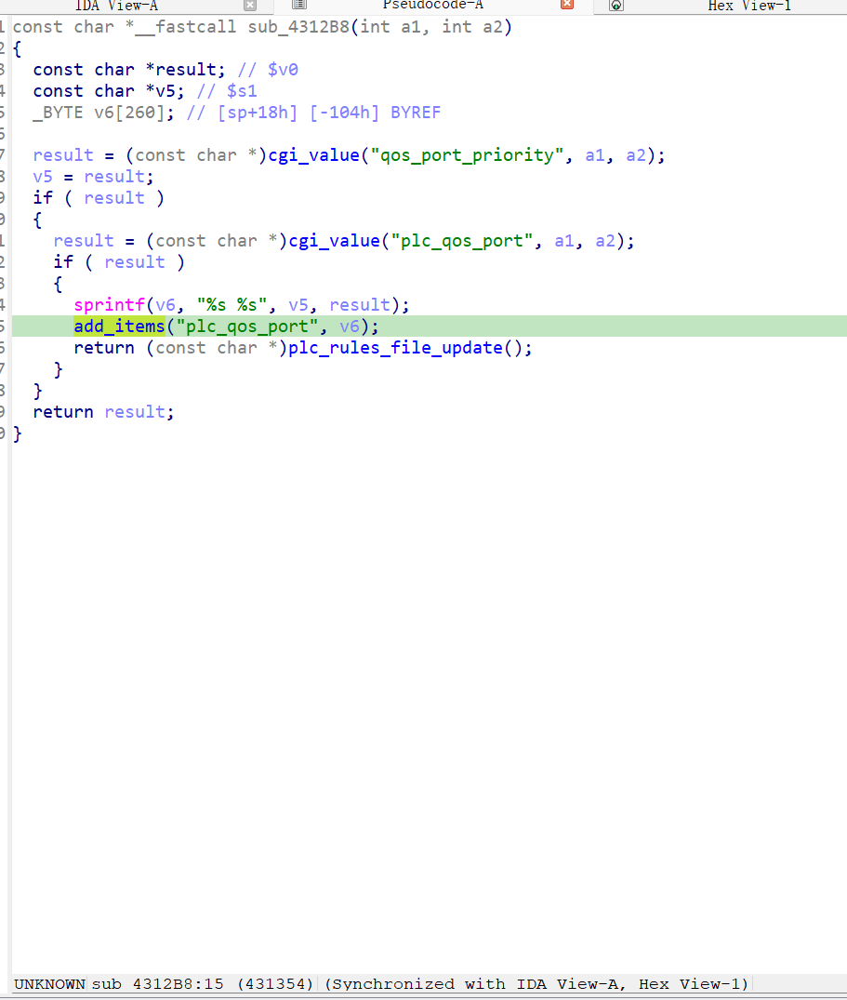
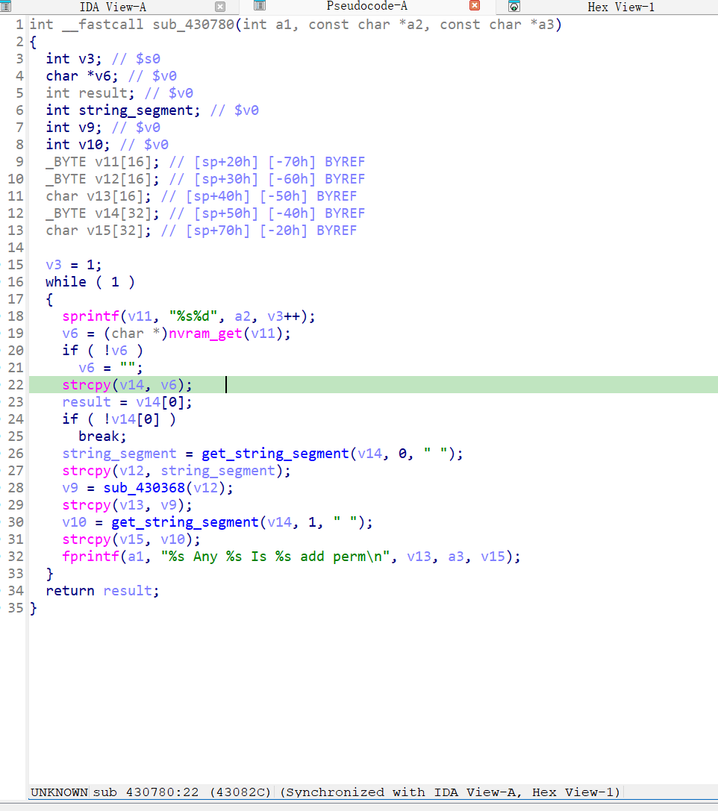

漏洞名称：
Netgear XAVN2001v2 0x430780 缓冲区溢出漏洞

Netgear XAVN2001v2是Netgear公司旗下的一款网络设备固件，受影响固件名称为XAVN2001v2，受影响版本为0.4.0.7。

xavn2001v2-0.4.0.7
Netgear XAVN2001v2的/usr/sbin/uhttpd二进制文件中存在一个缓冲区溢出漏洞。远程攻击者可以通过向/apply.cgi?pls_wait.html发送构造的POST请求，在PLC QoS端口配置流程中触发规则文件更新逻辑，使程序在重建配置项时执行strcpy出现缓冲区溢出。

该漏洞位于二进制文件/usr/sbin/uhttpd中。在submit_flag=plc_qos_port_add对应的处理分支内，程序会先读取qos_port_priority和plc_qos_port参数，并将两者拼接后写入plc_qos_port配置项，随后立即写入nvram中。在该函数内部，sub_430780会循环读取plc_qos_port1、plc_qos_port2等NVRAM项，并调用strcpy函数写入局部变量中导致缓冲区溢出。

攻击者可以远程发起攻击，通过向/apply.cgi?pls_wait.html发送POST请求，提交submit_flag=plc_qos_port_add来触发漏洞。

漏洞研究环境：

通过模拟仿真进行验证。当前附件中的环境是已经patch了认证环节之后的，未patch的环境可以用binwalk解压对应下载链接的固件得到。
原始固件链接为：https://github.com/GinRawin/PoC/blob/main/0412PoC/xavn2001v2-0.4.0.7.zip/IMG_xavn2001v2-0.4.0.7.zip

通过greenhouse进行仿真，greenhouse链接为https://github.com/sefcom/greenhouse。仿真环境搭建的具体命令链接为https://github.com/sefcom/greenhouse/blob/master/MANUAL.md。
我在附件里面附上了rehost的镜像，链接为https://github.com/GinRawin/PoC/blob/main/0412PoC/xavn2001v2-0.4.0.7.zip/xavn2001v2-0.4.0.7.tar.gz，启动的命令为进入到dockerfile目录下，然后docker-compose build, docker-compose up。

目标配置情况：

没有进行特殊配置，默认仿真环境启动。

具体验证过程：

第一步。攻击者向/apply.cgi?pls_wait.html发送POST请求，提交submit_flag=plc_qos_port_add，使程序进入函数sub_4312b8,该函数会在0x4312f4和0x431318处分别读取qos_port_priority与plc_qos_port，并将值用空格拼接后写入nvram的plc_qos_port1对应值。

第二步。程序在规则更新过程中进入sub_430780，按顺序读取plc_qos_port1配置项，并调用strcpy复制该值，导致缓冲区溢出。

相关问题代码：

0x430780
