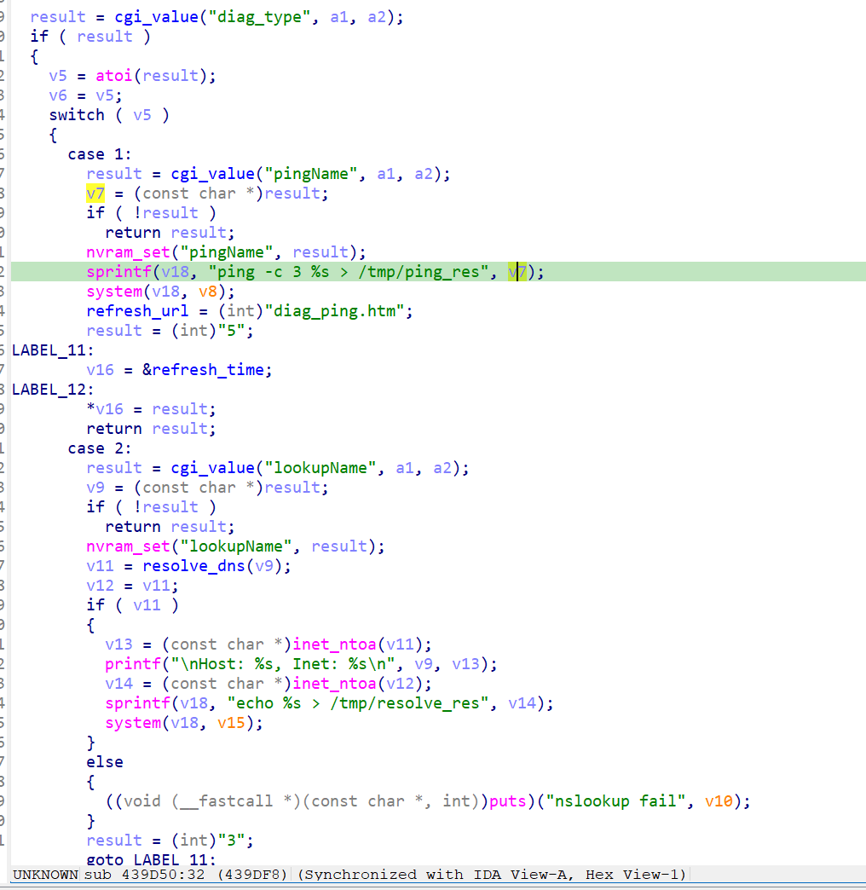

漏洞名称：
Netgear XAVN2001v2 0x439d50 命令注入漏洞

Netgear XAVN2001v2是Netgear公司旗下的一款网络设备固件，受影响固件名称为XAVN2001v2，受影响版本为0.4.0.7。

xavn2001v2-0.4.0.7
Netgear XAVN2001v2的/usr/sbin/uhttpd二进制文件中存在一个命令注入漏洞。远程攻击者可以通过向/apply.cgi?c发送构造的POST请求，控制pingName参数内容，在诊断处理流程中将用户输入直接拼接进shell命令并执行，从而造成任意命令执行风险。

该漏洞位于二进制文件/usr/sbin/uhttpd中。在submit_flag=diag且diag_type=1对应的处理分支内，程序会在0x439dc8处读取pingName参数，并在0x439e04处将其拼接进`ping -c 3 %s > /tmp/ping_res`命令模板，随后在0x439e14处调用system执行。由于用户输入在进入shell前没有经过过滤或转义，攻击者可以构造恶意内容触发命令注入。

攻击者可以远程发起攻击，通过向/apply.cgi?c发送POST请求，并在pingName参数中插入恶意命令内容来触发漏洞。

漏洞研究环境：

通过模拟仿真进行验证。当前附件中的环境是已经patch了认证环节之后的，未patch的环境可以用binwalk解压对应下载链接的固件得到。
原始固件链接为：https://github.com/GinRawin/PoC/blob/main/0412PoC/xavn2001v2-0.4.0.7.zip/IMG_xavn2001v2-0.4.0.7.zip

通过greenhouse进行仿真，greenhouse链接为https://github.com/sefcom/greenhouse。仿真环境搭建的具体命令链接为https://github.com/sefcom/greenhouse/blob/master/MANUAL.md。
我在附件里面附上了rehost的镜像，链接为https://github.com/GinRawin/PoC/blob/main/0412PoC/xavn2001v2-0.4.0.7.zip/xavn2001v2-0.4.0.7.tar.gz，启动的命令为进入到dockerfile目录下，然后docker-compose build, docker-compose up。

目标配置情况：

没有进行特殊配置，默认仿真环境启动。

具体验证过程：

第一步。攻击者向/apply.cgi?c发送POST请求，提交submit_flag=diag和diag_type=1，使程序进入诊断处理分支。

第二步。该分支在0x439dc8处读取pingName参数，并在0x439e04处将其直接拼接进ping命令模板，随后由0x439e14处的system调用通过/bin/sh -c执行。由于输入内容未经过过滤，用户可控数据会进入shell执行路径，从而形成命令注入。

相关问题代码：

0x439d50
