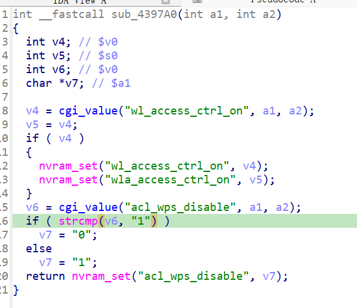

漏洞名称：
Netgear XAVN2001v2 0x4397a0 空指针解引用漏洞

Netgear XAVN2001v2是Netgear公司旗下的一款网络设备固件，受影响固件名称为XAVN2001v2，受影响版本为0.4.0.7。

xavn2001v2-0.4.0.7
Netgear XAVN2001v2的/usr/sbin/uhttpd二进制文件中存在一个空指针解引用漏洞。远程攻击者可以通过向/apply.cgi?debuginfo.htm发送构造的POST请求，在访问控制应用流程中同时省略wl_access_ctrl_on和acl_wps_disable参数，使程序在后续字符串比较时对空指针进行解引用，从而导致uhttpd进程崩溃，造成拒绝服务。

该漏洞位于二进制文件/usr/sbin/uhttpd中。在submit_flag=wlacl_apply对应的处理分支内，程序会先尝试读取wl_access_ctrl_on；当该字段缺失时进入后续分支，再在0x43982c处读取acl_wps_disable参数。若该字段同样缺失，cgi_value返回NULL，但代码仍在0x439844处调用strcmp(NULL, "1")，最终触发SIGSEGV。

攻击者可以远程发起攻击，通过向/apply.cgi?debuginfo.htm发送POST请求，并省略acl_wps_disable等关键参数来触发漏洞。

漏洞研究环境：

通过模拟仿真进行验证。当前附件中的环境是已经patch了认证环节之后的，未patch的环境可以用binwalk解压对应下载链接的固件得到。
原始固件链接为：https://github.com/GinRawin/PoC/blob/main/0412PoC/xavn2001v2-0.4.0.7.zip/IMG_xavn2001v2-0.4.0.7.zip

通过greenhouse进行仿真，greenhouse链接为https://github.com/sefcom/greenhouse。仿真环境搭建的具体命令链接为https://github.com/sefcom/greenhouse/blob/master/MANUAL.md。
我在附件里面附上了rehost的镜像，链接为https://github.com/GinRawin/PoC/blob/main/0412PoC/xavn2001v2-0.4.0.7.zip/xavn2001v2-0.4.0.7.tar.gz，启动的命令为进入到dockerfile目录下，然后docker-compose build, docker-compose up。

目标配置情况：

没有进行特殊配置，默认仿真环境启动。

具体验证过程：

第一步。攻击者向/apply.cgi?debuginfo.htm发送POST请求，提交submit_flag=wlacl_apply，使程序进入访问控制应用处理分支。

第二步。程序在前面读取wl_access_ctrl_on失败后，继续在0x43982c处读取acl_wps_disable。由于当前请求中该字段同样缺失，返回值为NULL，但程序仍在0x439844处调用strcmp进行比较，最终导致崩溃。

相关问题代码：

0x4397a0
