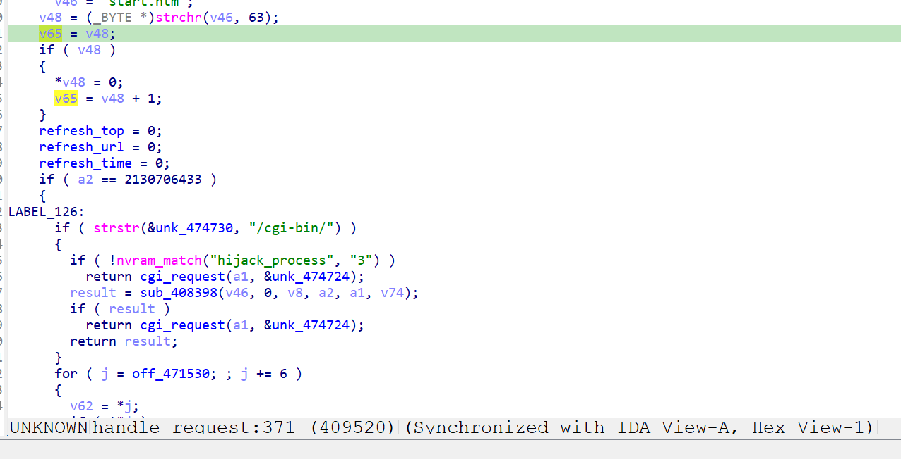
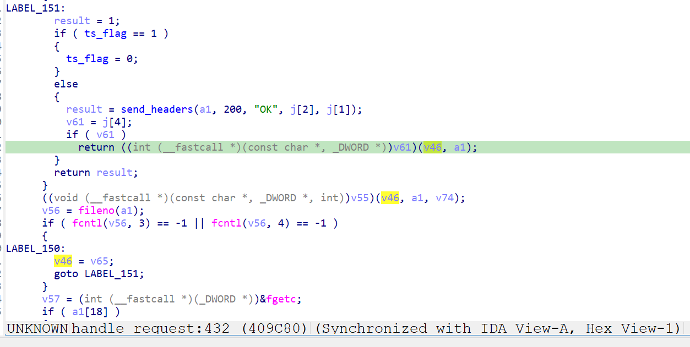
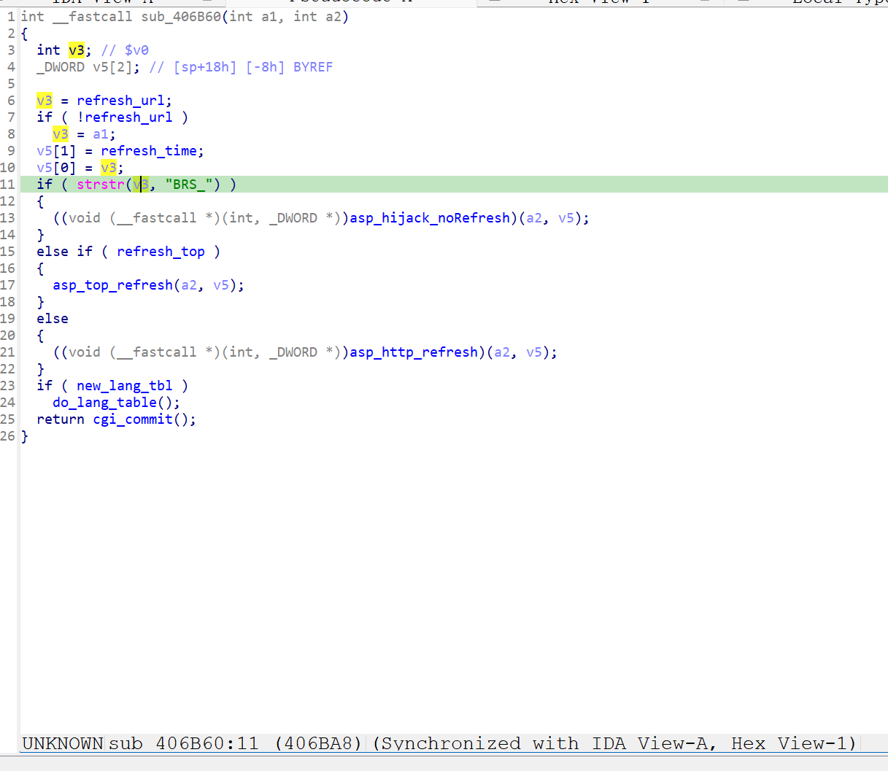

http://www.downloads.netgear.com/files/GDC/XWN5001/XWN5001-V0.4.1.1.zip

漏洞名称：
Netgear XWN5001 0x406b60 空指针解引用漏洞

Netgear XWN5001 0.4.1.1是netgear公司旗下的一款网络设备固件，受影响产品为XWN5001，受影响版本为0.4.1.1。

Netgear XWN5001 0.4.1.1的/usr/sbin/uhttpd二进制文件中存在一个空指针解引用漏洞。远程攻击者可以通过向/apply.cgi发送构造的POST请求，使用异常submit_flag值使程序未进入任何合法处理分支，最终在后续页面回调阶段解引用空指针并导致uhttpd进程崩溃，从而造成拒绝服务。

该漏洞位于二进制文件/usr/sbin/uhttpd中，在/apply.cgi请求处理流程内，程序会先清空refresh_url等全局状态，再读取submit_flag参数进行分发。当submit_flag的值未命中任何已知分支时，这些状态不会被重新初始化。随后程序在0x406b90处继续对refresh_url执行无保护解引用，最终触发SIGSEGV。

攻击者可以远程发起攻击，通过向/apply.cgi发送包含异常submit_flag参数的POST请求触发漏洞。

漏洞研究环境：

通过模拟仿真进行验证。当前附件中的环境是已经patch了认证环节之后的，未patch的环境可以通过上述下载链接获取对应固件。

通过greenhouse进行仿真，greenhouse链接为https://github.com/sefcom/greenhouse。仿真环境搭建的具体命令链接为https://github.com/sefcom/greenhouse/blob/master/MANUAL.md。
我在附件里面附上了rehost的镜像，链接为https://github.com/GinRawin/PoC/blob/main/0412PoC/xwn5001-0.4.1.1.zip/xwn5001-0.4.1.1.tar.gz，启动的命令为进入到dockerfile目录下，然后docker-compose build, docker-compose up。

目标配置情况：

没有进行特殊配置，默认仿真环境启动。

具体验证过程：

第一步。攻击者向/apply.cgi发送POST请求，请求中携带异常的submit_flag参数，使程序进入CGI请求分发流程handle_request函数。程序在处理该请求时未命中任何合法submit_flag分支，导致refresh_url被清空后没有再次填充有效内容。由于URL中没有?，导致备用字符串v65为空。

第二步。程序在0x406b60处，由于refresh_url指针为空指针，因此回退使用备用字符串，然而备用字符串也是空指针，导致空指针解引用并导致uhttpd进程崩溃。

相关问题代码：

0x406b60
