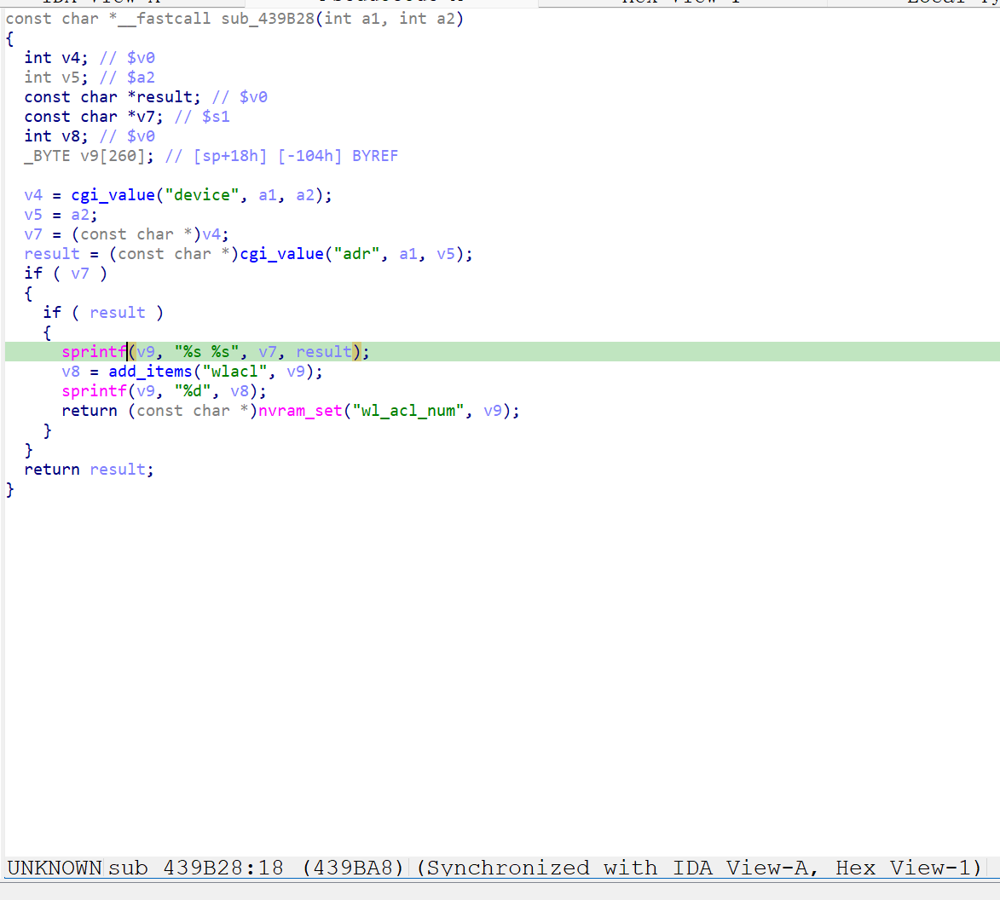

http://www.downloads.netgear.com/files/GDC/XWN5001/XWN5001-V0.4.1.1.zip

漏洞名称：
Netgear XWN5001 0x439b28 栈缓冲区溢出漏洞

Netgear XWN5001 0.4.1.1是netgear公司旗下的一款网络设备固件，受影响产品为XWN5001，受影响版本为0.4.1.1。

Netgear XWN5001 0.4.1.1的/usr/sbin/uhttpd二进制文件中存在一个栈缓冲区溢出漏洞。远程攻击者可以通过向/apply.cgi?pls_wait.html发送构造的POST请求，在submit_flag=wlacl_add的处理路径中提供超长device参数，触发sprintf向固定栈缓冲区写入过长数据，最终覆盖返回地址并导致uhttpd进程崩溃，从而造成拒绝服务。

该漏洞位于二进制文件/usr/sbin/uhttpd中，在wlacl_add处理分支内，程序会读取adr和device参数，并在0x439ba8处调用sprintf("%s %s")将两者拼接写入栈上的固定缓冲区。由于这里没有进行长度检查，超长device字段会覆盖保存寄存器和返回地址，最终在函数返回时触发崩溃。

攻击者可以远程发起攻击，通过向/apply.cgi?pls_wait.html发送包含submit_flag=wlacl_add、超长device参数以及adr参数的POST请求触发漏洞。

漏洞研究环境：

通过模拟仿真进行验证。当前附件中的环境是已经patch了认证环节之后的，未patch的环境可以通过上述下载链接获取对应固件。

通过greenhouse进行仿真，greenhouse链接为https://github.com/sefcom/greenhouse。仿真环境搭建的具体命令链接为https://github.com/sefcom/greenhouse/blob/master/MANUAL.md。
我在附件里面附上了rehost的镜像，链接为https://github.com/GinRawin/PoC/blob/main/0412PoC/xwn5001-0.4.1.1.zip/xwn5001-0.4.1.1.tar.gz，启动的命令为进入到dockerfile目录下，然后docker-compose build, docker-compose up。

目标配置情况：

没有进行特殊配置，默认仿真环境启动。

具体验证过程：

第一步。攻击者向/apply.cgi?pls_wait.html发送POST请求，并将submit_flag设置为wlacl_add，使程序进入ACL新增处理分支sub_439b28。程序读取adr和超长device参数，并在0x439ba8处通过sprintf将这两个字段拼接到栈上的固定缓冲区中。由于拼接后的数据超过缓冲区容量，返回地址等关键栈数据被覆盖，程序在函数返回时触发崩溃。

相关问题代码：

0x439b28
