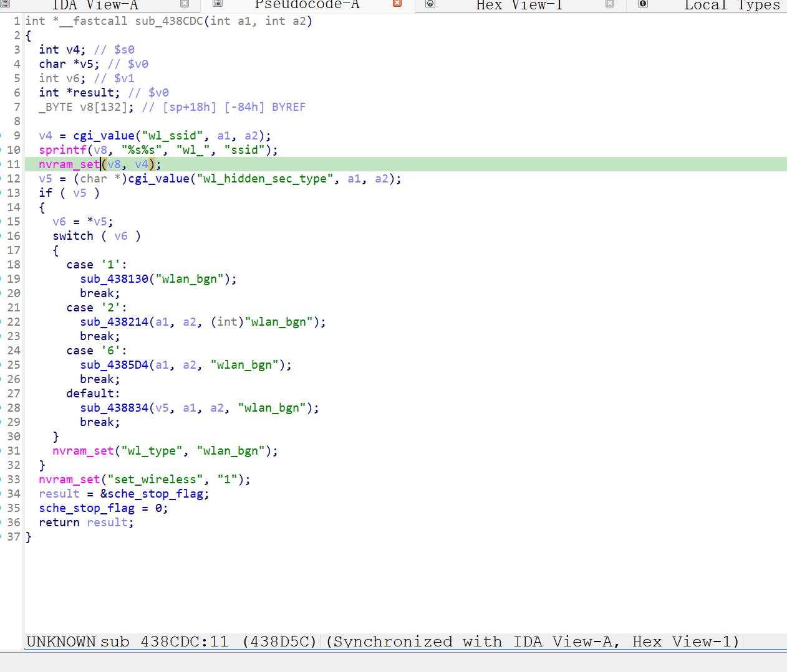

http://www.downloads.netgear.com/files/GDC/XWN5001/XWN5001-V0.4.1.1.zip

漏洞名称：
Netgear XWN5001 0x438cdc 空指针解引用漏洞

Netgear XWN5001 0.4.1.1是netgear公司旗下的一款网络设备固件，受影响产品为XWN5001，受影响版本为0.4.1.1。

Netgear XWN5001 0.4.1.1的/usr/sbin/uhttpd二进制文件中存在一个空指针解引用漏洞。远程攻击者可以通过向/apply.cgi?c发送构造的POST请求，在submit_flag=wlan_brs的处理路径中省略wl_ssid参数，触发后续配置写入流程对空指针进行使用，最终导致uhttpd进程崩溃，从而造成拒绝服务。

该漏洞位于二进制文件/usr/sbin/uhttpd中，在wlan_brs处理分支内，程序会读取wl_ssid参数并将其用于后续nvram_set配置写入。但在当前路径中，程序没有检查该字段是否存在，当请求中缺少wl_ssid时，程序在0x438d5c附近继续使用空指针并触发SIGSEGV。

攻击者可以远程发起攻击，通过向/apply.cgi?c发送包含submit_flag=wlan_brs且缺少wl_ssid参数的POST请求触发漏洞。

漏洞研究环境：

通过模拟仿真进行验证。当前附件中的环境是已经patch了认证环节之后的，未patch的环境可以通过上述下载链接获取对应固件。

通过greenhouse进行仿真，greenhouse链接为https://github.com/sefcom/greenhouse。仿真环境搭建的具体命令链接为https://github.com/sefcom/greenhouse/blob/master/MANUAL.md。
我在附件里面附上了rehost的镜像，链接为https://github.com/GinRawin/PoC/blob/main/0412PoC/xwn5001-0.4.1.1.zip/xwn5001-0.4.1.1.tar.gz，启动的命令为进入到dockerfile目录下，然后docker-compose build, docker-compose up。

目标配置情况：

没有进行特殊配置，默认仿真环境启动。

具体验证过程：

第一步。攻击者向/apply.cgi?c发送POST请求，并将submit_flag设置为wlan_brs，使程序进入对应的无线配置处理分支sub_438cdc,程序在该分支中尝试读取wl_ssid参数，但当前请求没有提供该字段，因此返回值为空。程序在0x438d5c附近继续将该空指针用于配置写入流程，最终触发空指针解引用并导致uhttpd进程崩溃。

相关问题代码：

0x438cdc
