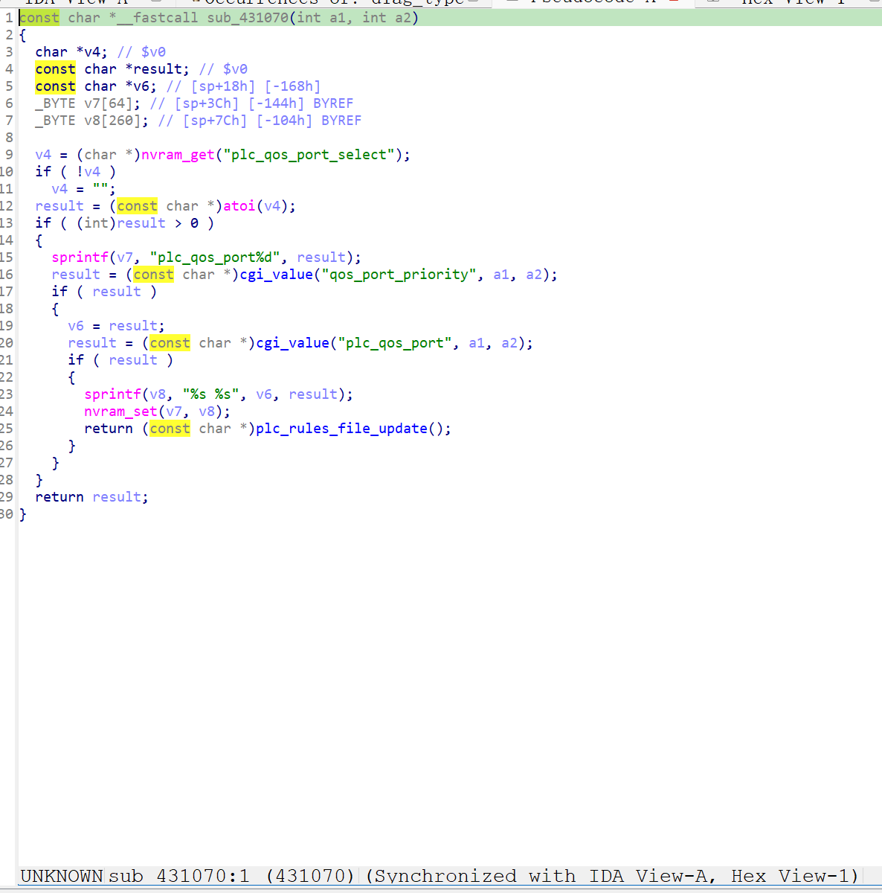
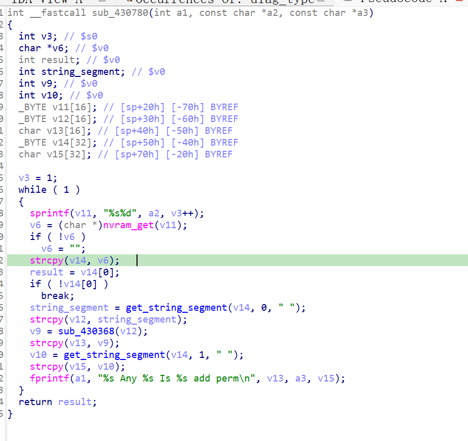

http://www.downloads.netgear.com/files/GDC/XWN5001/XWN5001-V0.4.1.1.zip

漏洞名称：
Netgear XWN5001 0x430780 缓冲区溢出漏洞

Netgear XWN5001 0.4.1.1是netgear公司旗下的一款网络设备固件，受影响产品为XWN5001，受影响版本为0.4.1.1。

Netgear XWN5001 0.4.1.1的/usr/sbin/uhttpd二进制文件中存在一个缓冲区溢出漏洞。远程攻击者可以通过向对应的/apply.cgi?c接口发送构造的POST请求，在submit_flag=plc_qos_port_add的处理路径中提供超长qos_port_priority和/或plc_qos_port参数。程序在sub_431070中读取qos_port_priority和plc_qos_port，将两者拼接后写入NVRAM中的plc_qos_port%d配置项，随后在规则文件更新过程中进入sub_430780，对这些配置项执行strcpy复制，最终触发缓冲区溢出并导致uhttpd进程崩溃，从而造成拒绝服务。

该漏洞位于二进制文件/usr/sbin/uhttpd中。在PLC QoS端口新增处理函数sub_431070内，程序先通过nvram_get("plc_qos_port_select")确定当前端口索引，并拼接出配置键名plc_qos_port%d。随后函数分别通过cgi_value("qos_port_priority", a1, a2)与cgi_value("plc_qos_port", a1, a2)获取用户可控数据，使用sprintf(v8, "%s %s", v6, result)将两者拼接后调用nvram_set(v7, v8)写入对应NVRAM项，并立即执行plc_rules_file_update()。在后续规则重建函数sub_430780中，程序会循环读取plc_qos_port1、plc_qos_port2等配置项，并调用strcpy将内容复制到局部缓冲区。由于这里没有进行长度检查，只要拼接后的配置值超出目标缓冲区容量，最终就会导致缓冲区溢出。

攻击者可以远程发起攻击，通过向对应的/apply.cgi?c接口发送包含submit_flag=plc_qos_port_add以及超长qos_port_priority和/或plc_qos_port参数的POST请求触发漏洞。

漏洞研究环境：

通过模拟仿真进行验证。当前附件中的环境是已经patch了认证环节之后的，未patch的环境可以通过上述下载链接获取对应固件。

通过greenhouse进行仿真，greenhouse链接为https://github.com/sefcom/greenhouse。仿真环境搭建的具体命令链接为https://github.com/sefcom/greenhouse/blob/master/MANUAL.md。
我在附件里面附上了rehost的镜像，链接为https://github.com/GinRawin/PoC/blob/main/0412PoC/xwn5001-0.4.1.1.zip/xwn5001-0.4.1.1.tar.gz，启动的命令为进入到dockerfile目录下，然后docker-compose build, docker-compose up。

目标配置情况：

没有进行特殊配置，默认仿真环境启动。

具体验证过程：

第一步。攻击者向对应的/apply.cgi?c接口发送POST请求，并将submit_flag设置为plc_qos_port_add，使程序进入PLC QoS端口新增处理函数sub_431070。程序先读取plc_qos_port_select确定配置索引，再分别获取qos_port_priority与plc_qos_port，并将两者用空格拼接后写入plc_qos_port%d对应的NVRAM项。

第二步。程序随后调用plc_rules_file_update，在规则更新过程中进入sub_430780，按顺序读取plc_qos_port1等配置项，并调用strcpy将其复制到局部缓冲区。由于复制数据长度超出缓冲区容量，局部缓冲区边界被破坏，栈上的关键数据被覆盖，程序最终在后续执行过程中触发崩溃。

相关问题代码：

0x430780
