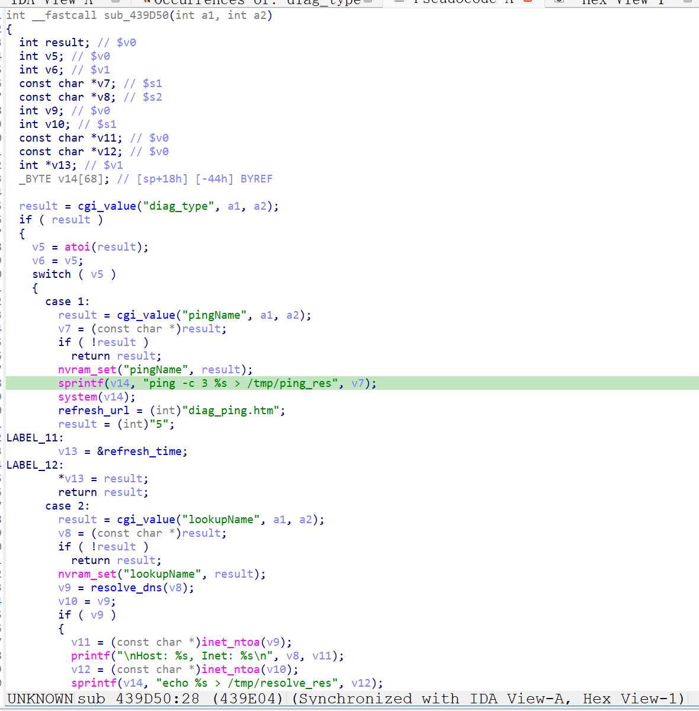

http://www.downloads.netgear.com/files/GDC/XWN5001/XWN5001-V0.4.1.1.zip

漏洞名称：
Netgear XWN5001 0x439d50 命令注入漏洞

Netgear XWN5001 0.4.1.1是netgear公司旗下的一款网络设备固件，受影响产品为XWN5001，受影响版本为0.4.1.1。

Netgear XWN5001 0.4.1.1的/usr/sbin/uhttpd二进制文件中存在一个命令注入漏洞。远程攻击者可以通过向/apply.cgi?upgrade_check_free.cgi发送构造的POST请求，在submit_flag=diag且diag_type=1的处理路径中控制pingName参数内容，使其进入shell命令模板并被/bin/sh -c执行，从而造成任意命令执行。

该漏洞位于二进制文件/usr/sbin/uhttpd中，在诊断处理逻辑内，程序会读取pingName参数，并将其拼接进ping -c 3 %s > /tmp/ping_res命令模板后交由shell执行。由于整个过程没有对用户输入进行shell级过滤，因此攻击者可以构造恶意pingName参数触发命令注入。

攻击者可以远程发起攻击，通过向/apply.cgi?upgrade_check_free.cgi发送包含submit_flag=diag、diag_type=1以及恶意pingName参数的POST请求触发漏洞。

漏洞研究环境：

通过模拟仿真进行验证。当前附件中的环境是已经patch了认证环节之后的，未patch的环境可以通过上述下载链接获取对应固件。

通过greenhouse进行仿真，greenhouse链接为https://github.com/sefcom/greenhouse。仿真环境搭建的具体命令链接为https://github.com/sefcom/greenhouse/blob/master/MANUAL.md。
我在附件里面附上了rehost的镜像，链接为https://github.com/GinRawin/PoC/blob/main/0412PoC/xwn5001-0.4.1.1.zip/xwn5001-0.4.1.1.tar.gz，启动的命令为进入到dockerfile目录下，然后docker-compose build, docker-compose up。

目标配置情况：

没有进行特殊配置，默认仿真环境启动。

具体验证过程：

第一步。攻击者向/apply.cgi?upgrade_check_free.cgi发送POST请求，并通过submit_flag=diag和diag_type=1使程序进入ping诊断处理路径sub_439d50。程序读取pingName参数内容，并将其拼接进ping -c 3 %s > /tmp/ping_res命令模板。程序随后调用shell执行拼接后的命令，请求参数最终经/bin/sh -c解释执行，造成命令注入。

相关问题代码：

0x439d50
