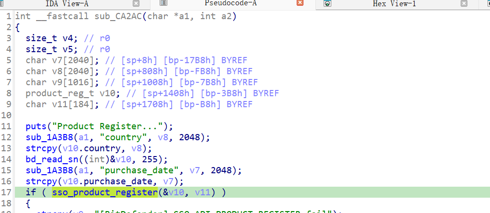
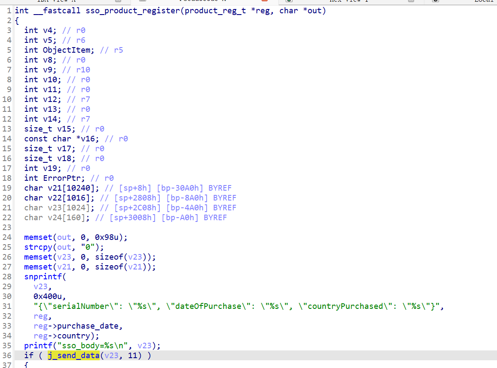
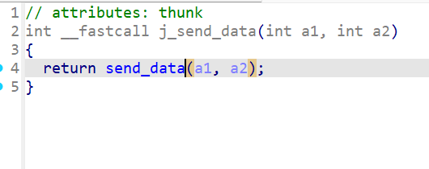
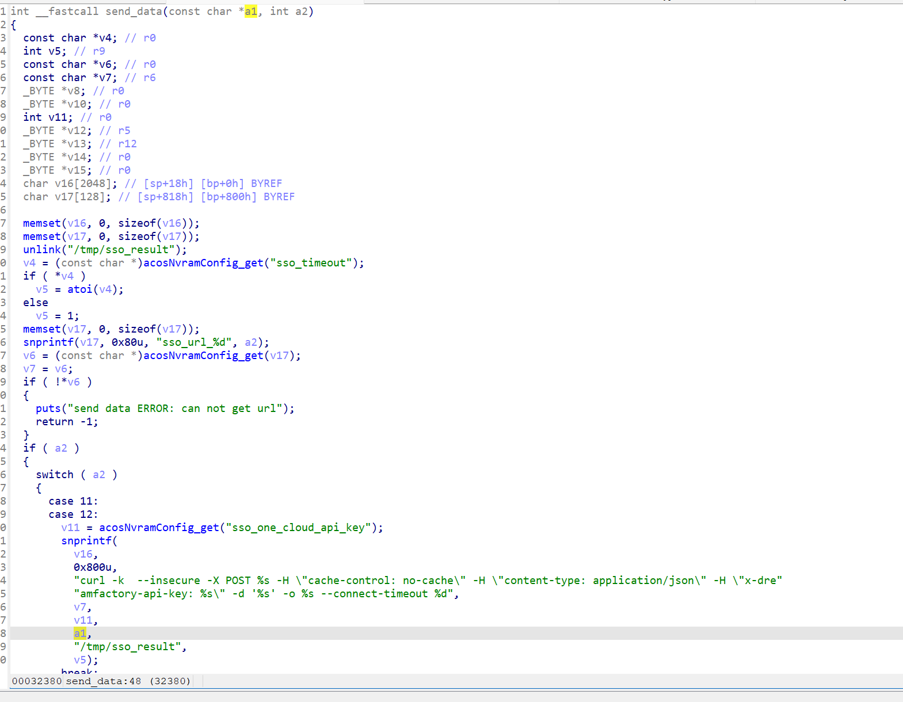
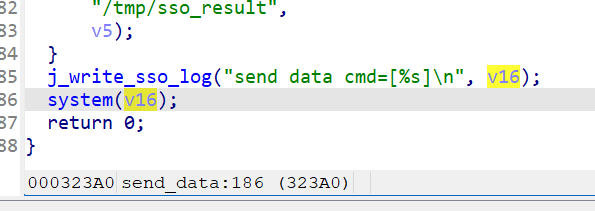

https://www.netgear.com/support/zh-CN/product/r6900
https://github.com/GinRawin/PoC/blob/main/0417PoC_hf/r6900-v1.0.2.26-10.0.45/r6900-v1.0.2.26-10.0.45.tar.gz

漏洞名称：

Netgear R6900 libacos_shared.so 0x000323a4 命令注入漏洞

Netgear R6900 1.0.2.26-10.0.45 是 Netgear 公司旗下的一款网络设备固件，受影响产品为 R6900，受影响版本为 1.0.2.26-10.0.45。

Netgear R6900 1.0.2.26-10.0.45 的 `/usr/sbin/httpd` 二进制文件中存在一个 `命令注入` 漏洞。远程攻击者可以通过发送构造的 HTTP 请求触发该问题。bd_genie_prodcut_register.cgi 将请求体中的 country / purchase_date 写入连续缓冲区后交给 sso_product_register，后者把这两个字段拼进 JSON，再由 send_data 直接格式化进 curl ... -d '%s' 的 shell 命令并调用 system()，没有做 shell 转义。

该漏洞位于二进制文件 `/usr/sbin/httpd` 中。程序在 `/usr/sbin/httpd handler@0x000ca2ac 0x000ca2ac` 处对攻击者可控输入完成读取、解析或传递，并最终在 `/lib/libacos_shared.so sym.send_data 0x000323a4` 处进入危险操作，最终导致任意命令执行风险。

攻击者可以远程发起攻击，通过向目标设备发送恶意请求触发漏洞。

漏洞研究环境：

通过模拟仿真进行验证。当前样本目录中提供了对应的请求包与发送脚本 send.py，可用于复现该问题。

原始固件可通过上述官方链接获取。

通过 greenhouse 进行仿真，greenhouse 链接为 https://github.com/sefcom/greenhouse。仿真环境搭建的具体命令链接为 https://github.com/sefcom/greenhouse/blob/master/MANUAL.md。
我在附件里面附上了 rehost 的镜像，链接为 https://github.com/GinRawin/PoC/blob/main/0417PoC_hf/r6900-v1.0.2.26-10.0.45/r6900-v1.0.2.26-10.0.45.tar.gz，启动的命令为进入到 dockerfile 目录下，然后 `docker-compose build`, `docker-compose up`。

目标配置情况：

没有进行特殊配置，默认仿真环境启动。

具体验证过程：

第一步。HTTP POST /bd_genie_prodcut_register.cgi 命中 httpd 中的 handler 0x000ca2ac

第二步。handler 读取 country 和 purchase_date，与本机 serialNumber 组织成一块连续内存并调用 sso_product_register

第三步。sso_product_register 用 snprintf 生成 {"serialNumber":"%s","dateOfPurchase":"%s","countryPurchased":"%s"}，再传给 send_data

第四步。send_data 用 snprintf 生成 curl -k --insecure -X POST %s ... -d '%s' ...，最后在 0x000323a4 调用 system()

相关问题代码：

0x000323a4
