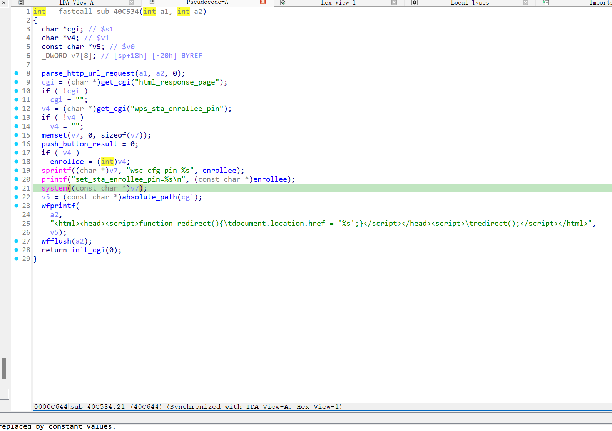

https://www.trendnet.com/support/support-detail.asp?prod=180_TEW-634GRU

漏洞名称：

Trendnet TEW-634GRU 1.01B14 0x40c644 命令注入漏洞

Trendnet TEW-634GRU 1.01B14 是 Trendnet 公司旗下的一款路由器固件，受影响产品为 TEW-634GRU，受影响版本为 1.01B14。

Trendnet TEW-634GRU 1.01B14 的 `/sbin/httpd` 二进制文件中存在一个 `命令注入` 漏洞。远程攻击者可以通过发送构造的 HTTP 请求触发该问题。httpd 将 POST 字段 wps_sta_enrollee_pin 直接格式化进 "wsc_cfg pin %s"，随后调用 system()，没有任何 shell 元字符过滤或参数隔离。

该漏洞位于二进制文件 `/sbin/httpd` 中。程序在 `/sbin/httpd sym.do_apply_post 0x40c5a8` 处对攻击者可控输入完成读取、解析或传递，并最终在 `/sbin/httpd sym.do_apply_post 0x40c644` 处进入危险操作，最终导致任意命令执行风险。

攻击者可以远程发起攻击，通过向目标设备发送恶意请求触发漏洞。

漏洞研究环境：

通过模拟仿真进行验证。当前样本目录中提供了对应的请求包 packet_1.request.raw 与发送脚本 send.py，可用于复现该问题；原始固件可通过上述官方链接获取。

通过 greenhouse 进行仿真，greenhouse 链接为 https://github.com/sefcom/greenhouse。仿真环境搭建的具体命令链接为 https://github.com/sefcom/greenhouse/blob/master/MANUAL.md。

我在附件里面附上了 rehost 的镜像，链接为 https://github.com/GinRawin/PoC/blob/main/0417PoC_hf/tew-634gru-1.01b14/tew-634gru-1.01b14.tar.gz，启动的命令为进入到 dockerfile 目录下，然后 `docker-compose build`, `docker-compose up`。

目标配置情况：

没有进行特殊配置，默认仿真环境启动。

具体验证过程：

第一步。httpd_main 命中 set_sta_enrollee_pin.cgi*，进入 do_apply_post 路径。

第二步。do_apply_post 在 0x40c5a8 读取 wps_sta_enrollee_pin，并在 0x40c608 写入全局 obj.enrollee。

第三步。do_apply_post 在 0x40c610/0x40c5bc 用 "wsc_cfg pin %s" 拼接命令，并在 0x40c644 调用 system()导致命令注入

相关问题代码：

system
