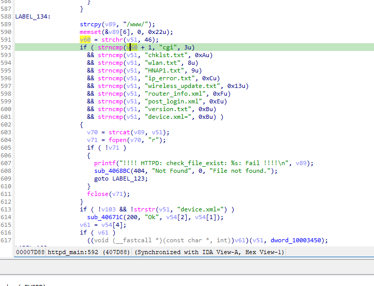

https://github.com/GinRawin/PoC/blob/main/0417PoC_hf/tew-652brp-1.10.29/tew-652brp-1.10.29.tar.gz

漏洞名称：

Trendnet TEW-652BRP 1.10.29 0x407d40 空指针解引用漏洞

Trendnet TEW-652BRP 1.10.29 是 Trendnet 公司旗下的一款网络设备固件，受影响产品为 TEW-652BRP，受影响版本为 1.10.29。

Trendnet TEW-652BRP 1.10.29 的 `/sbin/httpd` 二进制文件中存在一个 `空指针解引用` 漏洞。远程攻击者可以通过发送构造的 HTTP 请求触发该问题。httpd_main 在处理 vct_lan_01 路径时先对路径调用 strchr(s2, '.')，未检查返回值是否为 NULL，随后直接把 v0 + 1 作为后缀指针传给 strncmp，当请求路径没有 . 扩展名时触发崩溃。

该漏洞位于二进制文件 `/sbin/httpd` 中。程序在 `/sbin/httpd parse_http_url_request@0x408a28 0x408a28` 处对攻击者可控输入完成读取、解析或传递，并最终在 `/sbin/httpd httpd_main@0x407d40 0x407d40` 处进入危险操作，最终导致进程崩溃并造成拒绝服务。

攻击者可以远程发起攻击，通过向目标设备发送恶意请求触发漏洞。

漏洞研究环境：

通过模拟仿真进行验证。当前样本目录中提供了对应的请求包与发送脚本 send.py，可用于复现该问题。

通过 greenhouse 进行仿真，greenhouse 链接为 https://github.com/sefcom/greenhouse。仿真环境搭建的具体命令链接为 https://github.com/sefcom/greenhouse/blob/master/MANUAL.md。
我在附件里面附上了 rehost 的镜像，链接为 https://github.com/GinRawin/PoC/blob/main/0417PoC_hf/tew-652brp-1.10.29/tew-652brp-1.10.29.tar.gz，启动的命令为进入到 dockerfile 目录下，然后 `docker-compose build`, `docker-compose up`。

目标配置情况：

没有进行特殊配置，默认仿真环境启动。

具体验证过程：

第一步。parse_http_url_request@0x408a28 从 HTTP 请求行中解析出 URL/path，并在 httpd_main@0x4075a0 保存到 s2。

第二步。httpd_main@0x407a70 用常量 vct_lan_01 匹配 s2，命中后进入 vct_lan_01 处理路径。

第三步。httpd_main@0x407d7c 调用 strchr(s2, '.') 返回 NULL，0x407d88 构造出非法指针 0x1，0x407d98 将其传给 strncmp，最终导致 SIGSEGV。

相关问题代码：

0x407d40
