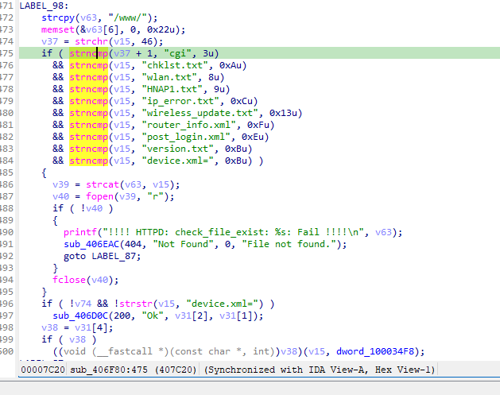

https://github.com/GinRawin/PoC/blob/main/0417PoC_hf/tew-673gru-1.00b40/tew-673gru-1.00b40.tar.gz

漏洞名称：

Trendnet TEW-673GRU 1.00B40 0x406f80 空指针解引用漏洞

Trendnet TEW-673GRU 1.00B40 是 Trendnet 公司旗下的一款网络设备固件，受影响产品为 TEW-673GRU，受影响版本为 1.00B40。

Trendnet TEW-673GRU 1.00B40 的 `/sbin/httpd` 二进制文件中存在一个 `空指针解引用` 漏洞。远程攻击者可以通过发送构造的 HTTP 请求触发该问题。代码把请求 URI 去掉前导 / 后放入 $19，随后无条件执行 strchr($19, '.') + 1 并传给后续后缀比较；当请求为 POST / HTTP/1.1 时找不到 '.'，触发 空指针解引用。

该漏洞位于二进制文件 `/sbin/httpd` 中。程序在 `/sbin/httpd 0x406f80` 处对攻击者可控输入完成读取、解析或传递，并最终在 `/sbin/httpd 0x406f80` 处进入危险操作，最终导致进程崩溃并造成拒绝服务。

攻击者可以远程发起攻击，通过向目标设备发送恶意请求触发漏洞。

漏洞研究环境：

通过模拟仿真进行验证。当前样本目录中提供了对应的请求包与发送脚本 send.py，可用于复现该问题。

通过 greenhouse 进行仿真，greenhouse 链接为 https://github.com/sefcom/greenhouse。仿真环境搭建的具体命令链接为 https://github.com/sefcom/greenhouse/blob/master/MANUAL.md。
我在附件里面附上了 rehost 的镜像，链接为 https://github.com/GinRawin/PoC/blob/main/0417PoC_hf/tew-673gru-1.00b40/tew-673gru-1.00b40.tar.gz，启动的命令为进入到 dockerfile 目录下，然后 `docker-compose build`, `docker-compose up`。

目标配置情况：

没有进行特殊配置，默认仿真环境启动。

具体验证过程：

0x407c04 调用 strchr($19, '.') 返回 NULL，0x407c10 把返回值加一后在 0x407c20 传给后续比较函数，最终空指针解引用用并崩溃。

相关问题代码：

0x406f80
