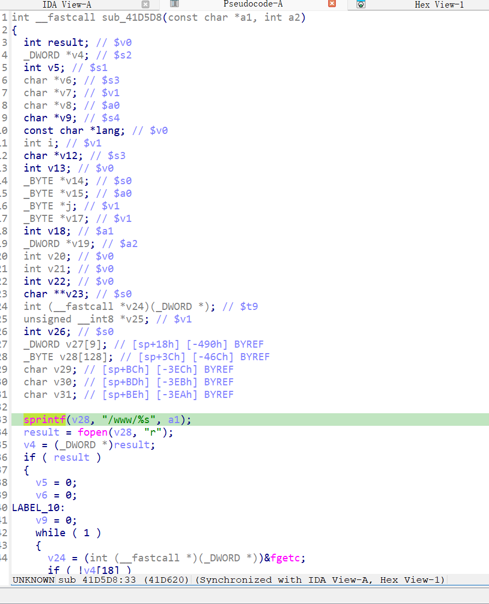

https://www.downloads.netgear.com/files/GDC/WNCE4004/WNCE4004-V1.0.0.22.zip

漏洞名称：

Netgear WNCE4004 1.0.0.22 0x41d5d8 缓冲区溢出漏洞

Netgear WNCE4004 1.0.0.22 是 Netgear 公司旗下的一款无线网桥固件，受影响产品为 WNCE4004，受影响版本为 1.0.0.22。

Netgear WNCE4004 1.0.0.22 的 /usr/sbin/uhttpd 二进制文件中存在一个栈缓冲区溢出漏洞。远程攻击者可以通过构造超长的 .htm 请求路径，使程序在资源处理函数中把用户可控路径直接拼接到栈缓冲区，最终覆盖返回地址并导致进程崩溃，从而造成拒绝服务。

该漏洞位于二进制文件 /usr/sbin/uhttpd 中。程序在 handle_request 中用 strsep 拆分 HTTP 请求行，并把 URI 保存到内部路径变量中。由于本样本访问的是 /cgi-bin.htm 后拼接的大量可控字符，程序在后续分发表中匹配到 .htm 处理逻辑，并通过函数指针调用 0x41d5d8。该函数在 0x41d620 处执行 sprintf(sp+0x3c, "/www/%s", path)，把超长路径写入栈缓冲区，最终覆盖保存的返回地址，在 0x41d908 附近返回时崩溃。

攻击者可以远程发起攻击，通过发送带有超长 .htm 路径的恶意 GET 请求触发漏洞。

漏洞研究环境：

通过模拟仿真进行验证。当前分析基于 greenhouse 仿真环境中的 WNCE4004 1.0.0.22 固件镜像完成。

通过 greenhouse 进行仿真，greenhouse 链接为 https://github.com/sefcom/greenhouse。当前样本目录中的现有 trace、日志和原始请求报文能够对应到 .htm 分发逻辑及后续 sprintf 栈溢出崩溃点。

我在附件里面附上了 rehost 的镜像，链接为 https://github.com/GinRawin/PoC/blob/main/0417PoC_hf/wnce4004-1.0.0.22/wnce4004-1.0.0.22.tar.gz，启动的命令为进入到 dockerfile 目录下，然后 `docker-compose build`, `docker-compose up`。

目标配置情况：

未进行特殊配置，使用默认仿真环境启动即可复现。

具体验证过程：

第一步。攻击者向设备发送 GET 请求，请求路径为 /cgi-bin.htm 开头，并在后面拼接超长字符串，使 URI 长度远超栈缓冲区容量。

第二步。uhttpd 在 handle_request 中解析请求行后，对请求路径执行扩展名匹配。由于当前路径命中 .htm 规则，程序通过 mime handler 表跳转到 0x41d5d8 对应的处理函数。

第三步。该处理函数在 0x41d620 处调用 sprintf(sp+0x3c, "/www/%s", path) 将超长路径直接写入栈缓冲区。由于没有长度检查，保存的返回地址被覆盖，函数在后续返回时触发 SIGSEGV，导致 uhttpd 进程崩溃。

相关问题代码：

0x41d5d8
