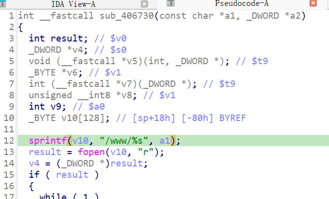

https://www.downloads.netgear.com/files/GDC/WNCE4004/WNCE4004-V1.0.0.22.zip

漏洞名称：

Netgear WNCE4004 1.0.0.22 0x00406730 缓冲区溢出漏洞

Netgear WNCE4004 1.0.0.22 是 Netgear 公司旗下的一款无线网桥固件，受影响产品为 WNCE4004，受影响版本为 1.0.0.22。

Netgear WNCE4004 1.0.0.22 的 `/usr/sbin/uhttpd` 二进制文件中存在一个 `栈缓冲区溢出` 漏洞。远程攻击者可以通过发送构造的 HTTP 请求触发该问题。handle_request 将用户可控的 URL handler_name 作为 a0 传入静态资源处理函数，后者在 0x406768 用 sprintf(sp+0x18, "/www/%s", a0) 向 128 字节栈缓冲区写入 138 字节以上路径，覆盖保存寄存器并在函数尾部崩溃。

该漏洞位于二进制文件 `/usr/sbin/uhttpd` 中。程序在 `/usr/sbin/uhttpd sym.handle_request 0x00405948` 处对攻击者可控输入完成读取、解析或传递，并最终在 `/usr/sbin/uhttpd fcn.00406730 0x00406768` 处进入危险操作，最终导致栈破坏并触发进程崩溃。

攻击者可以远程发起攻击，通过向目标设备发送恶意请求触发漏洞。

漏洞研究环境：

通过模拟仿真进行验证。当前分析基于 greenhouse 仿真环境中的 WNCE4004 1.0.0.22 固件镜像完成。

通过 greenhouse 进行仿真，greenhouse 链接为 https://github.com/sefcom/greenhouse。仿真环境搭建方式可参考其 MANUAL 文档。当前样本目录中的现有 trace、容器日志和请求报文已经能够闭合本次崩溃路径。

我在附件里面附上了 rehost 的镜像，链接为 https://github.com/GinRawin/PoC/blob/main/0417PoC_hf/wnce4004-1.0.0.22/wnce4004-1.0.0.22.tar.gz，启动的命令为进入到 dockerfile 目录下，然后 `docker-compose build`, `docker-compose up`。

目标配置情况：

未进行特殊配置，使用默认仿真环境启动即可复现。

具体验证过程：

第一步。进入函数00406730 在 0x40675c 把目标缓冲区设为 sp+0x18，将数据包的路径传入0x406768 调用 sprintf("/www/%s", a0)导致缓冲区溢出；

相关问题代码：

0x406730
