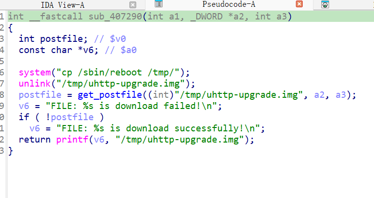
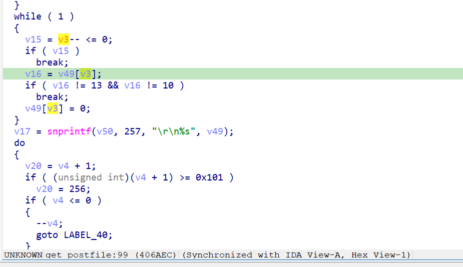

https://www.downloads.netgear.com/files/GDC/WNCE4004/WNCE4004-V1.0.0.22.zip

漏洞名称：

Netgear WNCE4004 1.0.0.22 0x406974 越界访问漏洞

Netgear WNCE4004 1.0.0.22 是 Netgear 公司旗下的一款无线网桥固件，受影响产品为 WNCE4004，受影响版本为 1.0.0.22。

Netgear WNCE4004 1.0.0.22 的 `/usr/sbin/uhttpd` 二进制文件中存在一个 `未初始化变量使用导致的栈越界读` 漏洞。远程攻击者可以通过发送构造的 HTTP 请求触发该问题。GET /upgrade_check.cgi 在未提供 Content-Length / body 的情况下仍进入升级处理函数，handle_request() 将长度参数 s6 保持为 0 传给 get_postfile()，后者在 arg3 <= 0 分支中使用未初始化的 s0 作为栈索引，最终在 0x406aec 发生非法读并崩溃。

该漏洞位于二进制文件 `/usr/sbin/uhttpd` 中。程序在 `/usr/sbin/uhttpd sym.handle_request 0x404be0` 处对攻击者可控输入完成读取、解析或传递，并最终在 `/usr/sbin/uhttpd sym.get_postfile 0x406aec` 处进入危险操作，最终导致安全风险。

攻击者可以远程发起攻击，通过向目标设备发送恶意请求触发漏洞。

漏洞研究环境：

通过模拟仿真进行验证。当前分析基于 greenhouse 仿真环境中的 WNCE4004 1.0.0.22 固件镜像完成。

通过 greenhouse 进行仿真，greenhouse 链接为 https://github.com/sefcom/greenhouse。仿真环境搭建方式可参考其 MANUAL 文档。当前样本目录中的现有 trace、容器日志和请求报文已经能够闭合本次崩溃路径。

我在附件里面附上了 rehost 的镜像，链接为 https://github.com/GinRawin/PoC/blob/main/0417PoC_hf/wnce4004-1.0.0.22/wnce4004-1.0.0.22.tar.gz，启动的命令为进入到 dockerfile 目录下，然后 `docker-compose build`, `docker-compose up`。

目标配置情况：

未进行特殊配置，使用默认仿真环境启动即可复现。

具体验证过程：

第一步。handle_request() 解析请求，/upgrade_check.cgi 命中对应 handler sub_407290，且由于请求无 Content-Length/body，长度变量a3保持为 0

第二步。函数sub_407290调用 get_postfile("/tmp/uhttp-upgrade.img", a2, a3)。get_postfile() 在 a3<=0 路径上跳过对v3的初始化，直接访问v49[v3]触发 SIGSEGV

相关问题代码：

0x406974
