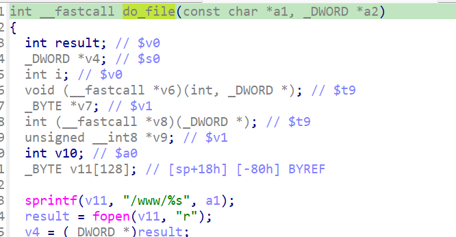

https://www.netgear.com/support/zh-CN/product/wndr3700v2
https://github.com/GinRawin/PoC/blob/main/0417PoC_hf/wndr3700v2-1.0.0.8/wndr3700v2-1.0.0.8.tar.gz

漏洞名称：

Netgear WNDR3700v2 1.0.0.8 0x4051dc 缓冲区溢出漏洞

Netgear WNDR3700v2 1.0.0.8 是 Netgear 公司旗下的一款网络设备固件，受影响产品为 WNDR3700v2，受影响版本为 1.0.0.8。

Netgear WNDR3700v2 1.0.0.8 的 `/usr/sbin/uhttpd` 二进制文件中存在一个 `栈缓冲区溢出` 漏洞。远程攻击者可以通过发送构造的 HTTP 请求触发该问题。`handle_request` 在解析请求行后，会把攻击者可控的超长请求路径分派给 `.gif` 静态文件处理函数 `do_file`；`do_file` 随后在 `0x405210` 处调用 `sprintf(sp+0x18, "/www/%s", path)`，将约 7.5KB 的路径写入栈上的小缓冲区，覆盖保存寄存器并导致进程崩溃。

该漏洞位于二进制文件 `/usr/sbin/uhttpd` 中。程序在 `/usr/sbin/uhttpd 0x407220` 处对攻击者可控输入完成读取、解析或传递，并最终在 `/usr/sbin/uhttpd 0x405210` 处进入危险操作，最终导致进程崩溃并造成拒绝服务。

攻击者可以远程发起攻击，通过向目标设备发送恶意请求触发漏洞。

漏洞研究环境：

通过模拟仿真进行验证。当前样本目录中提供了对应的请求包与发送脚本 `send.py`，可用于复现该问题。

原始固件可通过上述官方链接获取。

通过 greenhouse 进行仿真，greenhouse 链接为 https://github.com/sefcom/greenhouse。仿真环境搭建的具体命令链接为 https://github.com/sefcom/greenhouse/blob/master/MANUAL.md。
我在附件里面附上了 rehost 的镜像，链接为 https://github.com/GinRawin/PoC/blob/main/0417PoC_hf/wndr3700v2-1.0.0.8/wndr3700v2-1.0.0.8.tar.gz，启动的命令为进入到 dockerfile 目录下，然后 `docker-compose build`, `docker-compose up`。

目标配置情况：

没有进行特殊配置，默认仿真环境启动。

具体验证过程：

第一步。`handle_request` 遍历 `mime_handlers`，对 GET 请求使用 `strstr(path, ".gif")` 命中 `.gif` 处理表项，并在 `0x408558` 处把该路径作为实参传入 `do_file`(`0x4051dc`)。

第二步。`do_file` 在 `0x405210` 处执行 sprintf，把超长路径写入 144 字节左右的栈缓冲区，导致缓冲区溢出。

相关问题代码：

0x4051dc
