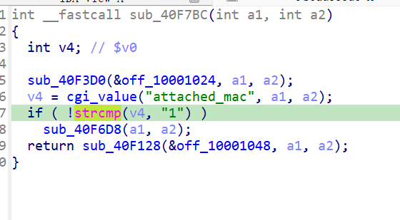

https://www.netgear.com/support/zh-CN/product/wndr3700v2
https://github.com/GinRawin/PoC/blob/main/0417PoC_hf/wndr3700v2-1.0.0.8/wndr3700v2-1.0.0.8.tar.gz

漏洞名称：

Netgear WNDR3700v2 1.0.0.8 0x40f7bc 空指针解引用漏洞

Netgear WNDR3700v2 1.0.0.8 是 Netgear 公司旗下的一款网络设备固件，受影响产品为 WNDR3700v2，受影响版本为 1.0.0.8。

Netgear WNDR3700v2 1.0.0.8 的 `/usr/sbin/uhttpd` 二进制文件中存在一个 `空指针解引用` 漏洞。远程攻击者可以通过发送构造的 HTTP 请求触发该问题。add_qos_mac 处理函数在读取 attached_mac 失败后，未检查 lookup("attached_mac", ...) 的返回值是否为 NULL，直接把它作为字符串比较函数的第一个实参使用，导致 SIGSEGV。

该漏洞位于二进制文件 `/usr/sbin/uhttpd` 中。程序在 `/usr/sbin/uhttpd 0x40f7bc` 处对攻击者可控输入完成读取、解析或传递，并最终在 `/usr/sbin/uhttpd 0x40f7bc` 处进入危险操作，最终导致进程崩溃并造成拒绝服务。

攻击者可以远程发起攻击，通过向目标设备发送恶意请求触发漏洞。

漏洞研究环境：

通过模拟仿真进行验证。当前样本目录中提供了对应的请求包与发送脚本 send.py，可用于复现该问题。

原始固件可通过上述官方链接获取。

通过 greenhouse 进行仿真，greenhouse 链接为 https://github.com/sefcom/greenhouse。仿真环境搭建的具体命令链接为 https://github.com/sefcom/greenhouse/blob/master/MANUAL.md。
我在附件里面附上了 rehost 的镜像，链接为 https://github.com/GinRawin/PoC/blob/main/0417PoC_hf/wndr3700v2-1.0.0.8/wndr3700v2-1.0.0.8.tar.gz，启动的命令为进入到 dockerfile 目录下，然后 `docker-compose build`, `docker-compose up`。

目标配置情况：

没有进行特殊配置，默认仿真环境启动。

具体验证过程：

第一步。请求进入 /usr/sbin/uhttpd，trace/entry_trace.txt 显示控制流进入 0x4168ec；这里先读取 submit_flag，并在表项 0x10000718 命中 add_qos_mac -> 0x40f7bc

第二步。0x40f7bc 处理 add_qos_mac，先执行辅助逻辑，然后在 0x40f814 再次通过 0x409060 查找 "attached_mac"

第三步。由于样本中没有 body.attached_mac，查找返回 NULL；随后 0x40f82c 对 NULL 执行strcmp导致空指针解引用

相关问题代码：

0x40f7bc
