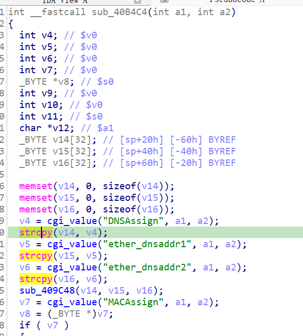

https://www.netgear.com/support/zh-CN/product/wndr3700v2
https://github.com/GinRawin/PoC/blob/main/0417PoC_hf/wndr3700v2-1.0.0.8/wndr3700v2-1.0.0.8.tar.gz

漏洞名称：

Netgear WNDR3700v2 1.0.0.8 0x40b4c4 空指针解引用漏洞

Netgear WNDR3700v2 1.0.0.8 是 Netgear 公司旗下的一款网络设备固件，受影响产品为 WNDR3700v2，受影响版本为 1.0.0.8。

Netgear WNDR3700v2 1.0.0.8 的 `/usr/sbin/uhttpd` 二进制文件中存在一个 `空指针解引用` 漏洞。远程攻击者可以通过发送构造的 HTTP 请求触发该问题。submit_flag 命中对应 handler 后，该 handler 直接将 cgi_value("DNSAssign", ...) 的返回值传给 strcpy，未检查字段缺失时的 NULL。

该漏洞位于二进制文件 `/usr/sbin/uhttpd` 中。程序在 `/usr/sbin/uhttpd 0x409060` 处对攻击者可控输入完成读取、解析或传递，并最终在 `/usr/sbin/uhttpd 0x40b4c4` 处进入危险操作，最终导致进程崩溃并造成拒绝服务。

攻击者可以远程发起攻击，通过向目标设备发送恶意请求触发漏洞。

漏洞研究环境：

通过模拟仿真进行验证。当前样本目录中提供了对应的请求包与发送脚本 send.py，可用于复现该问题。

原始固件可通过上述官方链接获取。

通过 greenhouse 进行仿真，greenhouse 链接为 https://github.com/sefcom/greenhouse。仿真环境搭建的具体命令链接为 https://github.com/sefcom/greenhouse/blob/master/MANUAL.md。
我在附件里面附上了 rehost 的镜像，链接为 https://github.com/GinRawin/PoC/blob/main/0417PoC_hf/wndr3700v2-1.0.0.8/wndr3700v2-1.0.0.8.tar.gz，启动的命令为进入到 dockerfile 目录下，然后 `docker-compose build`, `docker-compose up`。

目标配置情况：

没有进行特殊配置，默认仿真环境启动。

具体验证过程：

第一步。请求进入 /usr/sbin/uhttpd，cgi_setobject 先通过 cgi_value("submit_flag", ...) 取到 ether

第二步。submit_flag=ether 让控制流进入 0x40b4c4 对应的配置 handler

第三步。该 handler 调用 cgi_value("DNSAssign", ...) 未命中返回 NULL，随后在 0x40b56c 调 strcpy 时将 NULL 作为源指针，触发 SIGSEGV

相关问题代码：

strcpy
