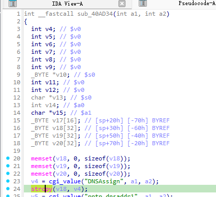

https://github.com/GinRawin/PoC/blob/main/0417PoC_hf/wndr37avv2-1.0.0.10/wndr37avv2-1.0.0.10.tar.gz

漏洞名称：

Netgear WNDR37AVv2 1.0.0.10 0040ad34 空指针解引用漏洞

Netgear WNDR37AVv2 1.0.0.10 是 Netgear 公司旗下的一款网络设备固件，受影响产品为 WNDR37AVv2，受影响版本为 1.0.0.10。

Netgear WNDR37AVv2 1.0.0.10 的 `/usr/sbin/uhttpd` 二进制文件中存在一个 `NULL 指针解引用` 漏洞。远程攻击者可以通过发送构造的 HTTP 请求触发该问题。pptp 配置处理函数从请求参数中读取 DNSAssign 后未判空，直接把 cgi_value() 返回值作为 strcpy 的 src，当该字段缺失时以 NULL 调用 strcpy 并崩溃。

该漏洞位于二进制文件 `/usr/sbin/uhttpd` 中。程序在 `/usr/sbin/uhttpd fcn.0040ad34 0x40adcc` 处对攻击者可控输入完成读取、解析或传递，并最终在 `/usr/sbin/uhttpd fcn.0040ad34 0x40ade0` 处进入危险操作，最终导致安全风险。

攻击者可以远程发起攻击，通过向目标设备发送恶意请求触发漏洞。

漏洞研究环境：

通过模拟仿真进行验证。当前样本目录中提供了对应的请求包与发送脚本 send.py，可用于复现该问题。

通过 greenhouse 进行仿真，greenhouse 链接为 https://github.com/sefcom/greenhouse。仿真环境搭建的具体命令链接为 https://github.com/sefcom/greenhouse/blob/master/MANUAL.md。
我在附件里面附上了 rehost 的镜像，链接为 https://github.com/GinRawin/PoC/blob/main/0417PoC_hf/wndr37avv2-1.0.0.10/wndr37avv2-1.0.0.10.tar.gz，启动的命令为进入到 dockerfile 目录下，然后 `docker-compose build`, `docker-compose up`。

目标配置情况：

没有进行特殊配置，默认仿真环境启动。

具体验证过程：

第一步。请求命中 apply.cgi,submit_flag是"pptp"，调用 0x40ad34，0x40ad34 读取 DNSAssign 失败得到 NULL，随后执行 strcpy(sp+0x30, NULL) 触发 SIGSEGV

相关问题代码：

0040ad34
