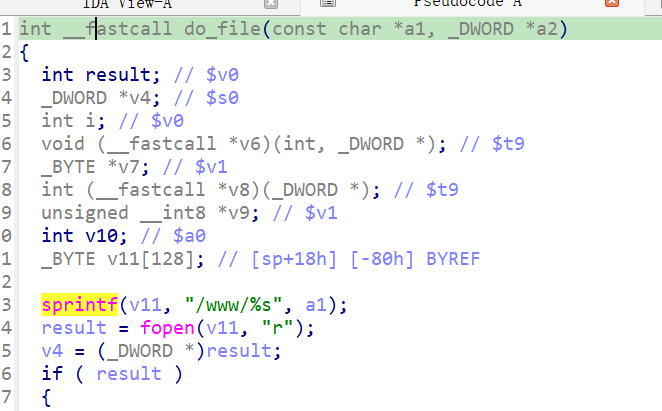

https://github.com/GinRawin/PoC/blob/main/0417PoC_hf/wndrmac-1.0.0.10/wndrmac-1.0.0.10.tar.gz

漏洞名称：

Netgear WNDRMAC 1.0.0.10 0x409530 缓冲区溢出漏洞

Netgear WNDRMAC 1.0.0.10 是 Netgear 公司旗下的一款网络设备固件，受影响产品为 WNDRMAC，受影响版本为 1.0.0.10。

Netgear WNDRMAC 1.0.0.10 的 `/usr/sbin/uhttpd` 二进制文件中存在一个 `栈缓冲区溢出` 漏洞。远程攻击者可以通过发送构造的 HTTP 请求触发该问题。handle_request() 读取请求行后使用 strsep() 提取 URI token，并在命中静态文件处理分支后将其传入 do_file()。do_file() 在 0x409564 处调用 sprintf(sp+0x18, "/www/%s", a0) 时，未对攻击者可控路径长度进行校验，最终覆盖栈上保存的返回地址并在函数返回时跳转到 0x61616160 崩溃。

该漏洞位于二进制文件 `/usr/sbin/uhttpd` 中。程序在 `/usr/sbin/uhttpd sym.handle_request 0x40c168` 处对攻击者可控输入完成读取、解析或传递，并最终在 `/usr/sbin/uhttpd sym.do_file 0x409564` 处进入危险操作，最终导致进程崩溃并造成拒绝服务。

攻击者可以远程发起攻击，通过向目标设备发送恶意请求触发漏洞。

漏洞研究环境：

通过模拟仿真进行验证。当前样本目录中提供了对应的请求包与发送脚本 send.py，可用于复现该问题。

通过 greenhouse 进行仿真，greenhouse 链接为 https://github.com/sefcom/greenhouse。仿真环境搭建的具体命令链接为 https://github.com/sefcom/greenhouse/blob/master/MANUAL.md。
我在附件里面附上了 rehost 的镜像，链接为 https://github.com/GinRawin/PoC/blob/main/0417PoC_hf/wndrmac-1.0.0.10/wndrmac-1.0.0.10.tar.gz，启动的命令为进入到 dockerfile 目录下，然后 `docker-compose build`, `docker-compose up`。

目标配置情况：

没有进行特殊配置，默认仿真环境启动。

具体验证过程：

第一步。handle_request() 使用 fgets() 读取整条请求行，随后通过 strsep() 连续切分方法、URI 和协议字段。攻击者提供的长 URI 被保存为后续处理使用的路径参数。当前请求方法为 GET，且请求路径以 `.gif` 结尾，因此程序命中静态文件处理逻辑，并在 `/usr/sbin/uhttpd sym.handle_request 0x40d840` 附近取出处理函数指针，最终调用 do_file()。do_file() 在 `/usr/sbin/uhttpd sym.do_file 0x409564` 处执行 sprintf(sp+0x18, "/www/%s", a0)。其中攻击者控制的 URI 长度为 261 字节，拼接 `/www/` 后总长度达到 266 字节，而栈上 `sp+0x18` 到保存返回地址 `sp+0xa0` 的距离仅为 136 字节，导致缓冲区溢出。

相关问题代码：

0x409530
