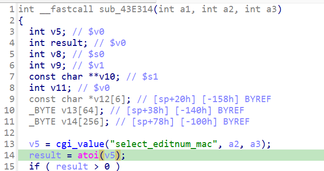

https://github.com/GinRawin/PoC/blob/main/0417PoC_hf/wndrmac-1.0.0.10/wndrmac-1.0.0.10.tar.gz

漏洞名称：

Netgear WNDRMAC 1.0.0.10 0x43e314 空指针解引用漏洞

Netgear WNDRMAC 1.0.0.10 是 Netgear 公司旗下的一款网络设备固件，受影响产品为 WNDRMAC，受影响版本为 1.0.0.10。

Netgear WNDRMAC 1.0.0.10 的 `/usr/sbin/uhttpd` 二进制文件中存在一个 `空指针解引用` 漏洞。远程攻击者可以通过发送构造的 HTTP 请求触发该问题。config_edit_qos_mac 路径下，代码对 CGI 字段 select_editnum_mac 的返回值未做 NULL 检查，直接传给 atoi，当请求中省略该字段时触发 SIGSEGV

该漏洞位于二进制文件 `/usr/sbin/uhttpd` 中。程序在 `/usr/sbin/uhttpd fcn.0043e314 0x43e358` 处对攻击者可控输入完成读取、解析或传递，并最终在 `/usr/sbin/uhttpd fcn.0043e314 0x43e368` 处进入危险操作，最终导致进程崩溃并造成拒绝服务。

攻击者可以远程发起攻击，通过向目标设备发送恶意请求触发漏洞。

漏洞研究环境：

通过模拟仿真进行验证。当前样本目录中提供了对应的请求包与发送脚本 send.py，可用于复现该问题。

通过 greenhouse 进行仿真，greenhouse 链接为 https://github.com/sefcom/greenhouse。仿真环境搭建的具体命令链接为 https://github.com/sefcom/greenhouse/blob/master/MANUAL.md。
我在附件里面附上了 rehost 的镜像，链接为 https://github.com/GinRawin/PoC/blob/main/0417PoC_hf/wndrmac-1.0.0.10/wndrmac-1.0.0.10.tar.gz，启动的命令为进入到 dockerfile 目录下，然后 `docker-compose build`, `docker-compose up`。

目标配置情况：

没有进行特殊配置，默认仿真环境启动。

具体验证过程：

第一步。POST /apply.cgi? 进入 uhttpd 的通用 CGI 分发路径，cgi_setobject 在 0x40f7b0 读取 submit_flag。submit_flag=edit_qos_mac 使控制流命中 sym.config_edit_qos_mac (0x43ebb0)，调用函数0043e314，其中 0x43e358 读取 select_editnum_mac，sym.cgi_value 在 0x40e3cc 返回 NULL，fcn.0043e314 在 0x43e368 调用 atoi(NULL)，空指针解引用程序崩溃。

相关问题代码：

0x43e314
