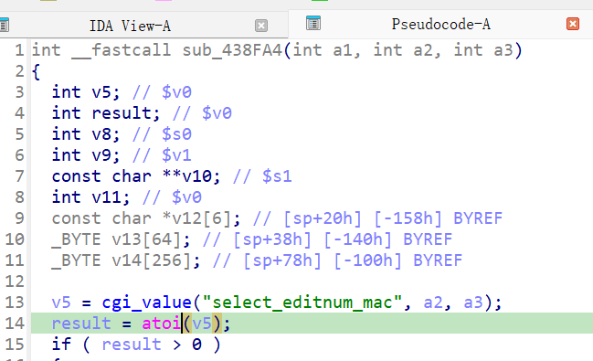

https://www.netgear.com/support/zh-CN/product/wndrmacv1
https://github.com/GinRawin/PoC/blob/main/0417PoC_hf/wndrmacv1-1.0.0.20/wndrmacv1-1.0.0.20.tar.gz

漏洞名称：

Netgear WNDRMACv1 1.0.0.20 0x438fa4 空指针解引用漏洞

Netgear WNDRMACv1 1.0.0.20 是 Netgear 公司旗下的一款网络设备固件，受影响产品为 WNDRMACv1，受影响版本为 1.0.0.20。

Netgear WNDRMACv1 1.0.0.20 的 `/usr/sbin/uhttpd` 二进制文件中存在一个 `空指针解引用` 漏洞。远程攻击者可以通过发送构造的 HTTP 请求触发该问题。edit_qos_mac 路径在读取 select_editnum_mac 后未检查 cgi_value 返回值是否为空，直接执行 atoi(NULL) 导致 SIGSEGV。

该漏洞位于二进制文件 `/usr/sbin/uhttpd` 中。程序在 `/usr/sbin/uhttpd fcn.00438fa4 0x438fe8` 处对攻击者可控输入完成读取、解析或传递，并最终在 `/usr/sbin/uhttpd fcn.00438fa4 0x438ff8` 处进入危险操作，最终导致进程崩溃并造成拒绝服务。

攻击者可以远程发起攻击，通过向目标设备发送恶意请求触发漏洞。

漏洞研究环境：

通过模拟仿真进行验证。当前样本目录中提供了对应的请求包与发送脚本 send.py，可用于复现该问题。

原始固件可通过上述官方链接获取。

通过 greenhouse 进行仿真，greenhouse 链接为 https://github.com/sefcom/greenhouse。仿真环境搭建的具体命令链接为 https://github.com/sefcom/greenhouse/blob/master/MANUAL.md。
我在附件里面附上了 rehost 的镜像，链接为 https://github.com/GinRawin/PoC/blob/main/0417PoC_hf/wndrmacv1-1.0.0.20/wndrmacv1-1.0.0.20.tar.gz，启动的命令为进入到 dockerfile 目录下，然后 `docker-compose build`, `docker-compose up`。

目标配置情况：

没有进行特殊配置，默认仿真环境启动。

具体验证过程：

第一步。请求进入 apply.cgi 路径后，sym.cgi_setobject@0x40e058 在 0x40e0b4 读取 submit_flag，并在 0x40e134-0x40e154 用 strcmp 遍历 obj.funcs。

第二步。submit_flag=edit_qos_mac 使执行流进入 sym.config_edit_qos_mac@0x4396fc；该函数先在 0x439734 调用 fcn.004390e4@0x4390e4，返回后继续在 0x439764 跳转到 fcn.00438fa4@0x438fa4。

第三步。fcn.00438fa4 在 0x438fe4-0x438fe8 调用 cgi_value("select_editnum_mac")，返回 NULL 后于 0x438ff8 调用 atoi，最终触发 SIGSEGV。

相关问题代码：

0x438ff4
