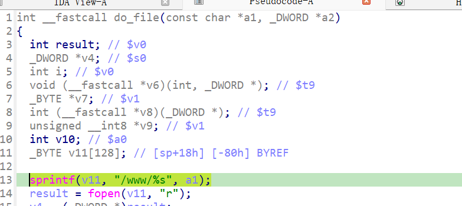

https://github.com/GinRawin/PoC/blob/main/0417PoC_hf/wndrmacv2-1.0.0.4/wndrmacv2-1.0.0.4.tar.gz

漏洞名称：

Netgear WNDRMACv2 1.0.0.4 0x408998 缓冲区溢出漏洞

Netgear WNDRMACv2 1.0.0.4 是 Netgear 公司旗下的一款网络设备固件，受影响产品为 WNDRMACv2，受影响版本为 1.0.0.4。

Netgear WNDRMACv2 1.0.0.4 的 `/usr/sbin/uhttpd` 二进制文件中存在一个 `缓冲区溢出` 漏洞。远程攻击者可以通过发送构造的 HTTP 请求触发该问题。程序在处理 GET 请求时会从请求首行中解析出 URI，当 URI 以 `.css` 等静态资源后缀进入文件处理逻辑后，`do_file()` 在 `0x4089cc` 使用 `sprintf(sp+0x18, "/www/%s", uri)` 将攻击者可控内容写入固定大小的栈缓冲区。由于这里没有长度检查，超长 URI 会覆盖栈上的保存返回地址，最终在函数返回阶段触发 SIGSEGV。

该漏洞位于二进制文件 `/usr/sbin/uhttpd` 中。程序在 `/usr/sbin/uhttpd sym.handle_request 0x40b048` 处对攻击者可控输入完成读取、解析或传递，并最终在 `/usr/sbin/uhttpd sym.do_file 0x4089cc` 处进入危险操作，最终导致进程崩溃并造成拒绝服务。从崩溃现象看，`0x408a94` 处取回的返回地址已经被输入数据污染，`si_addr=0x77616160` 也与典型的栈溢出覆盖特征一致。

攻击者可以远程发起攻击，通过向目标设备发送恶意请求触发漏洞。

漏洞研究环境：

通过模拟仿真进行验证。当前样本目录中提供了对应的请求包与发送脚本 `send.py`，可用于复现该问题。

通过 greenhouse 进行仿真，greenhouse 链接为 https://github.com/sefcom/greenhouse。仿真环境搭建的具体命令链接为 https://github.com/sefcom/greenhouse/blob/master/MANUAL.md。
我在附件里面附上了 rehost 的镜像，链接为 https://github.com/GinRawin/PoC/blob/main/0417PoC_hf/wndrmacv2-1.0.0.4/wndrmacv2-1.0.0.4.tar.gz，启动的命令为进入到 dockerfile 目录下，然后 `docker-compose build`, `docker-compose up`。

目标配置情况：

没有进行特殊配置，默认仿真环境启动。

具体验证过程：

第一步。由于数据包的 URI 使用了 `.css` 这类静态文件后缀，请求会命中静态文件处理路径。`sym.handle_request` 在 `0x40c3f8` 将解析得到的 URI 作为参数传入 `sym.do_file`。

第二步。`sym.do_file` 在 `0x4089cc` 执行 `sprintf(v11, "/www/%s", a1);`，将攻击者提供的超长 URI 直接拼接进栈上的固定缓冲区。由于目标缓冲区到保存返回地址 `ra` 的距离有限，超长输入会覆盖 `sp+0xa0` 处的返回地址，造成缓冲区溢出。

相关问题代码：

0x408998
