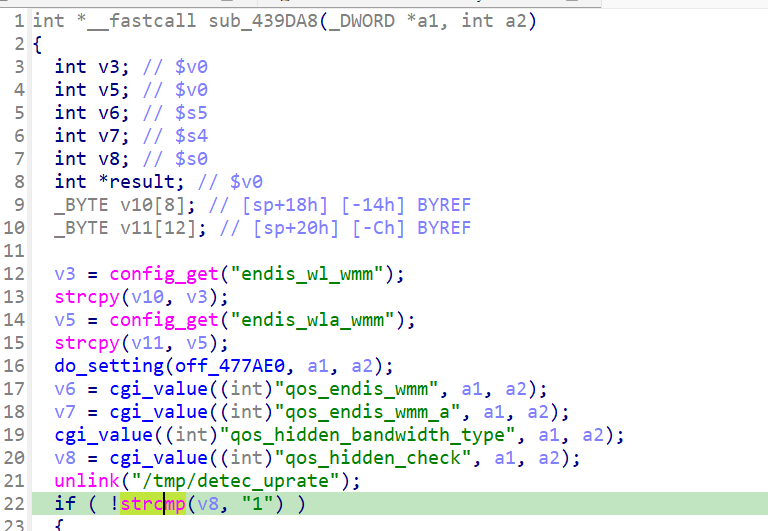

https://github.com/GinRawin/PoC/blob/main/0417PoC_hf/wnr2500-1.0.0.24/wnr2500-1.0.0.24.tar.gz

漏洞名称：

Netgear WNR2500 1.0.0.24 0x439da8 空指针解引用漏洞

Netgear WNR2500 1.0.0.24 是 Netgear 公司旗下的一款网络设备固件，受影响产品为 WNR2500，受影响版本为 1.0.0.24。

Netgear WNR2500 1.0.0.24 的 `/usr/sbin/uhttpd` 二进制文件中存在一个 `NULL 指针解引用导致的远程拒绝服务` 漏洞。远程攻击者可以通过发送构造的 HTTP 请求触发该问题。qos_uplink_bandwidth 处理函数对可选/缺失的 CGI 字段 qos_hidden_check 缺少空指针校验，在 unlink("/tmp/detec_uprate") 的 delay slot 中把 cgi_value() 返回的 NULL 保存到 s0，随后直接执行 strcmp(s0, "1") 触发 SIGSEGV

该漏洞位于二进制文件 `/usr/sbin/uhttpd` 中。程序在 `/usr/sbin/uhttpd cgi_value 0x439da8` 处对攻击者可控输入完成读取、解析或传递，并最终在 `/usr/sbin/uhttpd submit_flag=qos_uplink_bandwidth 0x439da8` 处进入危险操作，最终导致安全风险。

攻击者可以远程发起攻击，通过向目标设备发送恶意请求触发漏洞。

漏洞研究环境：

通过模拟仿真进行验证。当前样本目录中提供了对应的请求包与发送脚本 send.py，可用于复现该问题。

通过 greenhouse 进行仿真，greenhouse 链接为 https://github.com/sefcom/greenhouse。仿真环境搭建的具体命令链接为 https://github.com/sefcom/greenhouse/blob/master/MANUAL.md。
我在附件里面附上了 rehost 的镜像，链接为 https://github.com/GinRawin/PoC/blob/main/0417PoC_hf/wnr2500-1.0.0.24/wnr2500-1.0.0.24.tar.gz，启动的命令为进入到 dockerfile 目录下，然后 `docker-compose build`, `docker-compose up`。

目标配置情况：

没有进行特殊配置，默认仿真环境启动。

具体验证过程：

第一步。POST /apply.cgi?UPG_upgrade.htm 携带 submit_flag=qos_uplink_bandwidth 进入 cgi_setobject@0x40b46c

第二步。cgi_setobject 用 submit_flag 在表 0x475070 中匹配到 "qos_uplink_bandwidth" -> 0x439da8，随后调用该处理函数

第三步。0x439da8 调用 cgi_value("qos_hidden_check", ...) 取值失败得到 NULL，在 strcmp(NULL, "1") 处崩溃

相关问题代码：

0x439da8
